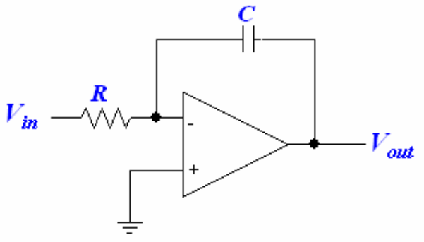
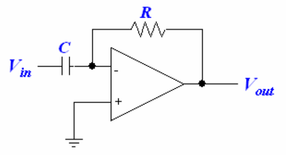
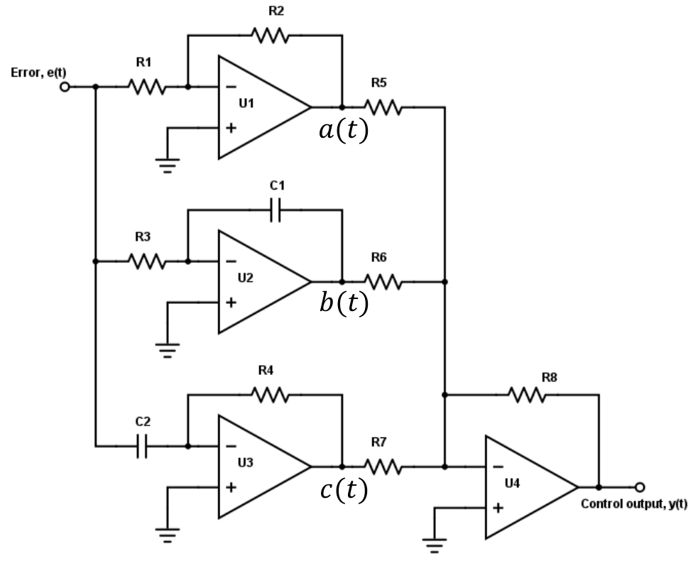

# Lecture 4, Sep 20, 2023

## Transfer Functions of Op-Amp Circuits

{width=50%}

* Example: find the transfer function for the circuit above
	* As a shortcut, we can notice how this resembles an inverting amplifier, so we can use the same formula and replace the resistances with impedances
		* Recall that for an inverting amplifier $\frac{V_{out}}{V_{in}} = -\frac{R_2}{R_1}$, so in this case we have $H(s) = -\frac{Z_2}{Z_1} = -\frac{1}{sRC}$
	* If we couldn't rely on the shortcut, we must use KVL at the inverting input
		* $\frac{V_x - V_{in}}{R} + \frac{V_x - V_{out}}{\frac{1}{sC}} = 0$
		* Since there is a valid negative feedback path, we know the voltage at the inverting and noninverting inputs are equal; therefore $V_x = 0$
		* Using this, $-\frac{V_{in}}{R} - sCV_{out} = 0 \implies \frac{V_{out}}{V_{in}} = -\frac{1}{sRC}$
	* We couldn't have used KVL at the output node, because the op-amp has a current output that we do not know
	* Since multiplying a signal by $\frac{1}{s}$ in the frequency domain is equivalent to an integration (because multiplication by $s$ is differentiation), this circuit is an integrator for the input signal
	* Note: in practice, capacitors don't hold their charge perfectly; since the capacitor is effectively keeping track of the integration state, the capacitor leaking charge leads to errors; in addition, real noise is often not zero-mean, so noise in the signal may accumulate

{width=50%}

* Example: find the transfer function for the circuit above
	* $H(s) = -\frac{Z_2}{Z_1} = -\frac{R}{\frac{1}{sC}} = -sRC$
	* Multiplication by $s$ is a differentiation in time domain, so this circuit is a differentiator
	* Note that this and the integrator are frequency limited; they may not respond properly with very high frequencies
* When there are multiple inputs, we can find the transfer functions for each input separately; however we have to assume that the other inputs are at some fixed known voltage, usually zero

{width=70%}

* Example: find the transfer function for the circuit above
	* Notice that we can break this into the 4 individual op-amp circuits: the inverting amplifier $U_1$, the integrator $U_2$, the differentiator $U_3$, and summing amplifier $U_4$; we will find transfer functions for each one individually and combine them
	* Note: this is a PID circuit, where an input error is scaled, integrated, and differentiated, and then combined together to form the control output
	* $H_1(s) = -\frac{R_2}{R_1}, H_2(s) = -\frac{1}{sR_3C_1}, H_3(s) = -sR_4C_2$
		* Note our assumptions: no loading effects at the input or output
	* For the summing amplifier, $Y(s) = -\left(\frac{R_8}{R_5}A(s) + \frac{R_8}{R_6}B(s) + \frac{R_8}{R_5}C(s)\right)$
	* Therefore $H(s) = \frac{Y(s)}{E(s)} = \frac{R_2R_8}{R_1R_5} + \frac{R_8}{R_3R_6C_1}\frac{1}{s} + \frac{R_4R_8C_2}{R_7}s$
	* Bringing this back to the time domain, we have $y(t) = K_Pe(t) + K_I\int e(t)\,\dt + K_D\diff{}{t}e(t)$

