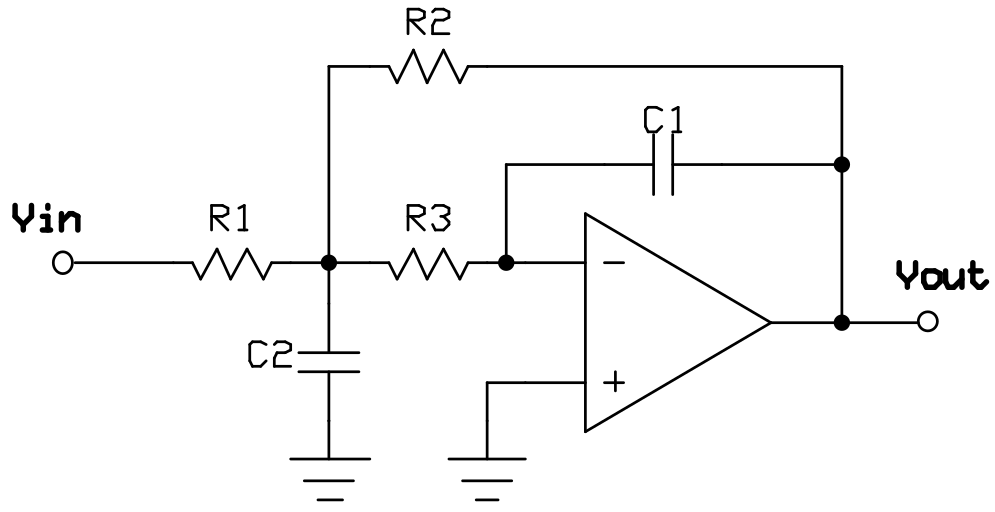
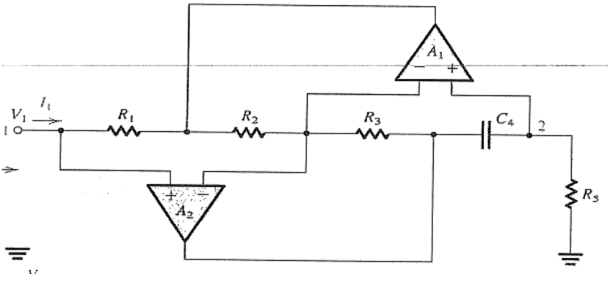
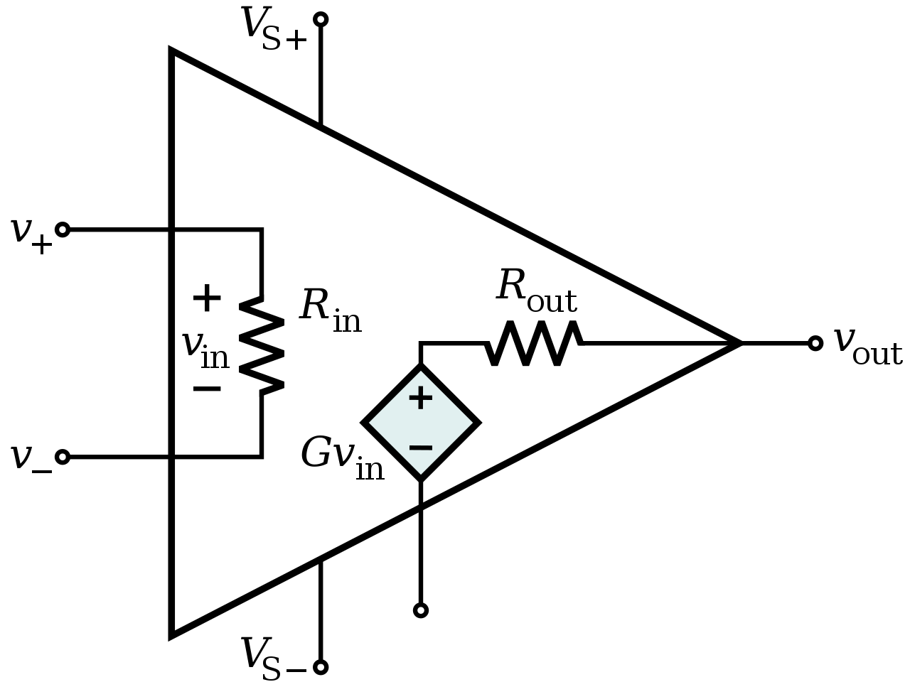

# Lecture 5, Sep 22, 2023

## Analyzing Complex Op-Amp Circuits

{width=70%}

* Example: find the transfer function of the above circuit
	* There is only one op-amp so we can't break this circuit down; we must write multiple node equations
	* We should write node equations at the inverting input ($V_y$) and the node to the right of $V_{in}$ ($V_x$)
		* We also know that $V_y = 0$
	* $\frac{V_x - V_{in}}{R_1} + sC_2V_x + \frac{V_x - V_{out}}{R_2} + \frac{V_x}{R_3} = 0 \implies \left(sC_2 + \frac{1}{R_1} + \frac{1}{R_3} + \frac{1}{R_2}\right)V_x + \left(-\frac{1}{R_1}\right)V_{in} + \left(-\frac{1}{R_2}\right)V_{out} = 0$
	* $\frac{-V_x}{R_3} + -sC_1V_{out} = 0 \implies V_x = -sR_1C_3V_{out}$
	* Sub back to get $H(s) = \frac{\left(\frac{1}{R_1}\right)}{-s^2C_1C_2R_3 + \left(-\frac{C_1R_3}{R_1} - C_1 - \frac{C_1R_3}{R_2}\right)s + \left(-\frac{1}{R_2}\right)}$
		* Normalize: $-\frac{\frac{1}{C_1C_2R_1R_3}}{s^2 + \left(-\frac{1}{C_2R_1} + \frac{1}{C_2R_2} + \frac{1}{C_2R_3}\right)s + \left(\frac{1}{C_1C_2R_2R_3}\right)}$

{width=70%}

* Example: find the equivalent input impedance of the circuit above
	* We want to find an input current $I_{in}$ caused by an input voltage $V_{in}$, then we can find the impedance as $\frac{V_{in}}{I_{in}}$
	* Note we can't write useful node equations at the node between $R_1, R_2$ or the node between $R_3, C_4$ because they are both connected to the output of op-amps
	* The node between $R_2, R_3$ and the node between $C_4, R_5$ have the same voltage as $V_{in}$ due to the op-amp feedback
	* Node equations:
		* $\frac{V_{in} - V_A}{R_1} - I_{in} = 0 \implies V_A = V_{in} - R_1I_{in}$
		* $\frac{V_{in} - V_A}{R_2} + \frac{V_{in} - V_C}{R_3} = 0 \implies V_{in}\left(\frac{1}{R_2} + \frac{1}{R_3}\right) + V_A\left(-\frac{1}{R_2}\right) + V_C\left(-\frac{1}{R_3}\right) = 0 \implies V_C = V_{in} - \frac{R_1R_3}{R_2}I_{in}$
		* $sC_4(V_{in} - V_C) + \frac{V_{in}}{R_3} = 0 \implies -\frac{sC_4R_1R_3}{R_2}I_{in} + \frac{1}{R_5}V_{in} = 0$
		* $Z_{eq} = \frac{V_{in}}{I_{in}} = s\left(\frac{C_4R_1R_3R_5}{R_2}\right)$
	* If we let $\frac{C_4R_1R_3R_5}{R_2} = L$, we see $Z_{eq} = sL$ -- this circuit is an inductance simulator
	* Inductors are very hard to work with at a small scale, so circuits like these are often used to replace inductors with other components
	* Note this only simulates the frequency response of an inductor, but not other aspects like the energy storage

## Real-World Op-Amps

{width=50%}

* Real-world op-amps have several differences compared to ideal op-amps:
	1. Feedback loops: the degree of negative feedback (output to inverting input) must be greater than the degree of positive feedback (output to noninverting input) for the system to be stable
		* For our purposes, we assume that the feedback is sufficient as long as there is a path from the output to the inverting input
	2. Finite input impedance: the impedance looking into the terminals is finite, which means that a small current can flow into the inputs
		* This impedance is frequency dependent but most of the time it suffices to model as a simple resistance
		* The input impedance is often in the range of megaohms to gigaohms, even for cheap op-amps
		* In most cases, the assumption that no current flows in is valid, unless the external resistances attached are on the same order of magnitude (or greater) than the internal resistance
	3. Nonzero input offset: the difference between the voltages on the terminals is nonzero due to the finite open-loop gain
		* This is often in the range of millivolts or nanovolts, so it will not affect the circuit in most cases
		* This does not matter most of the time, but for particular sensitive circuits or filters it needs to be accounted for
	4. Finite open-loop gain: the op-amp output voltage is $v_{out} = (v_+ - v_-)A_0$ where $A_0$ is the open-loop gain; in a real-world op-amp, this gain is finite
		* This means that the feedback control is not perfect, and so the difference between the voltages of the two inputs is nonzero
		* In modern op-amps, the gain is often around 100,000 for cheaper modern op-amps, or up to millions for better ones
			* For older technology this could be in the thousands
		* To see if this will have an impact, we need to compare the op-amp gain to the function of the circuit we're trying to implement
			* e.g. if we're trying to make an inverting amplifier, and the gain we want is within an order of magnitude of the open-loop gain, then it could be problematic
	5. Finite bandwidth, conditional stability, and not linear time-invariant (LTI): real op-amps can be frequency-limited, can have stability issues, and may not be perfectly linear time-invariant
		* The bandwidth is usually limited to megahertz to gigahertz ranges
		* The op-amp should be at least an order of magnitude faster than the operating range of the circuit
	6. Nonzero output impedance: the impedance of the output is nonzero, so the amount of current we can draw is finite
		* Drawing too much current would start causing considerable loading effects
		* The output resistance is typically in the range of ohms to kilohms
		* Since we're usually using kilohm-level resistances in our circuits, this could be a very common issue
* Additionally, real-world op-amps must be powered by some pair of voltages $V_{dd}, V_{ss}$, which restricts the range that $V_{out}$ can take on
	* If we expect the output voltage to be outside this range, it is capped instead
	* When the waveform is cut off due to op-amp output limits, it is referred to as *clipping*
	* Clipping may not happen right at the supply voltage; there may be a small gap and clipping happens slightly below the supply voltage

