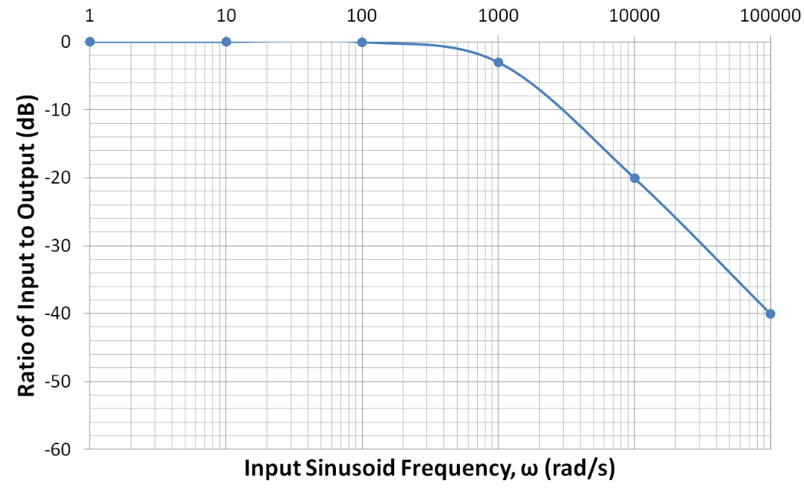
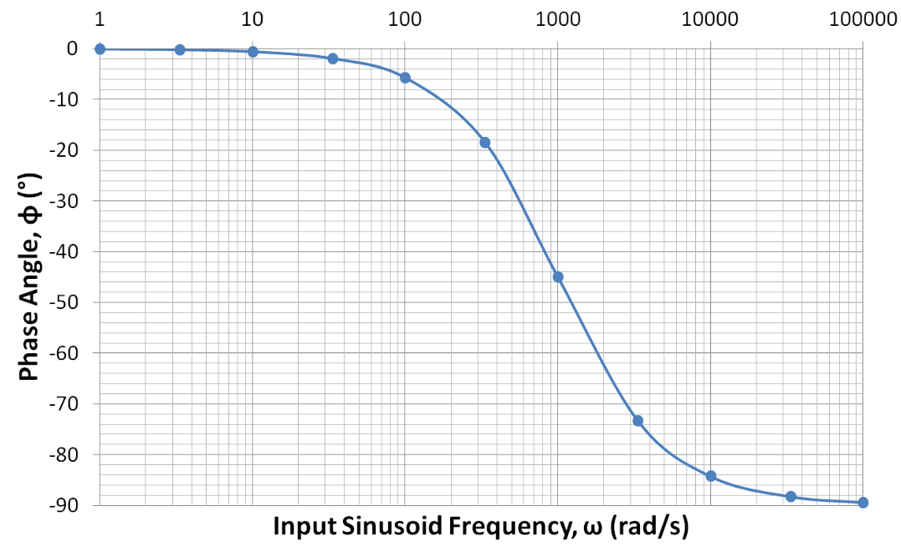

# Lecture 6, Sep 27, 2023

## Bode Plots

* Motivation: we need a good tool to predict what a circuit will do to a wide range of signal frequencies
* Example: $H(s) = \frac{1}{Ts + 1}$ with $y(t) = A\sin(\omega t)$
	* We will always get a sine wave of the same frequency
	* However the phase and the amplitude of the output will be different
	* In general, all LTI systems have this property
* A Bode plot shows, for different frequencies in logarithmic scale, how a system changes the phase and amplitude of an input sinusoid
	* The information from both parts of the Bode plot are equivalent to all the information from the transfer function/pole-zero plot

{width=70%}

* For the magnitude plot, a Bode plot shows the ratio of output amplitude over input amplitude in decibels -- $\si{dB} = 20\log _{10} \frac{A_{out}}{A_{in}}$
	* At $-3\si{dB}$, we consider the output amplitude to have started deviating considerably
	* A typical Bode plot for a single pole looks similar to the example figure, with a horizontal segment where frequency has little effect, and a diagonal segment where increasing frequency significantly affects the output
		* The inflection point is the location of the pole; this is known as the *cutoff frequency* or *corner frequency*
		* After the pole location, each decade of increase in frequency leads to about $-20\si{dB}$ of amplitude difference

{width=70%}

* For the phase plot, the phase shift angle in degrees is shown
	* The phase plot can be approximated by 3 segments, with 2 horizontal ones and a diagonal one
	* In the diagonal segment, the phase decreases by $-45\degree$ per decade
	* The pole location is at the center of the diagonal segment of the phase plot; it has a phase shift of $-45\degree$
* A complete Bode plot requires both a magnitude and a phase plot

