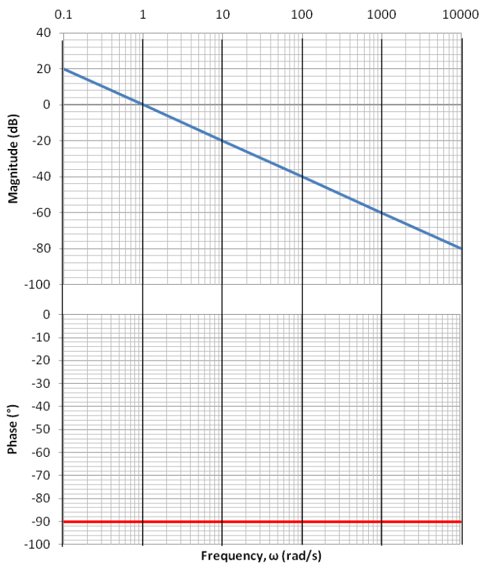
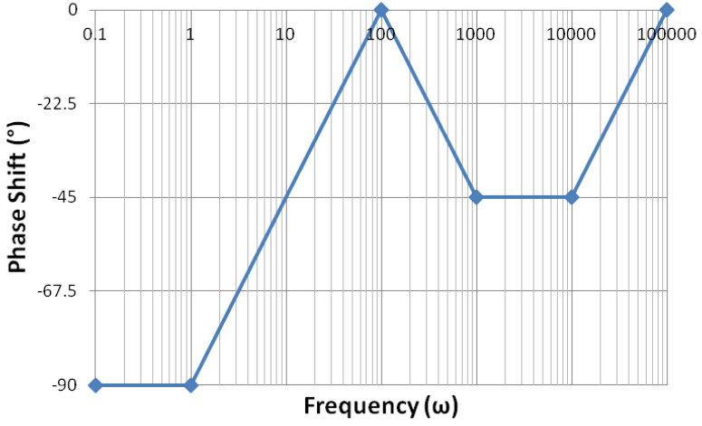

# Lecture 7, Sep 29, 2023

## Sketching Bode Plots

* Many common software tools exist to create Bode plots, but we are interested in sketching them by hand since this allows us to go from desired behaviour back to circuit
* Note that the behaviour that we discussed previously is for a single pole; if there are multiple poles/zeroes, their effects add together

{width=40%}

* Since the horizontal axis is logarithmic, the zero frequency would be infinitely to the left
	* If our pole is at $\omega _c = 0$, the cutoff frequency would be off the plot, so we only see a diagonal line of $-20\si{dB}$ per decade
	* The same goes for the phase plot; we almost always have a $-90\degree$ shift since the diagonal section is mostly off the plot
	* For such a pole we have exactly $0\si{dB}$ at $\omega = 1$ so we can draw a line through this point with the slope

{width=40%}

* Zeros are effectively the opposite of poles
	* For a zero at origin, we now have a constant slope of $+20\si{dB}$ per decade for the magnitude plot and a $+90\degree$ phase shift always
	* Compared to a pole, the effect of a zero is effectively the same as a pole but reflected across the $0\si{dB}/0\degree$ lines
* Note that for a phase shift the vertical axis wraps around ($360\degree = 0\degree$); by convention we try to keep it near zero
* In the case of constant gain $\pm K$, on the magnitude plot we have a constant value of $20\log _10(\abs{K})$, but the phase plot is either a constant $0\degree$ if $K > 0$ or $\pm 180\degree$ if $K < 0$, since an inversion is equivalent to a $180\degree$ phase shift

{width=40%}

* In the case of underdamped poles and zeroes, we have a quadratic factor in the transfer function so the Bode plot is much more complicated
	* We will not deal with this much in this course, but be aware that our linear approximations will no longer work
	* These poles mostly have no change at lower frequencies and gives $-40\si{dB}$ per decade at higher frequencies (which corresponds to the fact that they factor into two poles)
	* For the phase plot the total phase shift is $-180\degree$ at higher frequencies (since each pole contributes $-90\degree$); however the slope and shape of the phase plot changes significantly depending on the value of $\zeta$
	* However at frequencies near $\omega _n$ (the natural frequency) we hit a peak, which increases as $\zeta$ (the damping factor) decreases; this corresponds to a resonance
	* For the magnitude plot we will have to split it into 3 or 4 segments to accommodate the peak
* Our linear approximation will not exactly match the real plot; we can attempt to correct for this error
	* For the magnitude plot, we can apply a correction of $\pm 3\si{dB}$ per pole at $\omega \approx \omega _c$ and $\pm 1\si{dB}$ at $\omega \approx 2^{\pm 1}\omega _c$
		* We can also use a correction graph but this is often not needed
	* For the phase plot, near $\omega = \pm 2^{\pm 1}\omega _c, \abs{\phi} = 26.6\degree$ or $63.4\degree$; at $\omega \approx 10^\pm 1\omega _c, \abs{\phi} = 5.7\degree$ or $84.3\degree$
* To graph a Bode magnitude plot by hand:
	1. Factor the transfer function into distinct poles and zeroes
		* If we can't do this then the system is probably not LTI, or if there are complex poles, it will be very difficult for us to do
	2. Determine the starting point of the graph: we want the graph to start at around a factor of 10 smaller than the smallest (nonzero) pole/zero
		* This allows us to avoid most of the error at the start of the graph; since the entire graph is going to be relative to this point, if we have errors at the start the entire graph will be shifted
		* Now we need to determine the start gain in decibels
		* If poles and zeros are at at least $10\si{rad/s}$ and we are starting at $1\si{rad/s}$, we can simplify this to $K_{start} = \abs{K}z_1z_2\cdots\frac{1}{p_1}\frac{1}{p_2}\cdots$, i.e. the product of all the poles and zeros
			* This works because at $1\si{rad/s}$, poles and zeroes at a frequency of zero contribute nothing to the magnitude
			* We need other poles and zeros to be much bigger than 1 so our approximation works
		* Otherwise, we must sub in $s = j\omega$ manually for the starting $\omega$ and work out the initial magnitude by brute force calculations
		* Remember to convert $K_{start}$ back to decibels!
	3. Begin drawing at $K_{start}$ (in decibels)
		* If we've picked our starting frequency properly, then we should be in the flat region of all nonzero poles and zeros
		* If there are no zero poles and zeros we start directly at this frequency, otherwise we account for them
	4. Draw a straight line to the next corner frequency using the current slope
	5. Update the rate of change based on which poles and zeros are active, and then repeat until we finish all segments
		* For each zero that's active, add $+20\si{dB}$ per decade; for each pole add $-20\si{dB}$ per decade
* The phase plot can be graphed in a similar way:
	1. Factor the transfer function into distinct poles and zeroes
	2. Determine the starting point of the graph
	3. Group and sort all corner frequencies
		* Instead of the $\omega _c$ themselves, take $0.1\omega _c$ and $10\omega _c$ which corresponds to the start and end points of the influence of each pole and zero
	4. Begin drawing at the starting point
		* Note each pole or zero at the origin will introduce a constant $\mp 90\degree$ shift
	5. Draw the line segments and update the rate of change
		* Each pole or zero introduces a $\mp 45\degree$ per decade on the rate of change and contributes $\mp 90\degree$ in total
		* To check, count the number of poles and zeros and make sure that the endpoint is exactly $90\degree z - 90\degree p$ from the starting point, where $z$ is the number of zeros and $p$ is the number of poles
* Example: Graph the Bode plot for the transfer function: $H(s) = \frac{s^2 + 10010s + 100000}{s^2 + 1000s}$
	* First we graph the magnitude plot:
		1. Factor the transfer function: $H(s) = 1\frac{(s + 10)(s + 10000)}{s(s + 1000)}$
			* We have 2 real poles (with one at the origin), 2 real zeros, and a positive pure gain
			* Since there is an equal number of poles and zeroes their effect cancels in the long term
		2. Find the initial magnitude: $K_{start} = (1)\left(\frac{1}{1}\right)\left(\frac{1}{1000}\right)(10)(10000) = 100 \implies K_{start_{dB}} = 40\si{dB}$ and the starting point, which we choose to be $1\si{rad/s}$ which is a decade below the smallest pole/zero
			* Since the gain is positive we don't need to start with a $-180\degree$ phase
			* The starting slope is not flat but $-20\si{dB}$ per decade since we have a pole at the origin
			* Since we start at $\omega = 1$ the pole at origin does not affect the starting magnitude
			* We can also use the shortcut to compute $K_{start}$ which would not have been possible if we started at some other frequency
		3. Group the poles and zeros:
			* $\omega = 0$; pole at origin; $-20\si{dB}$ per decade
			* $\omega = 10$; zero; flat slope after this
			* $\omega = 1000$; pole; $-20\si{dB}$ per decade after this
			* $\omega = 10000$; zero; flat slope after this
		4. Draw all segments of the plot
	* See figures below for the completed plot; notice that it is fairly similar to the exact plot, except at the corner frequencies
	* Now for the phase plot:
		1. Factor the transfer function in the same way
		2. Find the starting phase shift and starting frequency
			* A positive starting gain would normally correspond to a $0\degree$ starting shift, but we have a pole at the origin, so we start at $-90\degree$
			* For this plot we shouldn't start at $1\si{rad/s}$ anymore, because the zero at $\omega _c = 10$ generates two inflection points at $1$ and $100\si{rad/s}$
		3. Organize the poles and zeros and their effects:
			* $\omega = 0$; pole at origin
			* $\omega = 1$; start zero at $\omega = 10$
			* $\omega = 100$; end zero at $\omega = 10$ and start pole at $\omega = 1000$
			* $\omega = 1000$; start zero at $\omega = 10000$
			* $\omega = 10000$; end pole at $\omega = 1000$
			* $\omega = 100000$; end zero at $\omega = 10000$

{width=60%}

{width=60%}

{width=60%}

{width=60%}

