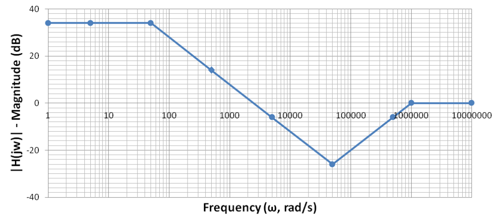
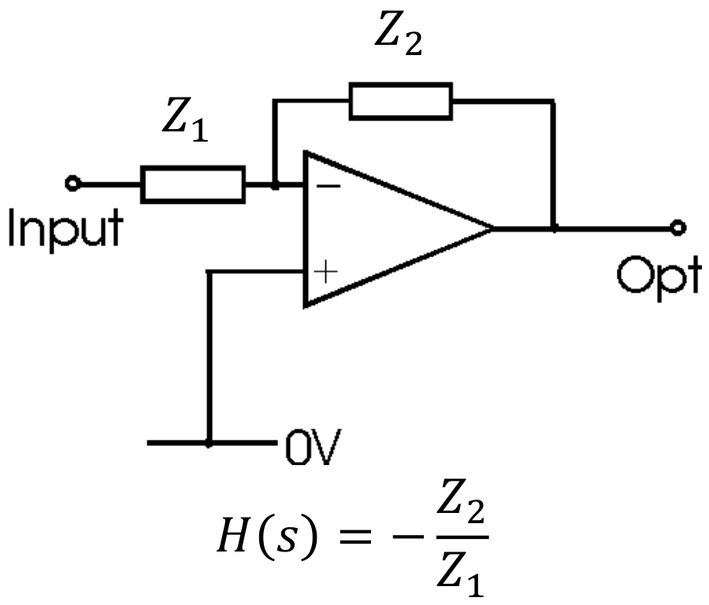

# Lecture 9, Oct 6, 2023

## From Bode Plot to Transfer Function

* We can reverse a Bode plot back into a transfer function by examining the magnitude plot:
	* Start by looking at the graph and finding all the inflection points -- these are the pole and zero corner frequencies
	* Reverse the change in slope to find the multiplicities of the poles/zeroes
	* Check for poles and zeros at the origin
	* Pick any point on the graph, and use this to solve for the pure gain on the transfer function
	* Note if we started with an exact bode plot, we have to first estimate the asymptote plot (however this is relatively rare since reversing a bode plot is often used as a design tool)
* However, if we only look at the magnitude graph, we do not get a unique solution -- there are multiple transfer functions that will give you the same magnitude plot, but not the same phase plot
	* Most of the time we don't care about the phase change when working with filter design
	* This could matter a lot in e.g. control systems
	* It also limits us to systems with magnitude rates of change being multiples of $20\si{dB}$ per decade; transfer functions with complex components can be problematic

{width=80%}

* Example reverse the Bode phase plot above:
	* We see inflection points at 50, 50k, and 1M, which are the corner frequencies
	* At 1M, the slope changes from $+20\si{dB}$ per decade to 0, so a pole with multiplicity 1 became active
	* At 50k, the slope changes from $-20\si{dB}$ per decade to $+20\si{dB}$ per decade, so a zero with multiplicity 2 became active
	* At 50, the slope changes from 0 to $-20\si{dB}$ per decade, so a pole with multiplicity 1 became active
	* We started with a flat slope, so there is no pole or zero at the origin
	* Therefore the transfer function has form $\frac{\abs{K}(s + 50000)^2}{(s + 50)(s + 1000000)}$
	* At $\omega = 1$ the magnitude plot has value $34\si{dB} = 50.119$; in our transfer function we have $\abs{K}(50000)^2\left(\frac{1}{50}\right)\left(\frac{1}{1000000}\right) = 50K$
		* Note we could choose this because the first corner frequency is more than a decade greater
	* Therefore $\abs{K}$ is about 1, so $H(s) = \frac{(s + 50000)^2}{(s + 50)(s + 1000000)}$
		* Note that we could've set $K = \pm 1$ and we would get the same magnitude; this would be reflected in the phase plot

## From Transfer Function to Circuit

{width=40%}

* Due to our simplifications, the simplest way for us to do this is to use a bunch of op-amp building blocks
	* Note this is an easy way, but not an optimal way
* Each inverting amplifier can (usually) give us up to one pole and one zero
* To get the desired $Z_1, Z_2$ to make the poles, we can choose a resistor and either an inductor or a capacitor
	* In practice capacitors are preferred because they are much cheaper and available in a wider range of values
	* However capacitors have a shorter lifespan (tens of thousands of hours vs. decades for inductors)
	* Capacitors are better at the lower frequencies while inductors are better at higher frequencies
	* In addition, we can also do resistors and capacitors/inductors in series or parallel, giving us a total of 4 choices per impedance
		* This means 16 possible combinations! Some of these can implement more advanced functions such as double poles/zeros
	* Example combination:
		* Both resistor and capacitor in series: $Z_1 = R_1 + \frac{1}{sC_1}, Z_2 = R_2 + \frac{1}{sC_2}$, then the transfer function has a pure gain of $K = -\frac{R_2}{R_1}$, a pole at $\frac{1}{R_1C_1}$, and a zero at $\frac{1}{R_2C_2}$
		* Both resistor and inductor in series: $Z_1 = R_1 + sL_1, Z_2 = R_2 + sL_2$, then the transfer function has a pure gain of $K = -\frac{L_2}{L_1}$, a pole at $\frac{R_1}{L_1}$ and a zero at $\frac{R_2}{L_2}$
* In the real world, we need to choose realistic component values:
	* Resistors from $100\si{\ohm}$ to $4.7\si{M\ohm}$
		* Too low and we'll get opamp loading effects
		* Too high and there will be current going into the opamp
	* Capacitors from $10\si{pF}$ to $1\si{\micro F}$
		* Too low and it will be too hard to make and too sensitive (capacitance exists between rows on a breadboard!)
		* Too high and we'll have to use electrolytic capacitors, which are polarized, and less accurate
	* Inductors from $1\si{\micro H}$ to $500\si{mH}$
		* Too low and the inductance will be comparable to PCB traces, so the circuit will be extremely sensitive
		* Too high and the inductor will be too hard to make and too big
* Systematic procedure to find a circuit:
	1. Group poles and zeros into pairs; each pair uses an inverting amplifier block
		* Try to keep the corner frequencies of the poles and zero close
		* When poles and zeros are very different, the gain will be extreme and reduces flexibility
		* For any remaining lone poles and zeros, add another amplifier block
	2. Divide any pure gain among the blocks; add additional pure gain blocks as needed
		* We can estimate the amount of gain that a stage provides by dividing the zero by the pole, so we can get an estimate of how much gain is left
		* Remember that real opamps have gain limits
	3. Select realistic component values
		* Start with capacitors and inductors first because they have a much smaller range of values
* Example: $H(s) = \frac{(s + 50000)^2}{(s + 50)(s + 1000000)}$
	* We have to match one 50k zero with the 50 pole and the other 50k zero with the 1M pole
	* The first stage has a gain of approximately 1000, the second has a gain of $1/100$, which leaves us with a gain of 10
		* When the leftover gain is one or two magnitudes, we are usually able to divide it among all the stages without having to add an additional amplifier
		* Note in practice we need to keep track of the magnitude of our signal in-between stages; if the signal becomes too small, it can get lost among the noise; if it's too big, it can get clipped
			* We might want to shuffle around the stages; e.g. if we have 2 stages with really big gain and 2 stages with really small gain, we should alternate the big and small gains so the signal does not get lost or clipped
	* If we have more freedom in grouping poles and zeros, we can try to group them differently in order to reduce the leftover gain
	* Lower frequency poles and zeroes are more easily realized with capacitors; higher frequency poles and zeros are more easily realized with inductors (this is a direct result of the range of component values we can use)
	* In the real world we might want to calculate the equivalent impedance of each stage of the circuit to prevent loading effects
	* For now we will try using only resistors and capacitors, by RC series
	* $H_1(s) = K_1\frac{(s + 50000)}{(s + 50)}, H_2(s) = K_2\frac{(s + 50000)}{(s + 1000000)}$ so $K_1K_2 = 1$ which is our constraint
		* We can try to get $K_1, K_2$ as close to 1 as possible for both stages
	* For circuit 1: we can try to select $C_1, C_2$ first
		* We want $\omega _c = 50\si{rad/s}$ which has value $P = \frac{1}{R_1C_1}$
		* We can try a capacitor value that's in the middle of the range, e.g. $0.5\si{\micro F}$, giving $R_1 = 43\si{k\ohm}$
	* For circuit 2: let's pick $R_2 = R_1$
		* We get a capacitor value around $23\si{pF}$, which works but is quite small

\noteImportant{Lower frequency poles and zeroes are more easily realized with capacitors; higher frequency poles and zeros are more easily realized with inductors. This is a direct result of the range of component values we can use.
Inductors begin to struggle below 100.}

