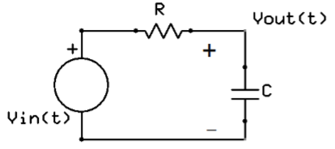
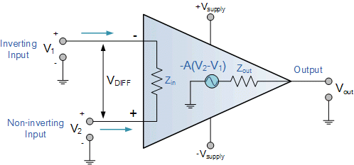
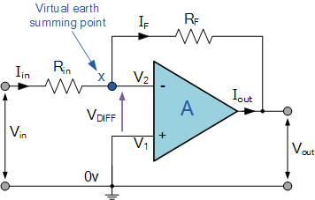

# Tutorial 1, Sep 13, 2023

## Transfer Functions

* Recall that the impedance for capacitors and inductors are dependent on frequency
	* Resistor: $R$
	* Capacitor: $\frac{1}{j\omega C} = \frac{1}{sC}$ where $s = j\omega$ and $\omega$ is the frequency
		* With increasing frequency, the impedance decreases
	* Inductor: $j\omega L = sL$
		* With increasing frequency, the impedance increases

{width=30%}

* Example problem 1: given the circuit above, what is $v_{out}(t)$ if $v_{in}(t) = u(t)$ (unit step)?
	* To do this we Laplace transform the input and use the transfer function
	* The impedance of the resistor is $Z_1 = R$ and the capacitor is $Z_2 = \frac{1}{sC}$; the two impedances form a voltage divider
	* $v_{out} = \frac{Z_2}{Z_1 + Z_2}v_{in} = \frac{1}{sC(R + \frac{1}{sC})}v_{in} = \frac{1}{sRC + 1}v_{in} \implies \frac{v_{out}}{v_{in}} = \frac{1}{sRC + 1} = H(s)$
	* The frequency domain signal is $\laplace{u(t)} = \frac{1}{s}$ so $Y(s) = \frac{1}{s}H(s) = \frac{1}{s(sRC + 1)} = \frac{1}{s} \cdot \frac{\frac{1}{RC}}{s + \frac{1}{RC}}$
		* We can already see based on the poles that this would be a decaying exponential plus an offset
	* Partial fraction expansion: $\frac{A}{s} + \frac{B}{s + \frac{1}{RC}} = \frac{1}{s} \cdot \frac{\frac{1}{RC}}{s + \frac{1}{RC}} \implies \left(s + \frac{1}{RC}\right)A + sB = \frac{1}{RC}$
		* Evaluate at $s = 0 \implies A = 1$
		* Evaluate at $s = -\frac{1}{RC} \implies B = -1$
		* $Y(s) = \frac{1}{s} - \frac{1}{s + \frac{1}{RC}}$
	* Apply the inverse transform: $\ilaplace{Y(s)} = y(t) = u(t) - u(t)e^{-\frac{t}{RC}}$

{width=35%}

* Example problem 2: find the transfer function for the above circuit
	* Nodal analysis at $v_{out}$: $\frac{v_{out} - v_{in}}{R} + sCv_{out} + \frac{v_{out}}{sL} = 0 \implies \frac{v_{out}}{v_{in}} = \frac{s}{s^2RC + s + \frac{R}{L}}$

## Op-Amp Basics

{width=35%}

* In practice, the op-amp requires both a positive and negative power input; however for ideal op-amps that we will analyze, they are not limited by power
* It has two inputs, the noninverting input $V_i^+$ and inverting input $V_i^-$; the currents $i^+, i^-$ going into the two inputs are both zero for an ideal op-amp
* The op-amp amplifies the voltage difference between the two inputs by the *gain* $A$: $V_o = A(V_i^+ - V_i^-)$
	* For an ideal op-amp, the gain $A$ is effectively infinite, so op-amps are almost never used as-is; instead feedback loops are used
	* The output $V_o$ would not be affected by any impedance (it maintains its voltage regardless of load)
	* In a real op-amp there is also an output impedance, but we will assume it is zero
* Typically, the inverting input is connected through a series of impedances to the output; this results in the voltage difference between the inputs being driven to zero
	* An input signal would be connected through an impedance into the inverting input, while the noninverting input is grounded or connected to a DC voltage; this configuration is called an *inverting amplifier*
	* When the noninverting input is grounded, the inverting input is forced to ground; we refer to it as a *virtual ground*

{width=35%}

* What is the transfer function of the amplifier circuit?
	* Notice that $i_{in} = i_F$ since there is no current going into the amplifier
	* $\frac{V_2 - v_{in}}{R_{in}} + \frac{V_2 - v_{out}}{R_F} = 0 \implies \frac{v_{in}}{R_{in}} - \frac{v_{out}}{R_F} = 0 \implies \frac{v_{out}}{v_{in}} = -\frac{R_F}{R_{in}}$
	* This circuit is called an inverting amplifier because of the negative sign; the input signal is amplified and inverted
	* Note that the value of $v_{out}$ stays the same regardless of any load driven by it; if we have a two-stage amplifier, we can find the transfer functions for both stages separately and then multiply them together, since the second stage would not affect the output of the first stage

