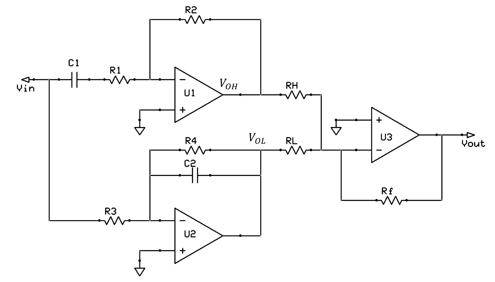
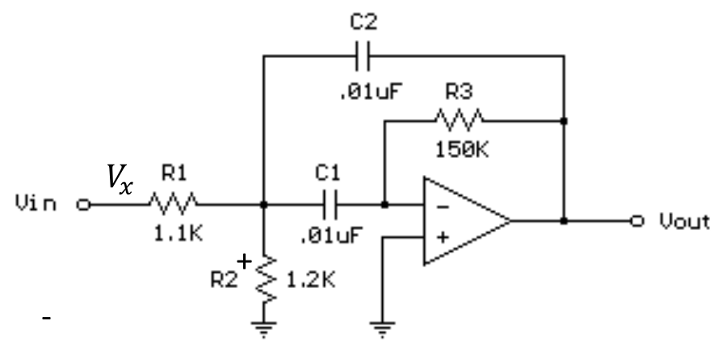
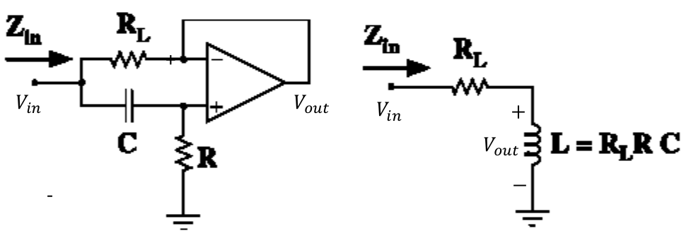

# Tutorial 2, Sep 20, 2023

## Active Filters

{width=90%}

* Example: find the transfer function of the circuit above
	* Since this is an op-amp circuit, we can combine transfer functions by simply multiplying; we will first find the transfer functions for $V_{OH}$ and $V_{OL}$
	* Recall that for an inverting amplifier configuration the transfer function is $H(s) = -\frac{Z_2}{Z_1}$ where $Z_1$ is the impedance before the input, and $Z_2$ is the feedback impedance
		* Both the op-amps at $V_{OH}$ and $V_{OL}$ are in an inverting amplifier configuration
		* For op-amp $U_1$ the input impedance is $Z_1 = \frac{1}{sC_1} + R_1$ and the feedback impedance is $R_2$, so $H_1(s) = -\frac{R_2}{\frac{1}{sC_1} + R_1} = -\frac{sR_2C_1}{1 + sR_1C_1}$
		* For op-amp $U_2$ the input impedance is $Z_1 = R_3$ and $Z_2 = \frac{1}{\frac{1}{R_4} + sC_2}$ so $H_2(s) = -\frac{1}{R_3(\frac{1}{R_4} + sC_2)} = -\frac{R_4}{R_3 + sR_3R_4C_2}$
	* The op-amp $U_3$ is in a *summing inverting amplifier* configuration
		* To find the transfer function for it, we can use superposition for each input separately
		* We find that the output is the sum of two inverting amplifiers, $V_{out} = -\frac{Z_F}{Z_1}V_{in_1} - \frac{Z_F}{Z_2}V_{in_2}$
		* Therefore $\alignedeqntwo[t]{V_{out}}{-\frac{R_f}{R_H}V_{OH} - \frac{R_f}{R_L}V_{OL}}{\left(\frac{R_f}{R_H}\frac{sR_2C_1}{1 + sR_1C_1} + \frac{R_f}{R_L}\frac{R_4}{R_3 + sR_3R_4C_2}\right)V_{in}}$
		* Overall this circuit essentially breaks the input signal into two parts, one higher in frequency and one lower, and sums them up and amplifies them; the proportion of higher frequency to lower frequency in the sum is controlled by the resistances $R_H, R_L$

{width=60%}

* Example: find the transfer function of the circuit above
	* Let $V_x$ be the voltage at the node to the left of the virtual ground
	* $\frac{V_x - V_{in}}{R_1} + \frac{V_x}{R_2} + sC_2(V_x - V_{out}) + sC_1V_x = 0$
	* At the virtual ground $-sC_1V_x - \frac{V_{out}}{R_3} = 0 \implies V_x = -\frac{V_{out}}{sR_3C_1}$
	* We can then sub in $V_x$ to find the transfer function through the equation at $V_x$
	* $\frac{V_{out}}{V_{in}} = -\frac{sR_2R_3C_1}{R_1R_2 + R_2^2 + sR_1^2R_2C_2 + sR_1^2R_2C_1 + s^2R_1^2R_2R_3C_1C_2}$

{width=80%}

* Example: find the transfer function of the circuit above and show that it is equivalent to the one on the right
	* At both inputs of the op-amp, the voltage is $V_out$
	* At the noninverting input: $sC(V_{out} - V_{in}) + \frac{V_{out}}{R} = 0 \implies V_{out}\left(sC + \frac{1}{R}\right) = V_{in}sC \implies \frac{V_{out}}{V_{in}} = \frac{sRC}{sRC + 1} = \frac{s}{s + \frac{1}{RC}}$
	* For the second circuit we have a voltage divider, so $V_{out} = \frac{L}{R_L + L}V_{in} = \frac{sL}{sL + RL} = \frac{sR_LRC}{sR_LRC + R_L} = \frac{sC}{sC + \frac{R_L}{R_L R_LR}}$

