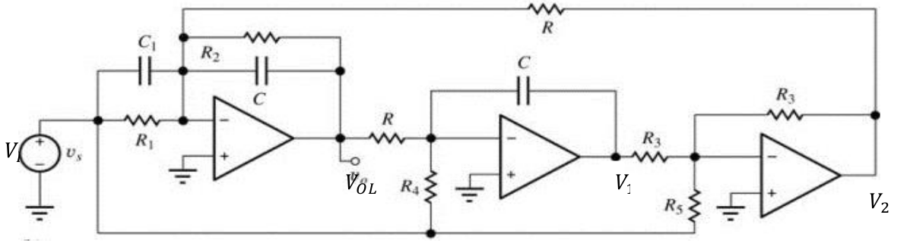
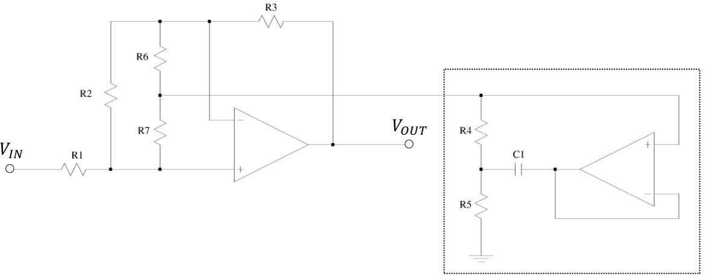

# Tutorial 3, Sep 27, 2023

{width=80%}

* Example: find the transfer function of the above
	* Replace $C_1, R_1$ by impedance $Z_a = \frac{R}{sR_1C_1 + 1}$
	* Replace $C, R_2$ by impedance $Z_2 = \frac{R_2}{sR_2C + 1}$
	* Replace $R$ by impedance $Z_b$
	* At the first op-amp we have an inverting summing amplifier
		* We don't need to worry about $R_4$ and $R_5$ since they just contribute to $V_I$
		* $V_{OL} = -\frac{Z_2}{Z_a}V_I - \frac{Z_2}{Z_b}V_2 = -\frac{R_2(sR_2C_1 + 1)}{(sR_2C + 1)R_1}V_I - \frac{R_2}{(sR_2C + 1)R}V_2$
	* $V_2 = -\frac{R_3}{R_3}V_1 - \frac{R_3}{R_5}V_I$
		* Sub in $V_2$ to get $V_{OL}$ in terms of $V_1$ and $V_I$
	* $V_1 = -\frac{\frac{1}{sC}}{R}V_{OL} - \frac{\frac{1}{sC}}{R_4}V_I$
	* ... a bunch of nasty algebra later

{width=90%}

* Example: find the transfer function of the circuit above
	* We will model the sub-circuit in the box as an equivalent impedance connected to ground
	* First find $Z_{eq}$
		* Assume a voltage of $V_{in}$ at the top node
		* Since this is an ideal op-amp, the inverting input and output are also at $V_{in}$ and no current flows into the noninverting input
		* Node equation at $A$, the node between the resistors: $\frac{V_A - V_{in}}{R_4} + \frac{V_A}{R_5} + \frac{V_A - V_{in}}{\frac{1}{sC_1}}$
		* $V_A\left(\frac{R_5 + R_4 + sR_4R_5C_1}{R_5R_4}\right) = V_{in}\left(\frac{1 + sR_4C_1}{R_4}\right)$
		* $\frac{V_A}{V_{in}} = \frac{R_5 + sR_4C_1R_5}{R_5 + R_4 + sR_4R_5C_1}$
		* If we have an input current $I_{in}$, then $I_{in} = \frac{V_{in} - V_A}{R_4}$ which we can substitute $V_A$
		* $Z_{eq} = \frac{V_{in}}{I_{in}} = \frac{1}{R_5 + R_4 + sR_4R_5C_1}$

