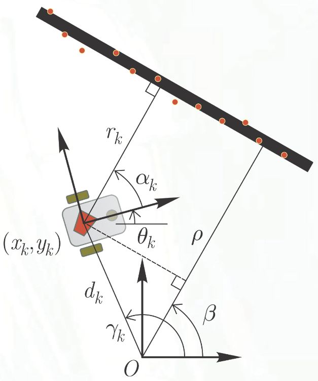

# Lecture 11, Oct 12, 2023

## Control (Actuator) Noise

* Consider the control input having some noise, so $\bm u_k = \bm u_{k|k}^* + \bm n_k$ where $\bm u_k$ is the actual control input delivered, $\bm u_{k|k}^*$ is the requested control input, and $\bm n_k$ is some zero-mean, Gaussian noise with covariance $\bm N_k$
* After linearization $\bm x_{k + 1} = \hat{\bm x}_{k + 1|k} + \bm A_k(\bm x_k - \hat{\bm x}_{k | k}) + \bm B_k(\bm u_k - \bm u_{k | k}^*) + \bm v_k$
* In this case our a priori covariance estimate is $\bm A_k\bm P_{k|k}\bm A_k^T + \bm B_k\bm N_k\bm B_k^T + \bm Q_k$
* The rest stays unchanged

## Kalman Filtering Example

{width=30%}

* Consider a differentially steered robot: $\bm x_{k + 1} = \bm f(\bm x_k, \bm u_k) = \bm A_k\bm x_k + \underbrace{\matthreetwo{\frac{1}{2}\cos\theta _k}{\frac{1}{2}\cos\theta _k}{\frac{1}{2}\sin\theta _k}{\frac{1}{2}\sin\theta _k}{-b^{-1}}{-b^{-1}}}_{\bm B_k}\underbrace{\cvec{\Delta s_{l,k}}{\Delta s_{r,k}}}_{\bm u_k} + \bm v_k$
* The robot measures the angle and perpendicular distance to a wall; the wall is specified in the map as an angle $\beta$ and distance $\rho$
* The measurement model is: $\bm z_k = \cvec{\alpha _k}{r _k} = \cvec{\beta - \theta _k}{\rho - x_k\cos\beta - y_k\sin\beta} + \bm w_k = \bm h(\bm x_k) + \bm w_k$
	* Linearize: $\bm D_{k + 1} = \pdiff{\bm h}{\bm x_{k + 1}^T} = \mattwothree{0}{0}{-1}{-\cos\beta}{-\sin\beta}{0}$
* Note that for Kalman filters to work, the system has to be *observable*, that is, using sufficient measurements of $\bm z$, we can reconstruct $\bm x$
	* A system $\dot{\bm x} = \bm A\bm x + \bm B\bm u, \bm z = \bm D\bm x$ is *observable* if the observability matrix $\bm O = \cvec{\bm D}{\bm D\bm A}{\vdots}{\bm D\bm A^{n - 1}}$ has rank $n$
* The dual of observability is *controllability*, the ability to achieve any system state by using a sequence of control inputs $\bm u$
	* The controllability matrix is $\bm C = \rvec{\bm B}{\bm A\bm B}{\bm A^2\bm B}{\cdots}{\bm A^n\bm B}$, which needs to be rank $n$ for the system to be controllable
* Our system is not observable, since $\bm A$ is the identity and $\bm D$ has rank 2
	* This corresponds to the fact that we don't get enough information by just looking at the wall; we could be anywhere along the wall and still get the same measurement
	* In this case, the output of the filter is not guaranteed to be correct (but we have no way of telling this)

## Mapping

* Before, we assumed that we had the location of landmarks; how do we get those landmark locations in the first place?
	* To build a map, we need to localize; to localize, we need a map, leading to a chicken-and-egg problem
	* For now, we will assume we have perfect localization, and see how we can build a map of landmarks
* Suppose we have $m$ landmarks each with coordinate $\bm\xi^{(i)}$; we want to estimate $\bm\xi = \cvec{\bm\xi^{(1)}}{\vdots}{\bm\xi^{(m)}}$
* We can try to use Kalman filtering!
* Since landmarks don't move, $\bm\xi _{k + 1} = \bm\xi _k \implies \bm A = \bm 1, \bm B = \bm 0$, and there is no noise
* Measurements are modelled by $\bm\zeta _k = \bm\eta(\bm x_k, \bm\xi _k) + \bm\varpi _k$
	* Example: if we treat landmarks as points $(\xi^{(i)}, \eta^{(i)})$ and we measure their bearing $\rho$ and distance $\phi$, then:
		* $\rho _k^{(i)} = \sqrt{(\xi _k^{(i)} - x_k)^2 + (\eta _k^{(i)} - y_k)^2}$
		* $\phi _k^{(i)} = \tan^{-1} \frac{\eta _k^{(i)} - y_k}{\xi _k^{(i)} - x_k} - \theta _k$
	* This can then be linearized to obtain $\bm D_{k + 1}^{(i)}$
* Apply EKF:
	* State estimation:
		1. $\hat{\bm\xi}_{k + 1|k} = \hat{\bm\xi}_{k|k}$
		2. $\bm\zeta _{k + 1|k} = \bm\eta(\bm x_k, \hat{\bm\xi}_{k + 1|k})$
		3. $\bm\nu _{k + 1} = \bm\zeta _{k + 1} - \hat{\bm\zeta}_{k + 1|k}$
		4. $\hat{\bm\zeta}_{k + 1|k + 1} = \hat{\bm\zeta}_{k + 1|k} + \bm W_{k + 1}\bm\nu _{k + 1}$
	* Covariance estimation:
		1. $\bm P_{k + 1|k} = \bm P_{k|k}$
		2. $\bm S_{k + 1} = \bm D_{k + 1}\bm P_{k + 1|k}\bm D_{k + 1}^T + \bm R_{k + 1}$
		3. $\bm W_{k + 1} = \bm P_{k + 1|k}\bm D_{k + 1}^T\bm S_{k + 1}^{-1}$
		4. $\bm P_{k + 1|k + 1} = \bm P_{k + 1|k} - \bm W_{k + 1}\bm S_{k + 1}\bm W_{k + 1}^T$
* However, unlike state, with landmarks we may wish to add new ones during the course of estimation
	* Suppose we want to add new variables to $\bm\xi, \bm P$; we do this at the a priori stage
	* The new landmark state is $\bm\xi_{k|k}^\text{new} = \cvec{\bm\xi_{k|k}}{\bm\xi_{k|k}^{(m + 1)}}$
	* To kick start the state: $\bm\xi_{k|k}^{(m + 1)} = \bm\gamma^{(m + 1)}(\bm x_k, \bm\zeta _k^{(m + 1)})$, where $\bm\gamma$ is the inverse of $\bm\eta$, so we initialize the new state by inverting the new measurement
	* For $\bm P$, we have $\bm P_{k|k}^\text{new} = \mattwo{\bm P_{k|k}}{\bm 0}{\bm 0}{\bm P_{k|k}^{(m + 1)}}$
	* Kick start with $\bm P_{k|k}^{(m + 1)} = \bm G_k^{(m + 1)}\bm\Sigma _\zeta^{(m + 1)}{\bm G_k^{(m + 1)}}^T + \bm R_k^{(m + 1)}$ where $\bm G^{(m + 1)} = \pdiff{\bm\gamma^{(m + 1)}}{{{\bm\zeta^{(m + 1)}}^T}}$ and $\bm R = \cov(\bm\varpi, \bm\varpi)$

## Simultaneous Localization and Mapping (SLAM)

* If we need to localize and map at the same time, we need to estimate the robot pose and landmark position simultaneously
* Our overall state just becomes the combination of the robot state $\bm x$ and map $\bm\xi$
* $\cvec{\bm x_{k + 1}}{\bm\xi _{k + 1}} = \mattwo{\bm A_k}{\bm 0}{\bm 0}{\bm 1}\cvec{\bm x_k}{\bm\xi _k} + \cvec{\bm B_k}{\bm 0}{\bm u_k} + \cvec{\bm v_k}{\bm 0}$
* $\cvec{\bm z_k}{\bm\zeta _k} = \cvec{\bm h(\bm x_k, \bm\xi _k)}{\bm\eta(\bm x_k, \bm\xi _k)} + \cvec{\bm w_k}{\bm\varpi _k}$
* Many SLAM approaches are available, but this is the essence of SLAM

