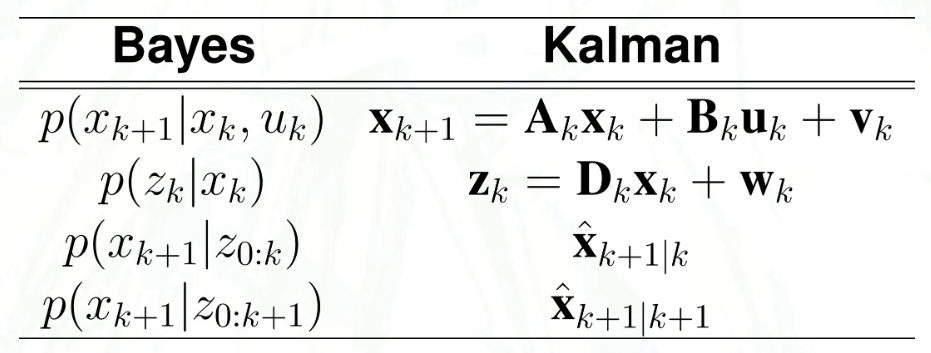

# Lecture 13, Oct 19, 2023

## Bayesian Localization

* Bayesian localization is a localization technique based on probability
	* Kalman filtering is a form of this for Gaussian distributions
* Let $p(x)$ be the probability that the robot is at location $x$
	* $x$ can represent a number of things, including a point in continuum state space (e.g. pose), discretized state space (e.g. a cell), or some descriptive location (e.g. a room in a building)
	* The first two are examples of ordered sets, which Kalman filters can do; the last is an unordered set, which we can do using a Bayesian Filter
* We will have a probability distribution described by $p(x)$; for ordered sets we can take the mean or media, for unordered sets we can take the mode
* Recall that for conditional probability, $p(x|z) = \sum _{\forall y} p(x|y, z)p(y|z)$
	* We will be making heavy use of Bayes' rule, $p(x|y) = \frac{p(y|x)p(x)}{p(y)}$
* For localization, we will assume the Markov property, $p(x_{k + 1} | x_k, x_{k - 1}, \dots, x_0) = p(x_{k + 1}|x_k)$, i.e. the probability of being in a state depends only on the previous state (and input) and not any of the states prior to that
* Let $z_{0:k} = z_0, z_1, \dots, z_k$ be a sequence of measurements up to and including time step $k$; the prediction of state $x_{k + 1}$ given measurements $z_{0:k}$ is denoted $p(x_{k + 1} | z_{0:k})$; the control inputs are $\upsilon _k, u_k$
* Start by predicting the state probabilities at $k + 1$ given the state at time $k$
	* $p(x_{k + 1}|z_{0:k}) = \sum _{\upsilon _k \in \Upsilon} p(x_{k + 1}|\upsilon _k, z_{0:k})p(\upsilon _k|z_{0:k}) = p(x_{k + 1}|\upsilon u_k, z_{0:k})$
	* If we assume we can deliver our desired control with certainty, $p(\upsilon _k|z_{0:k})$ is only 1 when $\upsilon _k = u_k$ and zero elsewhere, which is why we can get rid of the sum
* $p(x_{k + 1}|z_{0:k}) = p(x_{k + 1}|u_k, z_{0:k}) = \sum _{x_k \in \Lambda} p(x_{k + 1}|x_k, u_k, z_{0:k})p(x_k | z_{0:k})$
	* This considers all possible positions in the previous state, where $\Lambda$ is the entire state space
	* Assume $p(x_{k + 1}|x_k, u_k, z_{0:k}) = p(x_{k + 1}|x_k, u_k)$, that is, what the robot is doing is independent of the measurements
	* $p(x_{k + 1}|x_k, u_k)$ is just our state model that describes $x_{k + 1}$ in terms of $x_k$ and $u_k$
* The *a priori* state estimate is given by $p(x_{k + 1}|z_{0:k}) = \sum _{x_k \in \Lambda} p(x_{k + 1}|x_k, u_k)p(x_k|z_{0:k})$
	* By Bayes' rule, $p(x_{k + 1}|z_{0:k + 1}) = p(x_{k + 1}|z_{0:k}, z_{k + 1}) = \frac{p(z_{k + 1}|x_{k + 1}, z_{0:k})p(x_{k + 1}|z_{0:k})}{p(z_{k + 1}|z_{0:k})}$
	* Assume $p(z_{k + 1}|x_{k + 1}, z_{0:k}) = p(z_{k + 1}|x_{k + 1})$, i.e. the measurement has no dependence on previous measurements
		* This is our measurement model expressed probabilistically
* The *a posteriori* estimate is then $p(x_{k + 1}|z_{0:k + 1}) = \frac{p(z_{k + 1}|x_{k + 1})p(x_{k + 1}|z_{0:k})}{p(z_{k + 1}|z_{0:k})}$
	* The denominator is a normalization factor
* Therefore:
	* State prediction: $p(x_{k + 1}|z_{0:k}) = \sum _{x_k \in \Lambda} p(x_{k + 1}|x_k, u_k)p(x_k|z_{0:k})$
		* i.e. we take the state distribution we currently have, and we use the state prediction model to see what that distribution transforms into
	* State update: $p(x_{k + 1}|z_{0:k + 1}) = \frac{p(z_{k + 1}|x_{k + 1})p(x_{k + 1}|z_{0:k})}{\sum _{\xi _{k + 1} \in \Lambda} p(z_{k + 1}|\xi _{k + 1})p(\xi _{k + 1}|z_{0:k})}$
		* i.e. we take the predicted state distribution, and use the measurement model to see how likely each of the predicted states would yield the measurement that we got
	* Unlike Kalman filtering, now we get the entire probability distribution of the state instead of just the mean; however now we need to consider the entire possible state space

{width=50%}

## Particle Filtering

* Bayesian localization requires us to update all possible states at the same time; what if state space was continuous, or really large?
* The summations would become integrals for continuous probability distributions, but this is hard to compute
* Instead of treating the probabilities as continuous, we can instead use sampling
	* This is referred to as *particle filtering* or *Monte Carlo filtering*
	* We draw a set of discrete points $\Lambda _k = \Set{\bm x_k^{[1]}, \bm x_k^{[2]}, \dots, \bm x_k^{[p]}}$ from $p(\bm x_k)$ to represent the distribution; each of these points is called a *particle*
	* The basic idea is to follow each particle as if it describes the robot's pose, and hope that all particles converge on the robot's true pose
	* The pose at any given time can be estimated as $\hat{\bm x}_k = \sum _{i = 1}^p w_k^{[i]}\bm x_k^{[i]}$
	* Now the question is how to calculate the weights
* Particle filter procedure:
	* At each time $k$, draw a set of $p$ particles $\Lambda _{k}$ from $p(\bm x_k)$
		* If we know the initial location, we can sample the particles around it, otherwise can choose to evenly distribute the particles
	* For each particle calculate the prediction as $p(\bm x_{k + 1}^{[i]}|\bm z_{0:k}) = p(\bm x_{k + 1}^{[i]} | \bm x_k^{[i]}, \bm u_k)p(\bm x_k^{[i]}|\bm z_{0:k})$
	* Then update the state as $p(\bm x_{k + 1}^{[i]}|\bm z_{0:k + 1}) = \frac{p(\bm z_{k + 1}|\bm x_{k + 1}^{[i]})p(\bm x_{k + 1}^{[i]}|\bm z_{0:k})}{\sum _{\bm\xi_{k + 1}^{[j]} \in \Lambda _{k + 1}} p(\bm z_{k + 1}|\bm\xi_{k + 1}^{[j]})p(\bm\xi _{k + 1}^{[j]}|\bm z_{0:k})}$
	* Now we can estimate the state as $\hat{\bm x}_{k + 1} = \sum _{i = 1}^p w_{k + 1}^{[i]}\bm x_{k + 1}^{[i]}$, with the weight of each particle being its (normalized) probability
	* Update the probability distribution as $p(\bm x_{k + 1}|\bm z_{0:k + 1}) \gets p(\bm x_{k + 1}^{[i]} | \bm z_{0:k + 1}) \sim \sum _{i = 1}^p w_{k + 1}^{[i]}\phi(\bm x_{k + 1} - \bm x_{k + 1}^{[i]})$
		* This is combining the distributions of the individual particles
* One advantage of the particle filter is that it works on any probability distribution of states

