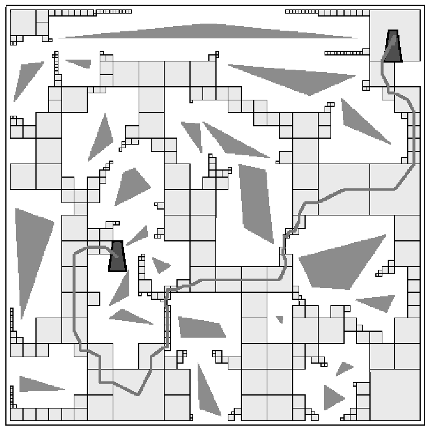

# Lecture 15, Oct 31, 2023

## Path Planning

* The path planning problem is about determining a path from a start pose to an end pose while being subject to constraints
	* Constraints can be created by obstacles, barriers, proscribed areas, etc
* The *configuration manifold* $C$ is the set of all possible states that the robot can exist in (given the robot's geometric constraints)
	* $C = \Set{\cvec{x}{y}{\theta} | x, y \in \reals, \theta \in S^1}$
	* Note $S^1$ is the set of all points on a circle
* Let $\Omega$ as the parts of the configuration manifold occupied by obstacles, barriers, and prohibited areas
* The *free-world manifold* $W = C\backslash \Omega$ is then all the points we are allowed to be
	* Note $A \backslash B = \Set{x | x \in A, x \notin B}$
* For manipulators, we can map the geometric workspace constraints to the configuration manifold
* We will examine 3 basic strategies in detail:
	1. Road-map method: identify a set of discrete routes within the free manifold
	2. Cell-decomposition method: discretizing the map and identifying free and occupied cells
	3. Potential-field method: imposes a field of resistance over obstacles, barriers, and prohibited areas that pushes back the robot

{width=50%}

### Road-Map Method

{width=30%}

* Visibility graph method: We can draw polygons around the obstacles in the configuration manifold and connect vertices with lines that don't cross any polygon
	* Using this set of connecting lines we can find an ideal path between two points
	* However this will slow down in cluttered environments as the number of vertices grow
	* This gives the shortest path, but will come as close as possible to obstacles

{width=30%}

* The Voronoi diagram method is the opposite and tries to pick a path that maximizes distance to obstacles
	* We essentially divide the space into regions that are closest to one point
		* Formally the cells are defined as $V_k = \Set{x \in S | d(x, P_k) \leq d(x, P_j) \forall j \neq k}$
	* We then use the boundaries between cells as possible routes, since this maximizes distance to obstacles
	* To build the diagram, we discretize the map into points,and for each point we compute the distance to the nearest obstacle and check which cell it belongs in
	* If obstacles are points, routes appear as edges of Voronoi cells; if obstacles are polygons, routes consist of straight and parabolic lines
	* The routes we get are usually far from shortest
	* Moving as far as possible from obstacles makes it difficult to localize if sensor ranges are short (e.g. sonar)
* Dijkstra's algorithm can be used once we discretize the space
	* Algorithm:
		1. Assign each node a tentative distance (infinite for undiscovered nodes)
		2. When visiting each node, calculate distance to all neighbouring nodes and update the their distance if it's shorter
		3. Choose the unvisited node with the shortest distance as the next node
	* Given $V$ vertices and $E$ edges, the complexity is $O(E + V\log V)$
	* This is guaranteed to find the shortest path
* To improve the search time we can use the A* algorithm, using a heuristic to direct the search towards the goal
	* Define the cost function $F(k) = G(k) + H(k)$ where $G(k)$ is the actual cost to the node and $H(k)$ is the heuristic estimate
	* The heuristic can be e.g. straight-line Euclidean distance to target
	* We want to ensure the heuristic never overestimates the actual cost, otherwise the algorithm will waste time
* Another way is to use Rapidly Expanding Random Trees (RRTs)
	* These were developed to deal particularly with high-dimensional planning problems
	* The solution space is explored by generating an expanding tree from the initial point towards the goal point; a kind of discretization is performed
	* Repeat until goal is reached:
		1. Begin with an initial point
		2. Select a random point in the free-world space
		3. Find the nearest point on the tree using some metric, e.g. shortest distance
		4. From the nearest point, determine a control input that takes the system towards the direction of the random point
		5. Apply this control input for one step and include the resulting point in the tree
	* The randomized discretization allows us to avoid the grid-like discretization of the graph search methods and generally generate smoother paths

### Cell Decomposition

* The general idea is to decompose the configuration space into free areas and occupied areas
	* The world is divided into cells, and then using adjacent free cells we construct a connectivity graph
	* We use the connectivity graph to find a path from start to finish
	* The final path is assembled by passing through the edge midpoints or following barriers

{width=50%}

* Exact cell decomposition decomposes space into exact shapes surrounding obstacles
	* The number of cells is small for sparse environments
	* However the implementation can be quite complex
* Approximate cell decomposition (i.e. *occupancy grid* approach) discretizes the world into a fixed-size grid and determines whether each cell is free
	* The number of cells is much larger but implementation is easier
	* A graph search algorithm can be used to find the path
	* We need a large number of cells to make them fine enough to get good resolution
* Adaptive cell decomposition uses an adaptive cell size; we start with a coarse grid, then occupied cells are decomposed further recursively using smaller cell sizes

{width=40%}

### Potential Field Method

* The robot is treated as a point under the influence of a potential field
	* The goal acts as an attractive force while obstacles act as repulsive forces
	* Robot travels towards the goal like a ball rolling down a hill
* In general $U(\bm x) = \bm U_\text{goal}(\bm x) + \sum _i U_{\text{obs},i}(\bm x)$
	* $\bm U_\text{goal}(\bm x)$ has a minimum when we reach the goal
	* $U_{\text{obs},i}(\bm x)$ increases when we get closer to the targets 
	* We can then find the force as $\bm f(\bm x) = -\del u(\bm x)$
	* Example:
		* Goal potential: $U_\text{goal} = \frac{1}{2}k_\text{goal}[(x - x_\text{goal})^2 + (y - y_\text{goal})^2]$
		* Obstacle potentials: $U_{\text{obs},i} = \twocond{\frac{1}{2}k_\text{obs}\left(\frac{1}{r_i} - \frac{1}{r_0}\right)^2}{r_i(\bm x) \leq r_0}{0}{r_i(\bm x) > r_0}$ where $r_0$ is some radius of influence
* Now to find the optimal path we can just use gradient descent
* However, we can get stuck in local minima and never reach the goal
	* This can be counteracted by adding a "momentum term"

