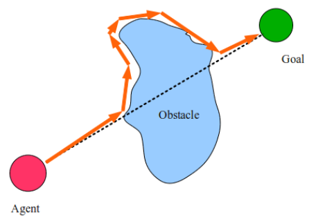
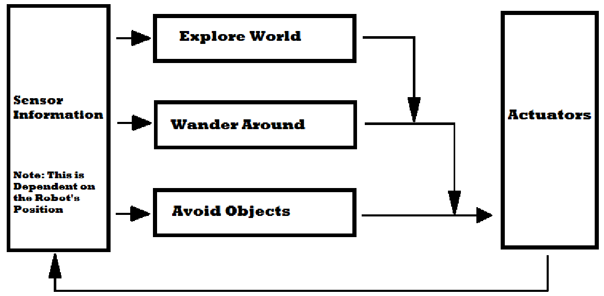

# Lecture 16, Nov 2, 2023

## Real-Time Obstacle Avoidance

{width=30%}

* The bug algorithm is the simplest obstacle avoidance algorithm; the robot just follows the perimeter of the obstacle and resumes on the desired path when possible
	* This assumes we can trace the edge of the obstacle, which is not realistic for non-holonomic robots
	* Only the most recent sensor reading is used so this is very susceptible to noise
* The bubble-band technique creates a bubble of free space around the robot; the bubble is elastic and sensor and obstacle uncertainty can be accounted for by adjusting the bubble
	* This requires a map
* The vector field histogram (VFH) algorithm builds a local probabilistic occupancy grid around the robot, and transforms it into polar coordinates; valleys where obstacle probability is low are identified as potential paths
	* The selected path is usually based on minimization of a path function
	* $G \sim c_1\Delta\phi _k + c_2\Delta\theta _k + c_3\Delta\theta _{k - 1}$
	* $\Delta\phi _k$ is the difference between the candidate path direction and the robot's preplanned desired path
	* $\Delta\theta _k$ is the difference in the candidate path direction and current direction
	* $\Delta\theta _k$ is the difference in the candidate path direction and previous directions
* The dynamic window approach (DWA) creates a search space for motion in terms of (linear and angular) velocities
	* Constraints and obstacles are represented as unfeasible areas in the velocity space
	* This allows us to take into account nonholonomic constraints
	* Like vector field histogram but in velocity space, whereas vector field histogram was about position
	* The path is approximated as a circular arc at each instant in time; each arc is defined by $(v_k, \omega _k)$ and limited to admissible velocities (i.e. velocities that allow us to stop in time)
	* Maximize a cost function, e.g. $G \sim c_1\frac{1}{\Delta\phi _k} + c_2\Delta d_k + c_3\norm{v_k, \omega_k}$ where $\Delta\phi$ is the change fro m the desired path, $\Delta d_k$ is the distance to obstacles

## Navigation and Control Architecture

* How do we design a navigation architecture?
* There are two ways to break down the architecture:
	* Temporal decomposition: distinguish processes having different levels of real-time demands
		* We can consider a hierarchy of processes that require increasing levels of temporal constraints
		* Offline planning (no temporal constraints), strategic decision making (few temporal constraints), quasi-real-time decision making (immediate action), real-time decision making (servo-level control)
	* Control decomposition: distinguish processes having different roles and running at different frequencies
		* Consider a hierarchy of processes that require increasing frequencies
		* Path planner, obstacle avoidance, emergency stop, low-level PID control
* There are 2 major paradigms:
	* Deliberative: traditional sense-plan-act; top-down approach
		* Some algorithm is used to determine the action to take
	* Reactive: parallelized planning with multiple concurrent, independent behaviours; most important action takes precedent; bottom-up approach
		* Action with the highest hierarchy gets executed
		* Subsumption architecture: higher levels of behaviour subsume lower levels

{width=80%}

* Subsumption philosophy has 4 principles:
	* Situatedness: "the world is its own best model"
		* The robot interacts with the environment directly without a world model
	* Embodiment: "the world grounds regress"
		* Using real physical systems, not theoretical or simulation models
		* Behaviours are grounded in the real world
	* Intelligence: "intelligence is determined by the dynamics of interaction with the world"
		* Perceptual and mobility skills are necessary for intelligence
	* Emergence: "intelligence is in the eye of the observer"
		* Individual low-level behaviors are not intelligent, but intelligence emerges from interaction of behaviours with each other and the world

