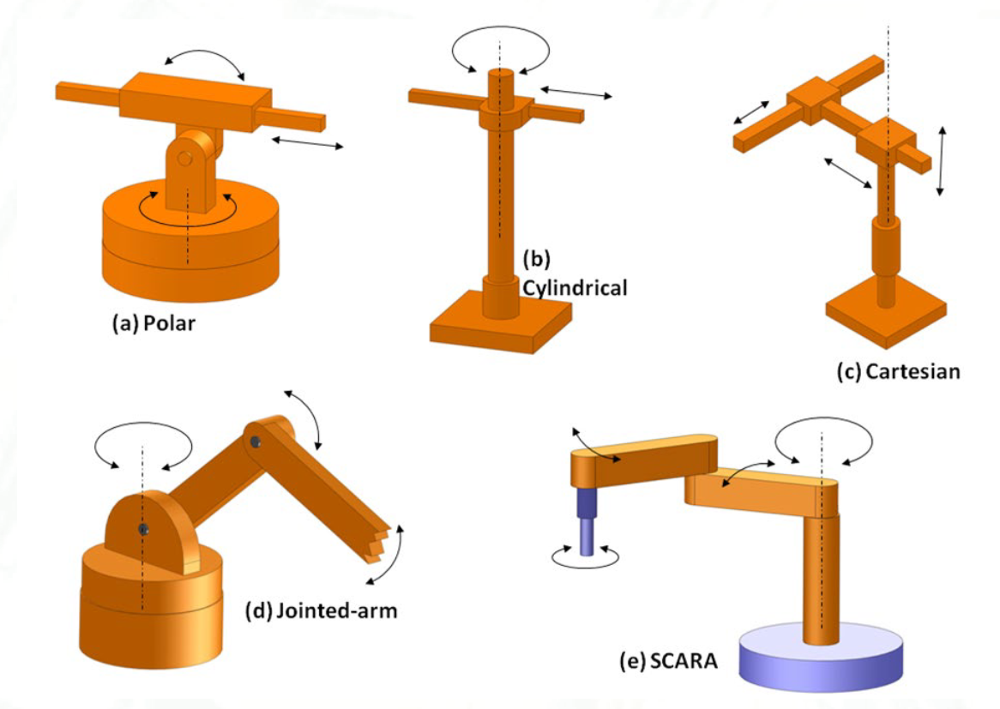
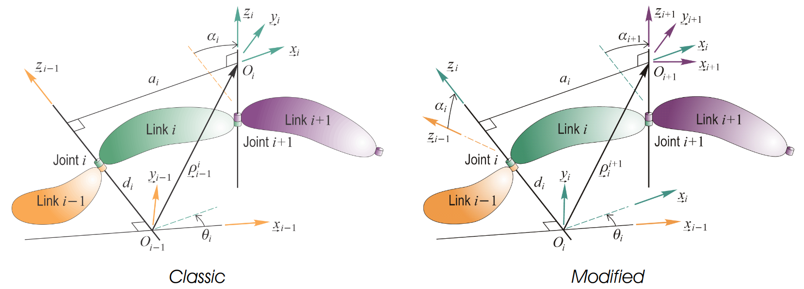
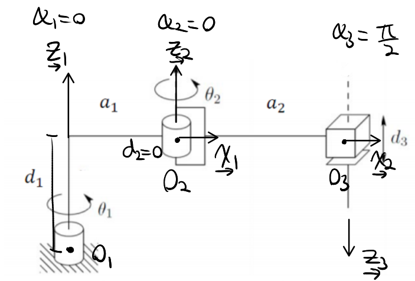

# Lecture 17, Nov 14, 2023

## Manipulators

* Two types of topologies: *open chains*, where there are no closed loops in the system, and *closed chains*
* We consider 2 types of joints: *revolute* (i.e. rotational) and *prismatic* (i.e. translational, extending/contracting)
	* Consider only 1 degree of freedom per joint

{width=80%}

* We are particularly interested in 3-DoF manipulators, because 3 independent degrees of freedom lets us place the end-effector anywhere in 3D translational space
	* Attaching another 3 degrees of freedom via a wrist will get us the rotations as well
* 3-DoF manipulators:
	* Cartesian: PPP (prismatic-prismatic-prismatic)
		* e.g. a 3D printer
		* Each degree of freedom covers a Cartesian coordinate
		* Workspace shape is a cube
	* Revolute/anthropomorphic: RRR (revolute-revolute-revolute)
		* e.g. ABB IRB1400
		* The joints are referred to as body, shoulder, forearm
	* SCARA (Selective Compliant Articulated Robot for Assembly): RRP (revolute-revolute-prismatic)
		* e.g. Epson E2L653S
	* Spherical/polar: RRP (revolute-revolute-prismatic)
		* e.g. the Stanford arm
		* Unlike SCARA the second revolute joint is rotated
	* Cylindrical: RPP (revolute-prismatic-prismatic)
		* e.g. Seiko RT3300

## Manipulator Geometry

* Rotation matrices form the *special orthogonal group*, $SO(3) = \Set{\bm C \in \reals^{3\times 3} | \bm C^T\bm C = \bm 1, \det\bm C = 1}$
	* Recall that a group is a set of elements $G$ and a binary operation $xy$ that is closed, associative, has an identity and inverse
	* Commutative groups (aka Abelian groups) have a commutative binary operation ($SO(3)$ is not Abelian)
	* $SO(3)$ is a *Lie group*, i.e. it is differentiable
* Given a point $\uvec w$ expressed in $\vcx F_b$ relative to $O_b$, we may want to express it in $\vcx F_a$ relative to $O_a$; $O_b$ has position $\uvec\rho$ relative to $O_a$
	* $\uvec v = \uvec w + \uvec\rho \iff \bm v_a = \bm C_{ab}\bm w_b + \bm\rho _a$
	* We can combine this as $\cvec{\bm v_a}{1} = \mattwo{\bm C_{ab}}{\bm\rho _a}{\bm 0^T}{1}\cvec{\bm w_b}{1} \implies \bm u_a = \bm T_{ab}\bm u_b$
		* Note this only works for position vectors
	* $\bm T_{ab}$ is a $4 \times 4$ matrix that generalizes rotations
	* $\bm T$ forms the *special Euclidean group* $SE(3) = \Set{\bm T = \mattwo{\bm C}{\bm\rho}{\bm 0^T}{1} \in \reals^{4\times 4} | \bm C^T\bm C = \bm 1, \det\bm C = 1}$
		* This is also a Lie group but not a commutative group
	* Note $\bm T^{-1} = \mattwo{\bm C^T}{-\bm C^T\bm\rho}{\bm 0^T}{1}$, and the identity of $SE(3)$ is $\bm 1_{4\times 4}$
	* In $SE(3)$, $\dot{\bm T}_{ab} = -\bm\Omega _a^{ab}\bm T_{ab}$ where $\bm\Omega _a^{ab} = \mattwo{{\bm\omega _a^{ab}}^\times}{\bm v_a^{ab}}{\bm 0^T}{0}$
		* This is a generalized form of Poisson's kinematical equation

### Denavit-Hartenberg Parameters

{width=100%}

* We can describe any series link manipulator with revolute and prismatic joints using *Denavit-Hartenberg parameters*
	* The DH parameters consist of 4 parameters per joint:
		1. Link length ($a_i$)
			* This is the length of a line segment normal to and joining $\uvec z_i, \uvec z_{i + 1}$ (direction $\uvec x_i = \uvec z_i \times \uvec z_{i + 1}$)
				* This could be longer than the actual physical length of the link due to the orientation of axes
			* The $\uvec z_i$ are the axes of each joint -- axis of rotation for revolute joints, axis of translation for prismatic joints
			* The intersection of this line and the link axes are the reference points $O_i$
				* Note if $\uvec z_i$ and $\uvec z_{i - 1}$ are parallel, this reference point can be anywhere
				* Note $O_i$ is not fixed with respect to link $i$, but link $i - 1$ instead (for a prismatic joint, $O_i$ can shift)
		2. Link twist ($\alpha _i$)
			* This is the angle between $\uvec z_{i - 1}$ and $\uvec z_i$
		3. Link offset ($d_i$)
			* This is the distance along $\uvec z_i$ from $O_i$ to the intersection of $\uvec x_i, \uvec z_i$
			* This is a variable if the joint is prismatic, fixed if the joint is revolute
		4. Joint angle ($\theta _i$)
			* This is the angle between $\uvec x_i$ and $\uvec x_{i - 1}$
			* This is a variable if the joint is revolute, fixed if the joint is prismatic
* Note that this is referred to as the *modified* DH parameters

{width=50%}

* The relative position of $O_{i + 1}$ from $O_i$ is $\rho _i^{i + 1} = d_i\uvec z_i + a_i\uvec x_i$
	* In $\uvec F_i$ we have $\uvec\rho _i^{i + 1} = \cvec{a_i}{0}{d_i}$
* Consider an arbitrary point $P$ with position $\uvec v_i$ relative to $O_i$; then $\uvec v_i = \uvec v_{i + 1} + \uvec\rho _i^{i + 1} = \uvec v_{i + 1} + d_i\uvec z_i + a_i\uvec x_i$
	* The rotation matrix from $\vcx F_{i - 1}$ to $\vcx F_i$ is $\bm C_{i,i - 1} = \bm C_3(\theta _i)\bm C_1(\alpha _i)$ (first rotate about $\uvec x_{i - 1}$, then rotate about $\uvec z_i$)
	* Therefore $\bm T_{i, i + 1} = \mattwo{\bm C_{i,i + 1}}{d_i\bm 1_3 + a_i\bm 1_1}{\bm 0^T}{1}$
	* Expanded out: $\bm T_{i, i + 1} = \begin{bmatrix} \cos(\theta _{i + 1}) & -\sin(\theta _{i + 1}) & 0 & a_i \\ \sin(\theta _{i + 1})\cos(\alpha _{i + 1}) & \cos(\theta _{i + 1}\cos(\alpha _{i + 1}) & -\sin(\alpha _{i + 1}) & 0 \\ \sin(\theta _{i + 1})\sin(\alpha _{i + 1}) & \cos(\theta _{i + 1})\sin(\alpha _{i + 1}) & \cos(\alpha _{i + 1}) & d_i \\ 0 & 0 & 0 & 1 \end{bmatrix}$

