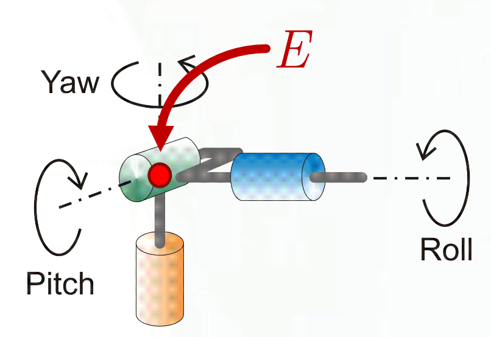

# Lecture 18, Nov 16, 2023

## Manipulator Jacobians

### Velocity

* Each joint gives us one degree of freedom $q_i = \twocond{\theta _i}{\text{joint is revolute}}{d_i}{\text{joint is prismatic}}$
* We want to know how, given a desired velocity of the end-effector, we can set the joint rates to achieve that velocity
* The manipulator Jacobian relates the end-effector velocity and angular velocity: $\bm v = \bm J(\bm q)\dot{\bm q}$
	* $\bm v = \cvec{\bm v_0^{ee}}{\bm\omega _0^{ee}}$ is the velocity (including translational and angular) velocity of the end-effector
		* Note that this is expressed in frame 0, which is our world/inertial frame
	* $\dot{\bm q}$ are the joint rates
	* $\bm J(\bm q) \in \reals^{m \times n}$ where $m \leq 6$ and $n$ is the number of joints; in general it is a function of the current joint states
* Partition the Jacobian as $\bm J(\bm q) = \cvec{\bm J^{(v)}(\bm q)}{\bm J^{(\omega)}(\bm q)}$, where one part is for linear velocity and the other part is for angular
	* Given an expression for the end-effector position we can simply differentiate it to get the translational velocity Jacobian
	* $\bm J^{(v)}(\bm q) = \pdiff{\bm r_0^{ee}}{\bm q^T}$ where $\bm r_0^{ee}$ is the position of the end-effector
	* Angular velocity however is more complicated since it's not the direct derivatives of the orientation variables
* For angular velocity $(\bm\omega _0^{ee})^\times \bm C_{0,n}\dot{\bm C}_{0, n}^T = \sum \bm C_{0,n}\pdiff{\bm C_{0,n}^T}{q_i}\dot q_i \equiv \sum _i (\bm\nu _i^{ee})^\times\dot q_i$
	* $\bm C_{0,i}$ is the rotation matrix from frame $i$ to the world frame
	* Therefore $\bm\omega _0^{ee} = \sum _i\bm\nu _i^{ee}\dot q_i$ and so $\bm J^{(\omega)} = \rvec{\bm \nu _1^{ee}}{\cdots}{\bm \nu _n^{ee}}$
* Using DH parameters:
	* Let $\uvec\rho _i^j = \sum _{k = i}^{j - 1} \uvec\rho _{k}^{k + 1}$ be the relative position of $O_j$ from $O_i$
	* Let $\uvec\omega _i^j = \sum _{k = i}^{j - 1}\uvec\omega _k^{k + 1}$ be the angular velocity of link $i$ with respect to link $j$
	* Let $\bm C_{ij} = \prod _{k = i}^{j - 1}\bm C_{k, k + 1}$ be the rotation matrix from frame $j$ to frame $i$
* Then $\uvec v^{ee} - {\uvec\rho _{0}^{n + 1}}^\dota$ and $\uvec\omega^{ee} = \uvec\omega _0^n$
	* Note the velocity is to $n + 1$ because we want the velocity of the end-effector (i.e. end of the last link), but the angular velocity is of the last link so it's to $n$
	* Note $\uvec \rho _i^{i + 1} = \vcx F_i^T\bm\rho _{i}^{i + 1}, \uvec\omega _{i - 1}^i = \vcx F_i^T\omega _{i - 1}^i$, i.e. $\bm\rho _i^{i + 1}$ and $\bm\omega _{i - 1}^i$ are both expressed in frame $i$
* For the angular velocity part:
	* $\uvec\omega _{i - 1}^i = \twocond{\dot\theta _i\uvec z_i}{\text{revolute joint}}{\uvec 0}{\text{prismatic joint}}$
	* $\uvec\omega^{ee} = \sum _{i = 1}^n \varepsilon _i\dot\theta\uvec z_i$
		* Note $\varepsilon _i$ is 1 if the joint is revolute, otherwise 0
	* $\uvec z_i = \vcx F_i^T\bm 1_3 \implies \bm\omega _0^{ee} = \sum _{i = 1}^n \varepsilon _i\bm C_{0, i}\bm 1_3\dot\theta _i$
	* The Jacobian is then $\bm J^{(\omega)} = \rvec{\bm j _1^{(\omega)}}{\cdots}{\bm j _n^{(\omega)}}$ where $\bm j _i^{(\omega)} = \varepsilon _i\bm C_{0,i}\bm 1_3$
* For the translational velocity part:
	* $\uvec v^{ee} = {\uvec \rho _{0}^{n + 1}}^\dota = \sum _{i = 0}^n {\uvec\rho _i^{i + 1}}^\dota$
	* ${\uvec\rho _i^{i + 1}}^\dota = {\uvec\rho _{i}^{i + 1}}^\dotb + \uvec\omega _0^i \times \uvec\rho _i^{i + 1}$
		* Recall $\uvec\rho _i^{i + 1} = d_i\uvec z_i + a_i\uvec x_i \implies {\uvec \rho _i^{i + 1}}^\dotb = (1 - \varepsilon _i)\dot d_i\uvec z_i + d_i\uvec z_i^\dotb + a_i\uvec x_i^\dotb$
		* But $\uvec x_i^\dotb = \uvec z_i^\dotb = \uvec 0$
	* Therefore ${\uvec\rho _i^{i + 1}}^\dota = (1 - \varepsilon _i)\dot d_i\uvec z_i + \uvec\omega _0^i \times \uvec\rho _i^{i + 1}$
	* Substitute $\uvec\omega _0^i = \sum _{k = 1}^i \varepsilon _k\dot\theta _k\uvec z_k$
	* So $\uvec v^{ee} = \sum _{i = 1}^n \left[(1 - \varepsilon _i)\dot d_i\uvec z_i + \sum _{k = 1}^i \varepsilon _k\dot\theta _k\uvec z_k \times \uvec\rho _i^{i + 1}\right]$
	* This reduces to $\uvec v^{ee} = \sum _{i = 1}^n \left[(1 - \varepsilon _i)\dot d_i\uvec z_i + \varepsilon _i\dot\theta _i\uvec z_i \times \uvec\rho _i^{n + 1}\right]$
	* In the world frame, $\bm v_0^{ee} = \sum _{i = 1}^n\left[(1 - \varepsilon _i)\dot d_i\bm C_{0,i}\bm 1_3 + \varepsilon _i\dot\theta _i\bm C_{0,i}\bm 1_3^\times\bm\rho _i^{n + 1}\right]$
	* Therefore $\bm J^{(v)} = \rvec{\bm j _1^{(v)}}{\cdots}{\bm j _n^{(v)}}$ where $\bm j _i^{(v)} = (1 - \varepsilon _i)\bm C_{0,i}\bm 1_3 + \varepsilon _i\bm C_{0,1}\bm 1_3^\times\bm\rho _i^{n + 1}$
* $\bm J = \rvec{\bm j _1}{\cdots}{\bm j _n}$ where $\bm j _i = \cvec{\bm j _i^{(v)}}{\bm j _i^{(\omega)}} = \twocond{\cvec{\bm C_{0,i}\bm 1_3^\times\bm\rho _i^{n + 1}}{\bm C_{0,i}\bm 1_3}}{\text{revolute joint}}{\cvec{\bm C_{0,i}\bm 1_3}{\bm 0}}{\text{prismatic joint}}$

### Force

* Define the joint control force/torque as $\uvec\eta _{i - 1}^i = \eta _i\uvec z_i = \twocond{\tau _i\uvec z_i}{\text{revolute joint}}{f_i\uvec z_i}{\text{prismatic joint}}$
	* This force or torque is between links $i - 1$ and $i$
* We can obtain the actual control input force by taking the dot product of the joint forces with $\uvec z_i$, since only 1 of 6 degrees of freedom of force is due to the input and the other are due to constraints
* How do we relate the control input force to the force delivered at the end-effector?
* Consider a free-body segment between links $i$ and $n$; assume this is static (i.e. ignoring inertial forces)
	* The interlink force and torque are $\uvec\tau _{i - 1}^i = \uvec\tau^{ee} + \uvec\rho _i^{n + 1} \times \uvec f^{ee}$ and $\uvec f_{i - 1}^i = \uvec f^{ee}$, derived from the FBD
* The control inputs are therefore $\eta _i = \twocond{\tau _i = \uvec z_i \cdot \uvec\tau^{ee} + \uvec z_i \cdot \rho _i^{n + 1} \times \uvec f^{ee}}{\text{revolute joint}}{f_i = \uvec z_i \cdot \uvec f^{ee}}{\text{prismatic joint}}$
	* Expressed in world frame: $\eta _i = \twocond{\tau _i = (\bm C_{0, i}\bm 1_3)^T\bm\tau _0^{ee} + (\bm C_{0,i}\bm 1_3^\times\bm\rho _{i}^{n + 1})^T\bm f_0^{ee}}{\text{revolute joint}}{f_i = (\bm C_{0,i}\bm 1_3)^T\bm f_0^{ee}}{\text{prismatic joint}}$
* This gives $\bm\eta = \bm J^T(\bm q)\bm f$ where $\bm f = \cvec{\bm f_0^{ee}}{\bm\tau _0^{ee}}$, where the Jacobian is the same as before

### Acceleration

* $\bm a = \dot{\bm v} = \cvec{\dot{\bm v}_0^{ee}}{\dot{\bm\omega}_0^{ee}}$
* So $\bm a = \bm J(\bm q)\ddot{\bm q} + \dot{\bm J}(\bm q)\dot{\bm q}$
* We can write $\dot{\bm J(\bm q)}\dot{\bm q} = \operatorname{col}\left[\sum _{j = 1}^n\sum _{k = 1}^n \pdiff{J_{ik}}{q_j}\dot q_j\dot q_k\right]$

## Kinematics

* Forward kinematics is finding $\bm v$ given $\dot{\bm q}$ and $\bm q$; this is easy if we have the Jacobian
* Inverse kinematics is the problem of finding $\dot{\bm q}$ given $\bm v$ (and integrating for $\bm q$); in general this is much more challenging
* If the Jacobian is square and invertible, then we can simply find $\dot{\bm q} = \bm J^{-1}(\bm q)\bm v$
* If it is not invertible, assuming $m < n$ (i.e. we have more joints/DoF than spacial dimensions), we can try using the *pseudoinverse*
	* Provided $\rank\bm J = m$, $\bm J\bm J^T$ is invertible
	* Define the *(Moore-Penrose) pseudoinverse* $\bm J^\dagger = \bm J^T(\bm J\bm J^T)^{-1}$, so $\bm J\bm J^\dagger = \bm 1 \in \reals^{m \times m}$
* Then in general if $\rank\bm J = m$, $\dot{\bm q} = \bm J^\dagger\bm v + (1 - \bm J^\dagger\bm J)\bm b$, for any $\bm b \in \reals^n$ (i.e. we have an infinite number of solutions)
	* Note that $(\bm 1 - \bm J^\dagger\bm J)\bm b \in \ker\bm J$
	* Take $\bm b = \bm 0$ if we want to minimize the joint rates
* What about square but non-invertible $\bm J$ or $\rank\bm J < m$?
	* In this case we have a *singularity* -- we cannot solve for $\dot{\bm q}$ given an arbitrary $\bm v$
* At singularities, configurations with motion in certain directions may be unattainable
	* These often occur at boundaries of the workspace
	* Finite end-effector rates might imply infinite joint rates
	* Finite joint forces/torques might imply infinite end-effector forces and torques

\noteDefn{A \textit{singularity} occurs at $\bm q$ when $\rank\bm J(\bm q) < m$, or equivalently $\det(\bm J(\bm q)\bm J(\bm q)^T) = 0$, where $m$ is the dimension of the workspace.}

{width=80%}

{width=30%}

* Singularities for the above arm occur at $\theta _3 = 0, \pi$ or $\theta _3 = -2\theta _2$
	* At $\theta _3 = -2\theta _2$, the end-effector will be on the $z$ axis, so any $\theta _1$ gives us the same end-effector position; therefore we can't solve for $\theta _1$
	* At $\theta _3 = 0$, the links are in a straight line, so we can't get any motion along that line
	* At $\theta _3 = \pi$, the arm is folded back on itself, so again we can't get any motion on that line

{width=50%}

* Translation and rotation of an end-effector can be theoretically uncoupled if we have a *wrist-partitioned arm*, if:
	* Last 3 joints are revolute with axes passing through the common centre $E$
	* Successive axes are not parallel
	* $E$ can be placed arbitrarily in position space
* Practically however the end-effector is always displaced from $E$

