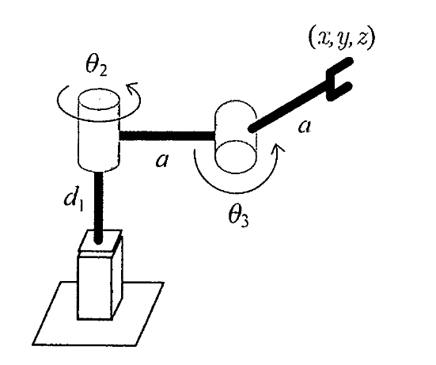

# Lecture 19, Nov 21, 2023

## Manipulator Examples

{width=50%}

* For the PRR manipulator above, with joint variables $d_1, \theta _2, \theta _3$ (where $\theta _3$ is measured relative to the second link), determine:
	* Displacement $(x, y, z)$ of the end-effector
		* We can do this by inspection from the geometry
		* $\bm r = \cvec{x}{y}{z} = \cvec{a(1 + \cos\theta _3)\cos\theta _2}{a(1 + \cos\theta _3)\sin\theta _2}{d_1 + a\sin\theta _3}$
	* The Jacobian $\bm J^{(v)}$, with the translational velocity only
		* Since we have $\bm r(d_1, \theta _2, \theta _3)$ we can directly differentiate to find the Jacobian
		* $\bm J^{(v)} = \matthreeb{0}{-a(1 + \cos\theta _3)\sin\theta _2}{-a\sin\theta _3\cos\theta _2}{0}{a(1 + \cos\theta _3)\cos\theta _2}{-a\sin\theta _3\sin\theta _2}{1}{0}{a\cos\theta _3}$
	* Singularities of the system
		* The singularity condition is $\det(\bm J\bm J^T) = 0$, which for a square $\bm J$ is equivalent to $\det\bm J = 0$
		* Since the first column has only a single 1, the determinant is given by the determinant of the 2x2 matrix at the top right
		* $\alignedeqntwo[t]{\det\bm J}{a(1 + \cos\theta _3)\sin\theta _2a\sin\theta _3\sin\theta _2 + a\sin\theta _3\cos\theta _2a(1 + \cos\theta _3)\cos\theta _2}{a^2(1 + \cos\theta _3)\sin\theta _3\sin^2\theta _2 + a^2(1 + \cos\theta _3)\sin\theta _3\cos^2\theta _2}{a^2\sin\theta _3(1 + \cos\theta _3)}$
		* This gives us $\theta _3 = 0, \pi$
		* Intuitively, at $\theta _3 = 0$, the last 2 links are aligned; this means we need an infinite $\dot\theta _3$ to get a finite EE velocity; at $\theta _3 = \pi$ the last links are folded on each other, so any angle of $\theta _2$ results in the same EE position, and we also have the infinite velocity issue; additionally $\dot d_1$ results in the same $\dot z$ as $\dot\theta _3$
			* Notice $\theta _3 = \pi$ is a double root, which corresponds to the two different interpretations
	* The required joint force and torques required to deliver a force $f^{ee}$ applied in the downward direction, when $d_1 = a, \theta _2 = 0, \theta _3 = -45\degree$
		* Recall: $\bm\eta = \bm J^T\bm f$
		* In this configuration, $\bm J = \matthreeb{0}{0}{\frac{a\sqrt{2}}{2}}{0}{a\left(1 + \frac{\sqrt{2}}{2}\right)}{0}{1}{0}{a\frac{\sqrt{2}}{2}}$
		* $\bm f = \cvec{0}{0}{-f^{ee}}$
		* Therefore $\bm\eta = \cvec{-f^{ee}}{0}{-\frac{a\sqrt{2}}{2}f^{ee}}$

