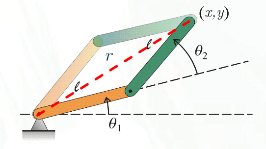
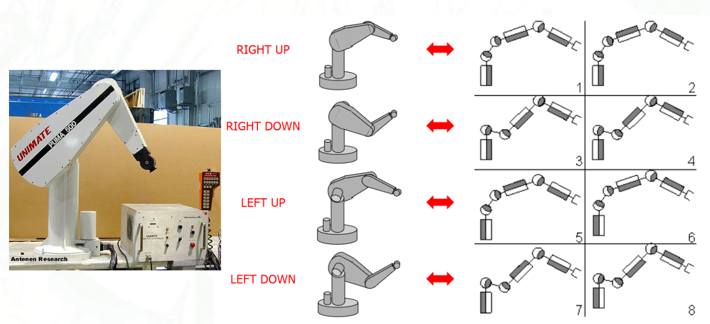
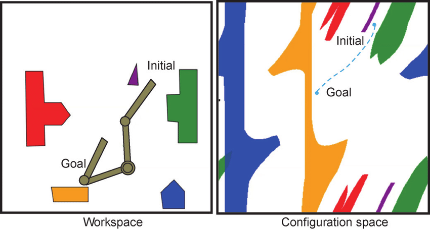
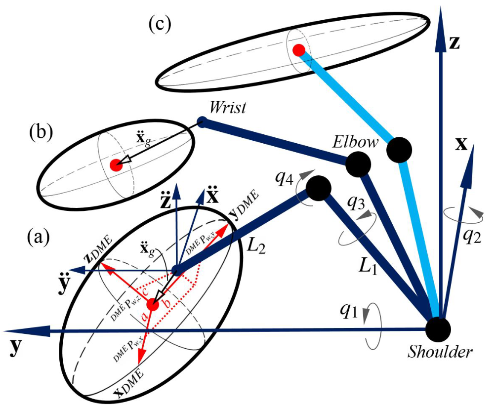
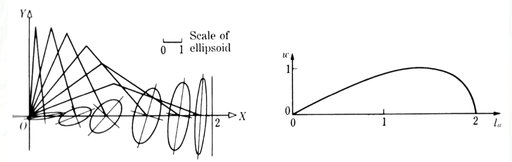
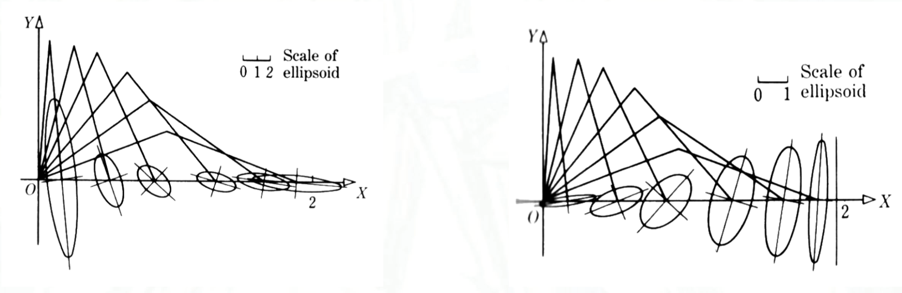

# Lecture 20, Nov 23, 2023

## Geometry in $SE(3)$

* We can represent the position of the end-effector using $SE(3)$ transformations
	* $\bm u^{ee} = \left(\prod _{i = 1}^n \bm T_{i - 1}\right)\bm u_n^{n + 1}$ (note the $\bm u_n^{n + 1}$ brings us from the last joint to the end-effector)
	* In matrix form: $\cvec{\bm r^{ee}}{1} = \mattwo{\bm C_{i - 1,i}}{\bm\rho _{i - 1}^i}{\bm 0^T}{1}\cvec{\bm\rho _n^{n + 1}}{1}$
* The orientation of the end-effector is given by $\bm C^{ee} = \prod _{i = 1}^n \bm C_{i - 1,i}$
* We can combine both into the pose: $\bm T^{ee} = \prod _{i = 1}^{n + 1}\bm T_{i - 1,i}$
	* $\bm T^{ee} = \mattwo{\bm C_{0,n}}{\bm r^{ee}}{\bm 0^T}{1}$
	* $\bm T_{n,n+1} = \mattwo{\bm 1}{\bm\rho _n^{n + 1}}{\bm 0^T}{1}$
		* We added this to bring us from the last joint to the end-effector

## Inverse Kinematics

* Technically inverse "geometry"
* In general, $\bm r^{ee} = \bm f_r(\bm q), \bm\theta^{ee} = \bm f_\theta(\bm q) \implies \bm p^{ee} = \bm f(\bm q)$ where $\bm p^{ee}$ is the end-effector pose
	* Given $\bm q$, solving for $\bm p^{ee}$ is the problem of *forward kinematics*
	* Given $\bm p^{ee}$, solving for $\bm q$ is the problem of *inverse kinematics*
* Solving inverse kinematics often requires numerical techniques, and often has multiple (possibly infinite) solutions

{width=40%}

{width=80%}

* For the example above, we can solve for the angles using the cosine law; the $\cos^{-1}$ gives two possible solutions, one for positive $\theta _2$ and one for negative $\theta _2$
* A 6-DoF robotic arm with revolute joints can have as many as 16 solutions depending on the link lengths
* Incremental solution technique: given a solution at $\bm q$ corresponding to $\bm p^{ee}$, what if we changed $\bm p^{ee}$ by a small $\Delta\bm p^{ee}$?
	* $\cvec{\bm v^{ee}}{\bm\omega^{ee}} = \bm J(\bm q)\dot{\bm q} \implies \cvec{\Delta t\bm v^{ee}}{\Delta t\bm\omega^{ee}} = \bm J(\bm q)\Delta q$
	* Therefore $\Delta\bm p^{ee} = \cvec{\Delta\bm r^{ee}}{\Delta\bm\phi^{ee}} = \bm J(\bm q)\Delta\bm q$ (since for small angular displacements only, we can directly multiply by $\Delta t$ to get $\Delta\bm\phi$)
	* Notice that this look exactly like the kinematical relation; we can now use the pseudoinverse to solve for it
* $\Delta\bm q = \bm J^\dagger(\bm q)\Delta\bm p^{ee} + (\bm 1 - \bm J^\dagger\bm J)\bm b$ where $\bm J^\dagger = \bm J^T(\bm J\bm J^T)^{-1}$
	* But this doesn't quite do it because the inverse can be big, even when $\Delta p^{ee}$ is small
* The *damped least-squares technique* (aka Levenberg-Marquardt method) is a variation on the incremental technique
	* Minimize $\norm{\Delta\bm p^{ee} - \bm J(\bm q)\Delta\bm q}^2 + \lambda^2\norm{\Delta\bm q}^2$
	* $\lambda$ is a damping term which makes sure that our $\Delta q$s are small -- this is known as *regularization*
		* If we're talking about a pose, we can use $\bm T$ and use a matrix norm
	* This is equivalent to minimizing $\norm*{\cvec{\Delta\bm p^{ee}}{\bm 0} - \cvec{\bm J}{\lambda\bm 1}\Delta\bm q}$, which is like a linear regression minimizing $\norm{\bm b - \bm A\bm x}$
		* Therefore this is satisfied by $\bm A^T\bm A\bm x = \bm A^T\bm b \implies \cvec{\bm J}{\lambda\bm 1}^T\cvec{\bm J}{\lambda\bm 1}\Delta\bm q = \cvec{\bm J}{\lambda\bm 1}^T\cvec{\Delta\bm p^{ee}}{\bm 0}$
	* This reduces to $\Delta\bm q = (\bm J^T\bm J + \lambda^2\bm 1)^{-1}\bm J^T\Delta\bm p^{ee}$
		* The addition of the $\lambda\bm 1$ term regularizes the solution and keeps the inverse small even when $\bm J^T\bm J$ is close to singular

## Planning

{width=70%}

* How do we get from work (task) space to configuration space?
* Recall that $C$, the configuration manifold, is the set of all possible points for the manipulator; $\Omega$ is all the parts of the configuration manifold occupied by obstacles, barriers and prohibited areas; then the free world manifold is $W = C\backslash\Omega$
* For a simple manipulator like the 2-link manipulator in 2 dimensions, we can calculate exactly where the links are and check that points on the links do not overlap obstacles
* In general, an analytical expression for this might be impossible to obtain, so we must resort to numerical methods
* The simplest way is to test point by point whether the manipulator at a given point in configuration space intersects obstacles
	* Take a point $\bm q$ in $C$ and determine all the points in the manipulator, $\mathcal M(\bm q)$
	* Make sure that $\mathcal M(\bm q) \cap \mathcal O_{i,\text{work}} = \emptyset$, then $\bm q$ is accessible in $C$
* Path planning techniques for mobile robots can also be used for manipulators in configuration space, e.g. road-map methods, Dijkstra's/$A^*$, potential fields, RRTs

## Manipulability

* How can we measure quantitatively the ability of a manipulator to undertake a task? Can we provide a measure of the maneuverability or manipulability for a manipulator?
* We can do this kinematically or dynamically
* Consider an $n$-link manipulator; taking just the velocity partition, we have $\bm v = \bm J^{(v)}(\bm q)\dot{\bm q}$ (we will drop the superscript from here on)
* Consider the set of all possible end-effector velocities $\bm v$ realizable by joint rates contained by $\norm{\dot{\bm q}}^2 \leq 1$; intuitively, the larger this set, the more "manipulable" the manipulator is
	* Note this requires some weighting and/or non-dimensionalization if both revolute and prismatic joints are involved
	* This set will turn out to be an ellipsoid, which is called the *manipulability ellipsoid*

{width=50%}

* Recall that away from a singularity, $\dot{\bm q} = \bm J^\dagger\bm v + (\bm 1 - \bm J^\dagger\bm J)\bm b$
	* This gives $\norm{\dot{\bm q}}^2 = \dot{\bm q}^T\dot{\bm q} \geq \bm v^T(\bm J^\dagger)^T\bm J^\dagger\bm v$
	* Therefore the manipulability ellipsoid is $\bm v^T(\bm J^\dagger)^T\bm J^\dagger\bm v \leq 1$
* The principal axes of this ellipsoid represent how fast the ellipsoid can move
	* The size is given by the eigenvalues of $(\bm J^\dagger)^T\bm J^\dagger$ (like the energy/momentum ellipsoid derivation)
	* Note that substituting in the definition for $\bm J^\dagger$, we have $(\bm J^\dagger)^T\bm J^\dagger = (\bm J\bm J^T)^{-1}$
* Consider the SVD of $\bm J$: $\bm J = \bm U\bm\Sigma\bm V^T$
	* For us, $m < n$ so $\bm\Sigma$ has several zero columns at the end
	* Note that the singular values are the square roots of the eigenvalues of $\bm J\bm J^T$
	* Then $\bm J^\dagger = \bm J^T(\bm J\bm J^T)^{-1} = \bm V\bm\Sigma^T\bm U^T(\bm U\bm\Sigma\bm V^T\bm V\bm\Sigma^T\bm U^T)^{-1} = \bm V\bm \Sigma^T(\bm\Sigma\bm\Sigma^T)^{-1}\bm U^T$
	* And $(\bm J^\dagger)^T\bm J^\dagger = (\bm J\bm J^T)^{-1} = \bm U(\bm\Sigma\bm\Sigma^T)^{-1}\bm U^T$
	* So $\bm v^T(\bm J^\dagger)\bm J^\dagger\bm v = \bm v^T\bm U(\bm\Sigma\bm\Sigma^T)^{-1}\bm U^T\bm v \leq 1$ gives the ellipsoid
	* Let $\bm z = \bm U^T\bm v$, then we have $\bm z^T(\bm\Sigma\bm\Sigma^T)^{-1}\bm z = 1$
	* So in terms of $z$, we get $\frac{z_1^2}{\sigma _1^2} + \frac{z_2^2}{\sigma _2^2} + \frac{z_3^2}{\sigma _3^2} = 1$ -- an ellipsoid with axes $\sigma _1, \sigma _2, \sigma _3$
* Given the ellipsoid, we can define several different measures of manipulability:
	* $w_1(\bm q) = \sigma _1\sigma _2\sigma _3 = \sqrt{\det(\bm J(\bm q)\bm J^T(\bm q))}$ (ellipsoid volume)
	* $w_2(\bm q) = \frac{\sigma _\text{min}}{\sigma _\text{max}}$ (ellipsoid stretching)
	* $w_3(\bm q) = \sigma _\text{min}$ (length of shortest axis)
	* $w_4(\bm q) = (\sigma _1\sigma _2\sigma _3)^\frac{1}{3} = w_1^\frac{1}{3}(\bm q)$ (geometric mean of the axes)

{width=70%}

* For the 2-link manipulator, we have $w = \abs{\det(\bm J)} = l^2\abs{\sin\theta _2}$
	* Notice that this is not dependent on $\theta _1$
	* The ellipsoid is rounder when we have intermediate values of $\theta _2$
	* At the singularities, the ellipsoid collapses to a line, so the manipulability also drops to 0
* Recall that $\bm\eta = \bm J^T\bm f$, so we can address manipulability from a force/torque perspective using this dual relation
	* Consider $\norm{\bm\eta}^2 \leq 1$
	* Going through the same steps yields $\bm f^T\bm J\bm J^T\bm f = 1 \implies \sigma _1^2f_1^2 + \sigma _2^2f_2^2 + \sigma _3^2f_3^2 = 1$
	* Notice that this flips the intercepts of the ellipsoid
	* e.g. in the diagram below, larger kinematics ellipsoids result in smaller force ellipsoids

{width=70%}

