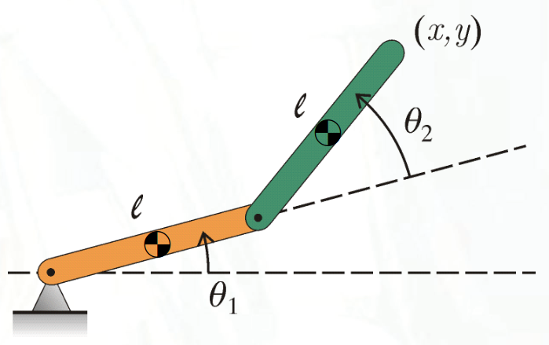

# Lecture 21, Nov 28, 2023

## Manipulator Dynamics

* For typical mobile robots, dynamics aren't all too important to their motion
* But for manipulator systems, we may need fast movements, making dynamics important
* We would like to derive the equations of motion for manipulators, using the Lagrangian formulation

{width=40%}

* Consider the 2-link manipulator with coordinates $\theta _1, \theta _2$, both links with length $l$, masses $m_1, m_2$, and moments of mass a bout joints $c_1, c_2, I_1, I_2$, and centres of mass at midlink
	* $T_1 = \frac{1}{2}m_1\left(\frac{1}{2}l\dot\theta _1\right)^2 + \frac{1}{2}I_{\scom, 1}\dot\theta _1^2 = \frac{1}{2}\left(I_{\scom,1} + \frac{1}{4}m_1l^2\right)\dot\theta _1^2 = \frac{1}{2}I_1\dot\theta _1^2$
		* Note we started with the kinetic energy relative to the centre of mass, where we have both a translational and a rotational component
		* This is equivalent to applying the parallel axis theorem
	* The speed of link 2's centre of mass is $v_{\scom, 2}^2 = (l\dot\theta _1)^2 + \left(\frac{1}{2}l(\dot\theta _1 + \dot\theta _2)\right)^2 + l^2\dot\theta _1(\dot\theta _1 + \dot\theta _2)\cos\theta _2$
		* Note we can obtain this by the cosine law
	* $\alignedeqntwo[t]{T_2}{\frac{1}{2}m_2\left((l\dot\theta _1)^2 + \left(\frac{1}{2}l(\dot\theta _1 + \dot\theta _2)\right)^2 + l^2\dot\theta _1(\dot\theta _1 + \dot\theta _2)\cos\theta _2\right) + \frac{1}{2}I_{\scom,2}(\dot\theta _1 + \dot\theta _2)^2}{\frac{1}{2}m_2(l\dot\theta _1)^2 + c_2(l\dot\theta _1)(\dot\theta _1 + \dot\theta _2)\cos\theta _2 + \frac{1}{2}I_2(\dot\theta _1 + \dot\theta _2)^2}$
		* $c_2 = \frac{1}{2}m_2l, I_2 = I_{\scom,2} + \frac{1}{4}m_2l^2$
		* $c_2$ is the first moment of mass of link 2 about its joint
	* $V_1 = \frac{1}{2}m_1gl\sin\theta _1, V_2 = m_1gl\left(\sin\theta _1 + \frac{1}{2}\sin(\theta _1 + \theta _2)\right)$
	* Virtual work done at joints: $\overarc{\delta W}_2 = \tau _1\delta\theta _1, \overarc{\delta W}_2 = \tau _2\delta\theta _2$
	* $(I_1 + I_2 + m_2l^2 + 2c_2l\cos\theta _2)\ddot\theta _1 + (I_2 + c_2l\cos\theta _2)\ddot\theta _2 - c_2l(2\dot\theta _1 + \dot\theta _2)\dot\theta _2\sin\theta _2 + \left(\frac{1}{2}m_1 + m_2\right)gl\cos\theta _1 + \frac{1}{2}m_2gl\cos(\theta _1 + \theta _2) = \tau _1$
	* $(I_2 + c_2l\cos\theta _2)\ddot\theta _1 + I_2\ddot\theta _2 + c_2l\dot\theta _1^2\sin\theta _2 + \frac{1}{2}m_2gl\cos(\theta _1 + \theta _2) = \tau _2$
	* We can cast this in a general form: $\bm M(\bm q)\ddot{\bm q} + \bm h(\bm q, \dot{\bm q}) - \bm f^g(\bm q) = \bm u(t)$
		* $\bm q = \cvec{\theta _1}{\theta _2}$ are the coordinates
		* $\bm u = \cvec{\tau _1}{\tau _2}$ are the applied forces
		* $\bm f^g(\bm q) = \cvec{-\left(\frac{1}{2}m_1 + m_2\right)gl\cos\theta _1 - \frac{1}{2}m_2gl\cos(\theta _1 + \theta _2)}{-\frac{1}{2}m_2gl\cos(\theta _1 + \theta _2)}$
		* $\bm M(\bm q) = \mattwo{I_1 + I_2 + m_2l^2 + 2c_2l\cos\theta _2}{I_2 + c_2l\cos\theta _2}{I_2 + c_2l\cos\theta _2}{I_2}$
			* This is the mass matrix, and it's symmetric positive definite
		* $\bm h(\bm q, \dot{\bm q}) = \cvec{-c_2l(2\dot\theta _1 + \dot\theta _2)\dot\theta _2\sin\theta _2}{c_2l\dot\theta _1^2\theta _2}$
* In general, the kinetic energy of link $i$ is $T_i = \frac{1}{2}m_i\bm{\mathrm v}_i^T\bm{\mathrm v}_i - \bm{\mathrm v}_i^T\bm c_i^\times\bm\omega _i + \frac{1}{2}\bm \omega _i^T\bm I_i\bm\omega _i$
	* Note this uses $O_i$ as a reference point
	* We may write this as $T_i = \frac{1}{2}\bm v_i^T\bm M_i\bm v_i$
	* $\bm v_i = \cvec{\bm {\mathrm v}_i}{\bm\omega _i}, \bm M_i = \mattwo{\bm m_i\bm 1}{-\bm c_i^\times}{\bm c_i^\times}{\bm I_i}$
	* Note $\bm M_i = \int \cvec{\bm 1}{\bm s^\times}\cvec{\bm 1}{\bm s^\times}^T\,\dm$
	* These are the generalized velocity and mass matrices
* We can build a Jacobian for link $i$ like the end-effector: $\bm v_i = \bm J_1(q_1, \dots, q_i)\dot{\bm q}$
	* Note that this is a function of only the coordinates up to $q_i$, since we have a serial manipulator
	* Therefore columns of $\bm J_i$ after column $I$ are zero
	* Also, this Jacobian is expressed in the link frame, instead of the world frame
		* i.e. $\bm J_i = \mattwo{\bm C_{i, 0}}{\bm 0}{\bm 0}{\bm C_{i, 0}}\bm J_i'$, where the latter is in the world frame
	* Note for a prismatic joint, $\bm M_i$ is dependent on $d_i$ (since the reference point $O_i$ changes with $d_i$)
		* With the moving reference point, $\bm s$ changes with $d_i$
		* Suppose we pick some reference point $O_i'$ fixed to the link, with position $\bm r$ relative to $O_i$, then $\bm s = \bm r + d_i\bm 1_3$
		* $\cvec{\bm 1}{\bm s^\times} = \mattwo{\bm 1}{\bm 0}{d_i\bm 1_3^\times}{\bm 1}\cvec{\bm 1}{\bm r^\times} = \bm D\cvec{\bm 1}{\bm r_\times}$
		* Therefore $\bm M_i = \bm D\bm M_{i,O_i'}\bm D^T$, where $\bm M_{i,O_i'}$ is independent of $d_i$, but $\bm D$ is
		* This doesn't really matter in the end since we need to add up all the kinetic energies in the end
* $T_i = \frac{1}{2}\dot{\bm q}^T\bm J_i^T(\bm q)\bm M_i\bm J_i(\bm q)\dot{\bm q}$
	* For the whole manipulator, $T = \sum _{i = 1}^n T_i = \frac{1}{2}\dot{\bm q}^T\left[\sum _{i = 1}^n\bm J_i^T(\bm q)\bm M_i\bm J_i(\bm q)\right]\dot{\bm q}$
		* We can define the middle part as the mass matrix for the whole arm
		* $\bm M(\bm q) = \sum _{i = 1}^n \bm J_i^T(\bm q)\bm M_i\bm J_i(\bm q)$
	* $T = \frac{1}{2}\dot{\bm q}^T\bm M(\bm q)\dot{\bm q}$
		* Note that this $\bm M$ is symmetric and positive definite, since if any joint is moving, we will have some amount of kinetic energy
* For gravitational potential energy, the centre of mass of link $i$ is $\bm r_{0}^{i,\scom} = \cvec{\bm\rho _0^{i,\scom}}{1} = \cvec{\bm C_{0, i}}{\bm \rho _0^i}{\bm 0^T}{1}\cvec{\bm\rho _{i}^{i,\scom}}{1} = \bm T_{0,i}\bm r_{i}^{i,\scom}$
	* The height is then $h^{i,\scom} = \bm k^T\bm r_0^{i,\scom} = \bm k^T\bm T_{0,i}\bm r_i^{i,\scom}$
	* $\bm k = \cvec{\bm 1_3}{0}$
* Therefore $V_i = m_ig\bm k^T\bm T_{0,i}\bm r_i^{i,\scom}$ so $\bm V = \sum _{i = 1}^n V_i = \sum _{i = 1}^n m_ig\bm k^T\bm T_{0,i}\bm r_i^{i,\scom}$
* The virtual work done is $\overarc{\delta W}_i^\text{con} = u_i\delta q_i$ so $\overarc{\delta W}^\text{con} = \sum _i u_i\delta q_i = \delta\bm q^T\bm u$
	* If we have friction, $\overarc{\delta W}_i^f = f_i(q_i, \dot q_i)\delta q_i$
	* Then $\overarc{\Delta W}^f = \sum _i f_i\delta q_i = \delta\bm q^T\bm f^f(\bm q, \dot{\bm q})$
	* If we have forces at the end-effector, we also have $\overarc{\delta W}^{ee} = \delta\bm q^T\bm J^T(\bm q)\bm f^{ee}$
* The total non-conservative virtual work is then $\overarc{\delta W} = \delta\bm q^T(\bm u + \bm f^f + \bm J^T(\bm q)\bm f^{ee})$
* The resulting equation of motion is $\bm M(\bm q)\ddot{\bm q} + \bm h(\bm q, \dot{\bm q}) - \bm f^f(\bm q, \dot{\bm q}) - \bm f^g(\bm q) - \bm J^T(\bm q)\bm f^{ee} = \bm u(t)$
	* $\bm f^f$ are the frictional forces, $\bm f^g$ are the gravitational forces and $\bm f^{ee}$ are the forces at the end-effector
	* $\bm h(\bm q, \dot{\bm q})$ is a nonlinear inertial term
	* $h_k = \sum _{j = 1}^n \left(\dot M_{kj} - \frac{1}{2}\sum _{i = 1}^n\pdiff{M_{ij}}{q_k}\dot q_i\right)\dot q_j$
* Like kinematics, we have 2 problems: inverse dynamics (given a trajectory $\bm q, \dot{\bm q}, \ddot{\bm q}$, solve for $\bm u(t)$), and forward or simulation dynamics (given control forces $\bm u(t)$, solve for the motion $\bm q$)
	* Inverse dynamics is much easier than forward dynamics
	* The problem is even more complex if the manipulator links are elastic, which is an issue for space manipulators especially
	* Flexibility/compliance at the joints also complicates the problem

