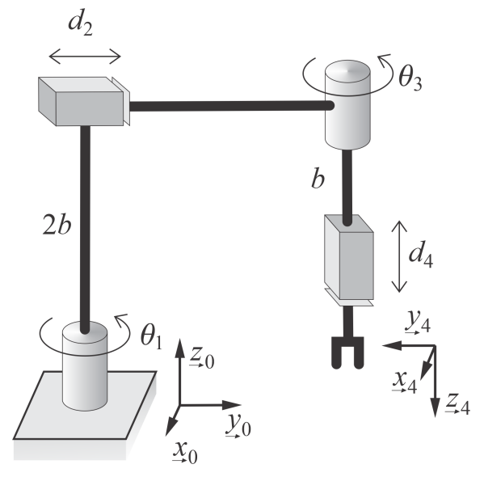

# Lecture 23, Dec 5, 2023

## Exam Review

{width=50%}

* Refer to the manipulator example from Lecture 19
* What is the manipulability index of this manipulator, based on the volume of the manipulability ellipsoid?
	* We need to find $w = \sigma _1\sigma _2\sigma _3$, where $\sigma _i$ are the singular values of $\bm J^{(v)}$
	* Since $\sigma _i^2$ are the eigenvalues of $\bm J\bm J^T$, $w = \sqrt{\lambda _1\lambda _2\lambda _3} = \sqrt{\det(\bm J\bm J^T)} = \abs{\det\bm J}$, since $\bm J$ is square
	* Recall from Lecture 19: $\abs{\det \bm J} = a^2\abs{\sin \theta _3}(1 + \cos\theta _3)$

{width=50%}

* Consider the RPRP manipulator above (note the direction of $\theta _3$) is reversed
	* Determine the DH transformation in $SE(3)$, $\bm T_{04}$
		* $\alpha _1 = 0, \alpha _2 = 270\degree, \alpha _3 = 270\degree, \alpha _4 = 0$
		* $\bm T_{01} = \begin{bmatrix}c_1 & -s_1 & 0 & 0 \\ s_1 & c_1 & 0 & 0 \\ 0 & 0 & 1 & 0 \\ 0 & 0 & 0 & 1\end{bmatrix}$
			* This is a rotation about the $\uvec z_1$ axis by an angle $\theta _1$
		* $\bm T_{12} = \begin{bmatrix} 1 & 0 & 0 & 0 \\ 0 & 0 & 1 & 0 \\ 0 & -1 & 0 & 2b \\ 0 & 0 & 0 & 1 \end{bmatrix}$
			* This is a rotation plus a translation
		* $\bm T_{23} = \begin{bmatrix} c_3 & 0 & -s_3 & 0 \\ 0 & 0 & 1 & 0 \\ -s_3 & -c_3 & 0 & d_2 \\ 0 & 0 & 0 & 1 \end{bmatrix}$
		* $\bm T_{34} = \begin{bmatrix} 1 & 0 & 0 & 0 \\ 0 & 1 & 0 & 0 \\ 0 & 0 & 1 & b \\ 0 & 0 & 0 & 1 \end{bmatrix}$
		* $\bm T_{04} = \begin{bmatrix} c_{13} & s_{13} & 0 & -d_2s_1 \\ s_{13} & -c_{13} & 0 & d_2c_1 \\ 0 & 0 & -1 & b \\ 0 & 0 & 0 & 1 \end{bmatrix}$
		* Note this only takes us to link 4, but not the position of the end-effector since we need an additional length $d_4$
	* Considering the pose of the end-effector to be only $(x, y, z, \phi)$, where $\phi$ is the rotation angle about the vertical axis, determine the theoretical singularities of the manipulator, if any
		* We can determine the manipulator pose in terms of joint variables by inspection
		* $\cvec{x}{y}{z}{\phi} = \cvec{-d_2\sin\theta _1}{d_2\cos\theta _1}{b - d_4}{\theta _1 - \theta _3}$
			* Note when $\theta _1 = 0$ the prismatic joint is aligned with $\uvec y_0$
		* $\bm J = \begin{bmatrix} -d_2\cos\theta _1 & -\sin\theta _1 & 0 & 0 \\ -d_2\sin\theta _1 & \cos\theta _1 & 0 & 0 \\ 0 & 0 & 0 & -1 \\ 1 & 0 & -1 & 0 \end{bmatrix}$
		* Singularities occur when $\det(\bm J\bm J^T) = 0 \iff \det\bm J = 0$
		* $\det\bm J = -(-1)(-1)(-d_2\cos^2\theta _1 - d_2\sin^2\theta _1) = d_2$
		* Hence the singularity is at $d_2 = 0$ -- however this is theoretical, since for a real manipulator we can never collapse $d_2$ to exactly 0
	* If there's only a force $f_y^{ee}$ acting in the $y$ direction (in the global frame) at the end effector, what must the joint control forces and torques be to balance it?
		* $\bm\eta = \cvec{\tau _1}{f_2}{\tau _3}{f_4} = \bm J^T\bm f^{ee} = \bm J^T\cvec{f_x}{f_y}{f_z}{\tau _z} = \bm J^T\cvec{0}{f_y^{ee}}{0}{0}$
		* We need to be careful here since we're working in 4-dimensional space instead of 6-dimensional space
		* Therefore $\bm\eta = f_y^{ee}\cvec{-d_2\sin\theta _1}{\cos\theta _1}{0}{0}$

