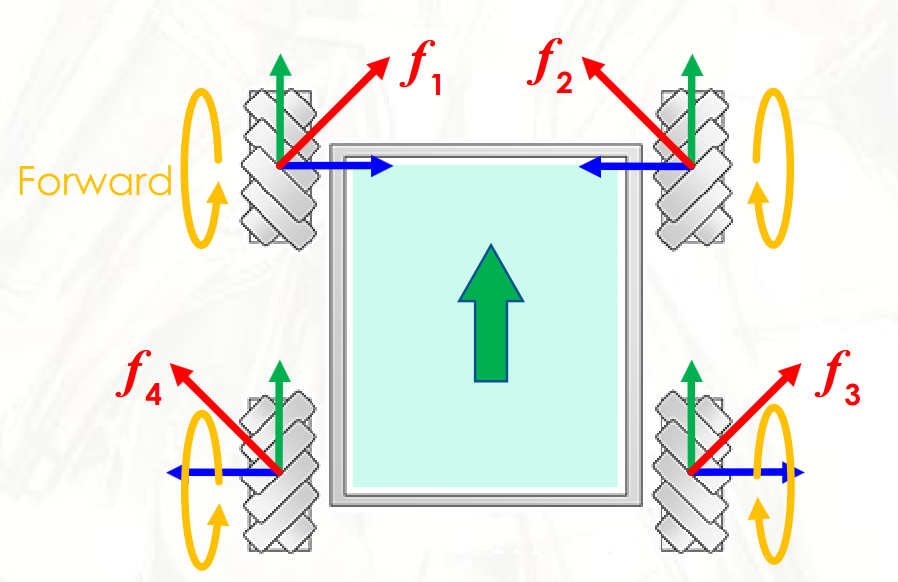
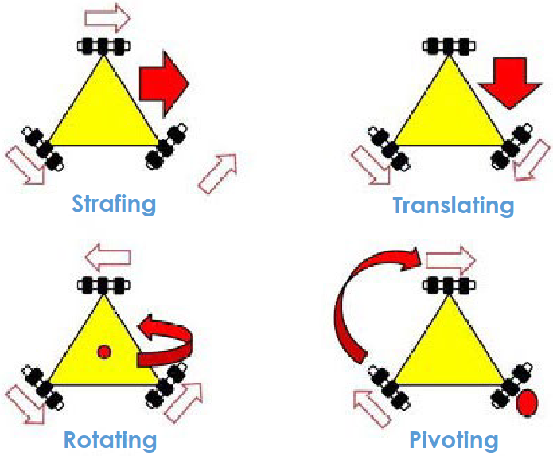
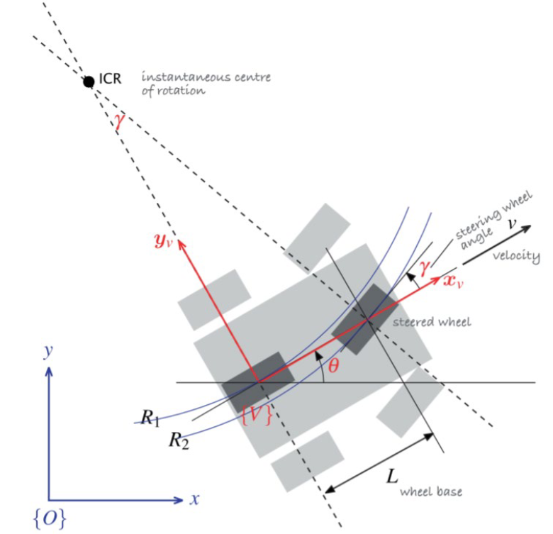
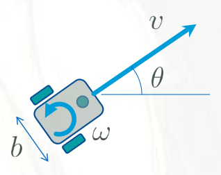
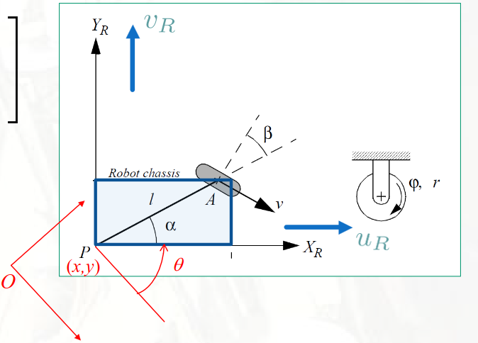

# Lecture 4, Sep 19, 2023

## Motion of Robots

* We will concentrate primarily on rolling, i.e. robots with wheels
* Steering models:
	* Bicycle steering: traction wheel in rear, steering wheel in front
		* Tricycle steering: the rear wheel is unpowered, while the front steering wheel is powered
	* Differential steering: two independently controlled wheels, vary speed to get desired curvature
		* Tripod differential steering: differential steering with an unpowered omnidirectional wheel in front for support
		* Skid-steering: each side is controlled together
	* Directed differential steering: differential steering aided by a steering wheel
	* Ackermann steering: two differentially operated wheels at the back and two connected steering wheels at the front
* Wheels can also be compound:
	* Mecanum wheels: wheels with angled rollers on the surface
		* Through moving the wheels in different directions, motion in any of the 4 directions or rotation can be achieved
		* The wheels produce forces in diagonal directions; combining these forces results in a net force in the desired direction
	* Omni wheels: like the Mecanum wheel, but the rollers are perpendicular instead of diagonal

{width=40%}

{width=40%}

* Holonomic constraint: a vehicle is holonomic if the vehicle's geometry does not constrain its motion (i.e. it can move in any direction, regardless of which direction it's facing)
	* Mecanum and omni drive are holonomic, but Ackermann is not
	* We will formally define this in AER301

## Kinematical Models of Motion

* The *pose* of a robot is its position and orientation
	* For now we will work in 2D, with position being $x, y$ and orientation being $\theta$, so the pose is $\bm x = \cvec{x}{y}{\theta}$
* For a simple unicycle model, $\theta$ is the angle of the wheel and $x, y$ are the position of the wheel on the ground
	* $\dot x = v\cos\theta, \dot y = v\sin\theta, \dot\theta = \omega$
	* $\bm x = \cvec{v\cos\theta}{v\sin\theta}{\omega}$
	* $\cvec{\dot x}{\dot y}{\dot \theta} = \matthreetwo{\cos\theta}{0}{\sin\theta}{0}{0}{1}\cvec{v}{\omega} \implies \dot{\bm x} = \bm B\bm u$
	* $\bm x$ is the state and $\bm u$ is the system input

{width=50%}

* For a bicycle model, refer to the diagram above
	* We will fix our reference point to the rear wheel; $\theta$ is the angle the rear wheel makes with the horizontal axis
	* $\dot x = v\cos\theta, \dot y = v\sin\theta$ as usual
	* To find $\dot\theta$, we extend a perpendicular line from the wheels to intersect at the instantaneous center of rotation
	* $v = R_1\dot\theta, \frac{l}{R_1} = \tan\gamma \implies \dot\theta = \frac{v}{l}\tan\gamma$
	* The control inputs are $v$ and $\gamma$
	* Notice that this model is now nonlinear due to the tangent on $\gamma$ and multiplication by $v$

{width=20%}

* For differential steering our control inputs are $\dot\gamma _r, \dot\gamma _l$, which are the rotational rates of the two wheels
	* $v = \frac{r(\dot\varphi _r + \dot\varphi _l)}{2}$ (velocity is simply the average)
	* $\omega = \frac{r(\dot\varphi _r - \dot\varphi _l)}{b}$
	* We can then put this into the unicycle model to obtain the final model
	* $\dot{\bm x} = \cvec{\dot x}{\dot y}{\dot \theta} = \matthreetwo{\frac{1}{2}r\cos\theta}{\frac{1}{2}r\cos\theta}{\frac{1}{2}r\sin\theta}{\frac{1}{2}r\sin\theta}{\frac{r}{b}}{-\frac{r}{b}}\cvec{\dot\varphi _r}{\dot\varphi _l}$

## Wheel Models

* To generalize our motion models, we want to derive the general model for a standard wheel

{width=60%}

* Let $\vcx F_g$ be the global reference frame, let $\vcx F_r$ be the vehicle reference frame and $\vcx F_w$ be the wheel reference frame
	* For all 3 frames the 3rd vector points up
	* $\uvec r_1$ is parallel to the vehicle and $\uvec r_2$ is normal to it
	* $\uvec w_1$ is normal to the wheel and $\uvec w_2$ is parallel to it
	* Since everything is in the same plane, we have $\bm C_{rg} = \bm C_3(\theta), \bm C_{wr} = \bm C_3(\alpha + \beta)$
* We'll use the notation that $\uvec\rho^{XY}$ being the position of point $X$ measured in frame $Y$ (if $Y$ is omitted, it is the global frame)
* For any wheel, the kinematics of the vehicle is defined by the constraints of the wheel
	* We will assume that the wheel does not slip, so it cannot move in the direction of $\uvec w_1$
		* This imposes a constraint $\uvec v^A \cdot \uvec w_1 = 0$, that is, $\uvec v^A$ has no velocity in the direction of $\uvec w_1$
	* The wheel can roll freely in the direction of $\uvec w_2$
		* This means means that $\uvec v^A \cdot \uvec w_2 = -r\dot\varphi$
* We want $\uvec v^A = \eval{\diff{}{t}\uvec\rho^A}{\vcx F_g} = \eval{\diff{}{t}\uvec\rho^P}{\vcx F_g} + \eval{\diff{}{t}\uvec\rho^{AP}}{\vcx F_g} = \uvec v^P + \eval{\diff{}{t}\uvec\rho^{AP}}{\vcx F_r} + \uvec\omega^{rg} \times \uvec\rho^{AP}$
	* $\uvec v^P = \vcx F_g^T\cvec{\dot x}{\dot y}{0} = \vcx F_r^T\bm C_{rg}\cvec{\dot x}{\dot y}{0} = \vcx F_r^T\cvec{u_r}{v_r}{0}$
	* $\uvec\omega^{rg}$ is the angular velocity of $\vcx F_r$ with respect to $\vcx F_g$ so it's simply $\vcx F_r^T\cvec{0}{0}{\dot\theta}$
	* $\uvec\rho^{AP} = \vcx F_r^T\cvec{l\cos\alpha}{l\sin\alpha}{0}$ so it has a derivative of 0
	* Therefore we can get $\uvec v^A = \uvec v^D + \uvec\omega^{rg} \times \uvec\rho^{AP}$ and then express it in frame $\vcx F_w^T$
		* This works out to be $\vcx F_w^T\cvec{u_R\cos(\alpha + \beta) + v_R\sin(\alpha + \beta) + l\dot\theta\sin\beta}{-u_R\sin(\alpha + \beta) + v_R\cos(\alpha + \beta) + l\dot\theta\cos\beta}{0} = \cvec{0}{-r\dot\varphi}{0}$ (due to the constraints) where $u_R, v_R$ are the components of the robot's velocity along and normal to its frame
* The two equations $\twopiece{u_R\cos(\alpha + \beta) + v_R\sin(\alpha + \beta) + l\dot\theta\sin\beta = 0}{-u_R\sin(\alpha + \beta) + v_R\cos(\alpha + \beta) + l\dot\theta\cos\beta = -r\dot\varphi}$ define the wheel kinematics

