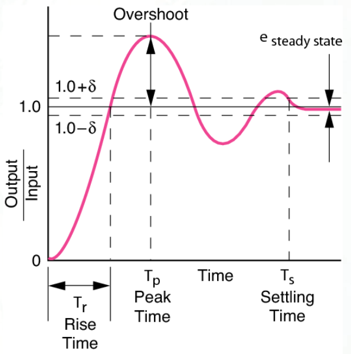
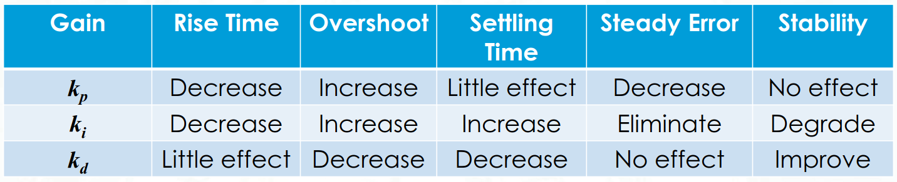
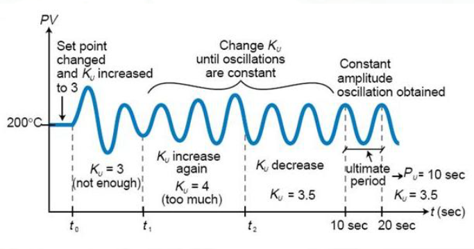
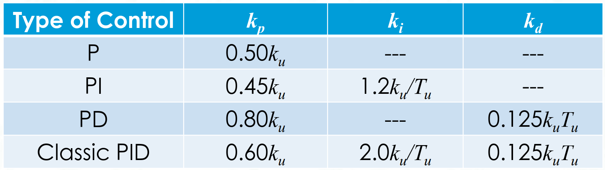

# Lecture 5, Sep 21, 2023

## Introduction to Control Theory

### Stability

* Consider the first-order linear time-invariant system $\dot{\bm x} = \bm A\bm x$
	* We diagonalize the system so that $\bm P^{-1}\bm A\bm P = \bm \Lambda$
	* Then we express $\bm x$ as a linear combination of eigenvectors: $\bm x(t) = \sum _{\alpha = 1}^n \eta _\alpha(t)\bm p_\alpha$
		* $\eta$ are the coordinates
	* Substituting it back into the equation of motion, we get $\dot\eta _\alpha = \lambda _\alpha\eta$ for $\alpha = 1, \dots, n$
	* Therefore we can solve it as $\eta _\alpha(t) = \eta _\alpha(0)e^{\lambda _\alpha t}$
* For this system, we know $\bm x = \bm 0$ is a solution; when talking about stability, we consider the long-term behaviour of the differential equation and see if it goes back to 0
	* The $\eta _\alpha(t)$ are disturbances to the system, so we want them to be eliminated eventually
* If $\Re(\lambda _\alpha) < 0$ then as $t \to \infty$, we have all $\eta _\alpha \to 0 \implies \bm x \to \bm 0$

\noteDefn{A linear system $\dot{\bm x} = \bm A\bm x$ is \textit{stable} if $\Re(\lambda _\alpha) \leq 0$ for all $\alpha$; it is \textit{asymptotically stable} if $\Re(\lambda _\alpha) < 0$. This works even for nondiagonalizable matrices by considering their Jordan forms.
\tcblower For nonlinear systems $\dot{\bm x} = \bm f(\bm x)$, we can consider local stability in the neightbourhood of a solution by linearizing the system using the Jacobian, $$\bm A = \pdiff{\bm f}{\bm x^T} = \matthreeb{\pdiff{f_1}{x_1}}{\pdiff{f_1}{x_2}}{\cdots}{\pdiff{f_2}{x_1}}{\pdiff{f_2}{x_2}}{\cdots}{\vdots}{\vdots}{\ddots}$$}

### PID Control

{width=100%}

* PID control can be used to address two types of problems: the regulator problem (eliminating disturbances to the system) and the servo or tracking problem (tracking the output to a trajectory)
* In control theory the thing being controlled is referred to as the *plant*, a combination of actuators and processes
* Consider a simple single-variable, first-order linear system $\dot x + \sigma x = u, x(0) = x_0$ where $x$ is the state variable and $u$ is the control variable; we want to track the system to $x_d$
	* The eigenvalue for this system is $-\sigma$ (see this by $\dot x = -\sigma x$), so if $\sigma < 0$, this system is unstable
	* Define the error $e = x - x_d$ and let $u = -k_pe(t)$, so $\dot x + (\sigma + k_p)x = x_d$
	* For this system, $x_h = e^{-(\sigma + k_p)t}, x_p = \frac{k_px_d}{\sigma + k_p}$ so the solution is $\frac{k_px_d}{\sigma + k_p} + \left(x_0 - \frac{k_px_d}{\sigma + k_p}\right)e^{-(\sigma + k_p)t}$
		* Therefore even if $\sigma < 0$, as long as we choose a sufficiently high $k_p$, the system can be stable
		* However if we let $t \to \infty$ we have $x = \frac{k_px_d}{\sigma + k_p} \neq x_d$, so we have a steady-state error
	* Let's add an integral term: $u = -k_pe - k_i\int e(\tau)\,\dtau$
		* Substituting in $u$ and differentiating, we have $\ddot x + (\sigma + k_p)x + k_ix = k_ix_d$
		* The general solution is $x_h = c_1e^{\lambda _1t} + c_2e^{\lambda _2t}$
		* The particular solution is just $x = x_d$
		* The complete solution is $x(t) = x_d + c_1e^{\lambda _1t} + c_2e^{\lambda _2t}$
			* $\lambda = \frac{-(\sigma + k_p) \pm \sqrt{(\sigma + k_p)^2 - k_i}}{2}$
			* If $\Re(\lambda _i) < 0$, then as $t \to \infty$, $x(t) \to x_d$ and we have no steady-state error
			* Now $\lambda$ might have an imaginary component, so our system may have oscillations; it could be underdamped, overdamped or critically damped depending on the gains
		* This system is stable if $k_i > 0, k_p + \sigma > 0$
* More generally, our state equation can be $\dot{\bm x} = \bm A\bm x + \bm B\bm u$
	* Our feedback is $\bm u = -\bm F\bm x$ where $\bm F$ is the gain matrix
	* This gives $\dot{\bm x} = (\bm A - \bm B\bm F)\bm x$
	* We can now make this system stable by finding an $\bm F$ that modifies the eigenvalues of $\bm A$
		* Whether we can always find such an $\bm F$ is related to the controllability of the system
* Even more generally, for nonlinear systems $\dot{\bm x} = \bm f(\bm x, \bm u)$, we can choose to linearize locally as before, or we can try heuristic feedback, with either linear or nonlinear control
* Now consider a second-order plant $\ddot x + \sigma\dot x + \eta x = u$
	* We will also add a derivative term: $u(t) = -k_pe(t) - k_d\dot e(t) - k_i\int e(\tau)\,\dtau$
	* Substituting this and differentiating, we will get a third order differential equation
	* This gives us a new set of stability requirements

{width=40%}

* Response characteristics:
	* Rise time: the amount of time for the output to approach the input
		* There is no set convention on this; often it's defined as the time from 0 to 100% of the desired output, sometimes it's 10% to 90%
	* Overshoot: the amount over the desired output that the maximum value is
	* Settling time: time to reach and stay within a certain band $\delta$ of the desired output
	* Steady-state error: remaining error as $t \to \infty$
* The gains change the characteristics of the response; depending on the system, different characteristics may be desired

{width=65%}

{width=30%}

* The Ziegler-Nichols method is one among many methods to tune PID gains:
	1. Suppress the integral and derivative terms completely
	2. Create a small disturbance by suddenly changing the setpoint
	3. Increase $k_p$ until the system is oscillating with constant amplitude
	4. Record the gain value as $k_u$, the oscillation period $T_u$, and refer to the table to set $k_p, k_i, k_d$

{width=50%}

* PID control is prone to common problems:
	* Noise in the derivative: derivatives are typically numerically calculated and can be quite noisy
		* This can be mediated by attaching a low-pass filter on the signal to remove high-frequency components
	* Integral windup: error can build up in the integral term, making it overwhelm the other control terms
		* This can be mediated by removing the $i$ term after the desired value is reached, capping the error integral, or reinitializing the $i$ term
	* Deadband: the region where the control input does not affect the actuator (e.g. due to friction)
		* This can be mediated by commanding a minimum control input when in the deadband so the control is not useless

### Applications in Robotics

* Consider robot with a bicycle model; we want to drive it to a desired goal point $(x_d, y_d)$
	* Proportional control: $v = -k_{p,v}\sqrt{(x - x_d)^2 + (y - y_d)^2}, \theta _d = \tan\frac{y - y_d}{x - x_d}, \gamma = -k_{p,\gamma}(\theta - \theta_d)$
* What if we wanted to follow a line $ax + by + c = 0$?
	* We can measure the crosstrack error by $\delta = \frac{ax + by + c}{\sqrt{a^2 + b^2}}$ (normal distance to line)
	* Then $\gamma _\delta = -k_{p,\delta}\delta$ makes us steer the robot towards the line
	* But now we want to keep the robot on the line, so let $\theta _d = \tan^{-1}\left(-\frac{a}{b}\right)$ and $\gamma _\theta = -k_{p,\theta}(\theta - \theta _d)$ steers us towards the line
	* These two terms are combined, and a fixed speed is added for this simple proportional control
* What if we wanted to follow a path?
	* Let $e = \sqrt{(x - x_d)^2 + (y - y_d)^2} - d$, and then apply PI control on the velocity using this error
		* In effect this follows a set point at a distance $d$ ahead all the time
		* This is because without the $-d$, $e$ will always be positive and so we will get integral wind-up, where the integral term overwhelms the control
	* The steering can be controlled using the same way as when moving to a goal point
* Consider a robot with a unicycle model; we want to move it to a pose $(x_d, y_d, \theta _d)$
	* We will transform our variables $(x, y, \theta)$ to $(\rho, \alpha, \beta)$, where $\rho$ is the distance to the setpoint, $\alpha$ is the angle from the line that connects directly to the target
		* $\rho = \sqrt{\Delta _x^2 + \Delta _y^2}$
		* $\alpha = \tan^{-1} \frac{\Delta _y}{\Delta x} - \theta$
		* $\beta = -\theta - \alpha$
	* We want to regulate $(\rho, \alpha, \beta) = (0, 0, 0)$
		* Apply proportional control on $v$ with $\rho$, and $\omega$ with $\alpha$ and $\beta$

