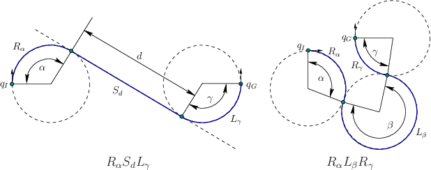
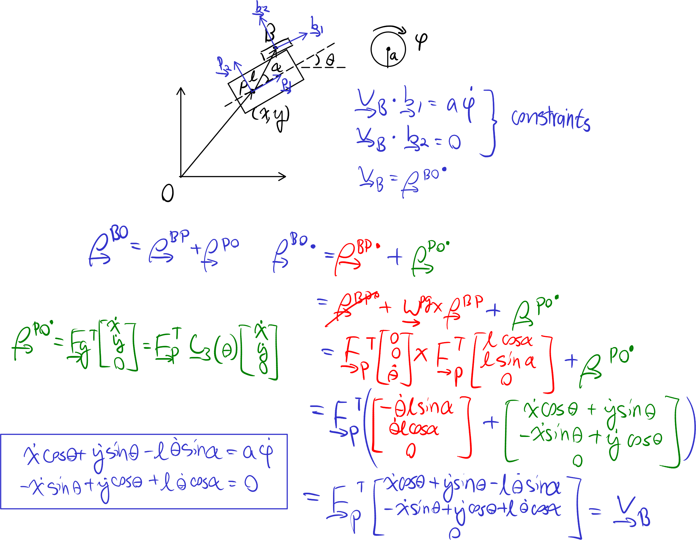

# Lecture 6, Sep 26, 2023

## Dubin's Model

{width=50%}

* Lester Eli Dubins proved that the shortest path between two points (with specified heading), with a minimum turning radius constraint, is a path with only straight and circular segments, corresponding to one of 6 types of curves:
	* LRL, RLR, LSL, LSR, RSL, RSR
	* Where L is a left turn of minimum radius, R is a right turn of minimum radius, and S is a straight line segment
	* This is the minimum-time path for a robot if the robot can only go forward at a constant velocity or stop
* To find the curves, we can draw two circles around each endpoint (one corresponding to a direction of rotation) and try to connect a circle on one side to a circle on the other side

## Example: Wheel Constraint Model

* Consider the following robot at $(x, y)$ with heading $\theta$; the wheel is at a distance $l$ and angle $\alpha$ from the robot center; the wheel has diameter $a$ and rotation angle $\phi$ and cannot slip; determine the constraints imposed by this wheel

{width=75%}

