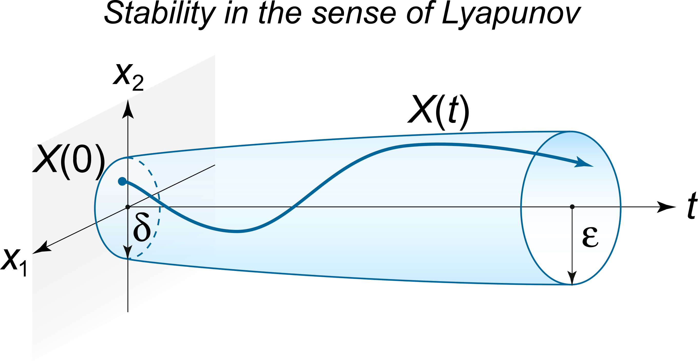

# Lecture 7, Sep 28, 2023

## Stability for Nonlinear Systems -- Lyapunov's Method

* In general a nonlinear model is characterized by $\dot{\bm x} = \bm f(\bm x, \bm u)$
* One approach is locally linearizing using the Jacobian around a particular state and control input
	* $\Delta\dot{\bm x} = \bm A\Delta\bm x + \bm B\bm u$ where $\Delta\bm x = \bm x - \bm x_d$ and $\bm x_d$ is the set point
	* $\bm A = \eval{\pdiff{\bm f}{\bm x^T}}{\bm x = \bm x_d}, \bm B = \eval{\pdiff{\bm f}{\bm u^T}}{\bm u = \bm 0}$
	* With this we can apply the normal feedback methods with $\bm u = -\bm F\Delta\bm x \implies \Delta\dot{\bm x} = (\bm A - \bm B\bm F)\Delta\bm x$ and choose $\bm F$ appropriately to put the poles in the left-half plane
	* Because this a local approximation, it will not work when the state is significantly different from the linearization point
* Another approach is *gain scheduling*, where we design a set of gains for a variety of different set points of the nonlinear system (i.e. "scheduling" the gains according to where you are in state space)
	* However this requires a lot of work and more importantly cannot guarantee stability
* To guarantee stability for a nonlinear system, we can use Lyapunov's method

\noteDefn{The solution $\bm x(t; \bm x_0, t_0)$ to the system $\dot{\bm x} = \bm f(\bm x, t)$ is said to be \textit{stable} in the Lyapunov sense (aka L-stable) if $$\forall \varepsilon > 0, \exists \delta > 0\text{ s.t. }\norm{\Delta\bm x_0} < \delta \implies \forall t > t_0, \norm{\Delta\bm x} < \varepsilon$$
\tcblower $\bm x$ is \textit{asympotitcally stable} if $\lim _{t \to \infty} \norm{\Delta\bm x} = 0$; \textit{exponential stability} further requires that $\norm{\Delta\bm x}$ decreases exponentially.}

{width=30%}

\noteDefn{A function $v(\bm x)$ is \textit{positive-definite} if $$\forall \bm x \neq \bm 0, v(\bm x) > 0\text{ and }v(\bm 0) = 0$$
and \textit{negative-definite} if $$\forall \bm x \neq \bm 0, v(\bm x) < 0\text{ and }v(\bm 0) = 0$$
\tcblower $v(\bm x)$ is positive/negative-\textit{semidefinite} if $v(\bm x) \geq 0$/$v(\bm x) \leq 0$ for all $\bm x$.}

\noteThm{Let $\dot{\bm x} = \bm f(x)$ with an equilibrium at $\bm x = \bm 0$; if we can find a positive-definite $v(\bm x)$, and $\dot v(\bm x)$ is negative-semidefinite, then $\bm x = \bm 0$ is stable. If $\dot v(\bm x)$ is negative-definite, then $\bm x = \bm 0$ is asymptotically stable. Note that $$\dot v = \pdiff{v}{\bm x^T}\dot{\bm x} = \pdiff{v}{\bm x^T}\bm f(\bm x)$$
\tcblower This function $v(\bm x)$ is known as a \textit{Lyapunov function}.}

* $v(\bm x)$ can be thought of as a potential energy surface; since $\dot v(\bm x)$ is negative-(semi)definite, we always go down the surface, and since $v(\bm x)$ is positive definite, we can't go down lower than 0, which is the location of the equilibrium
	* If $\dot v(\bm x)$ is merely negative-semidefinite, we can get "stuck" before reaching the equilibrium (e.g. in a local minimum), but the solution is still stable
* Just because you can't find a Lyapunov function doesn't mean the system is unstable!
* However we can invert the result and find a positive-definite $\dot v(x)$, which would mean the system is unstable
* Example: $\dot x_1 = x_2 + \alpha x_1(x_1^2 + x_2^2), \dot x_2 = -x_1 + \alpha x_2(x_1^2 + x_2^2)$
	* We can take $v(x_1, x_2) = \frac{1}{2}(x_1^2 + x_2^2)$ which is clearly positive-definite
	* $\dot v = x_1\dot x_1 + x_2\dot x_2 = \alpha(x_1^2 + x_2^2)$
	* Therefore the system is asymptotically stable if $\alpha < 0$ or merely stable if $\alpha \leq 0$
	* For this example we can also say that if $\alpha > 0$, the system is unstable since $\dot v$ is positive-definite

\noteThm{Lasalle's extension: If $\dot v$ is only negative-semidefinite, but the only solution to $\dot v(\bm x) = 0$ and $\dot{\bm x} = \bm f(\bm x)$ is $\bm x = \bm 0$, then $\bm x = \bm 0$ is asymptotically stable.}

* The idea is that Lyapunov's theorem considers all $\bm x$, but we only care about the ones that satisfy the equation of motion; so if $\dot v(\bm x) = \bm 0$ is only possible at $\bm x = 0$ if the equation of motion must be satisfied, then the system is still asymptotically stable
	* Usually when Lasalle's extension applies, we have a $\dot v$ that is zero when only some of the $x_i$ are zero, but does not require all of them to be zero; so if satisfying $\dot{\bm x} = \bm f(\bm x)$ with these $x_i = 0$ requires all the other coordinates to be zero, then $\bm x = \bm 0$ is still asymptotically stable

## Example: Feedback Tracking Problem

* Consider a robot with a unicycle model; we want to track a path $(x_d(t), y_d(t), \theta _d(t))$
	* $\cvec{\dot x_d}{\dot y_d}{\dot \theta _d} = \cvec{u_d\cos\theta _d}{u_d\sin\theta _d}{\omega _d}$
	* $u_d, \omega _d$ are the control inputs that will get us exactly to the setpoint in a perfect world; however since we might have disturbances we need feedback control
* We will do a coordinate transform into the robot coordinate system with axes $\xi$ parallel to the robot and $\eta$ perpendicular to it
	* $\bm\xi = \cvec{\xi}{\eta}{\theta} = \matthreeb{\cos\theta}{\sin\theta}{0}{-\sin\theta}{\cos\theta}{0}{0}{0}{1}\cvec{x}{y}{\theta}$ corresponding to a rotation about the third axis
	* $\dot{\xi} = \dot x\cos\theta + \dot y\sin\theta + (-x\sin\theta + y\cos\theta)\dot\theta = \dot x\cos\theta + \dot y\sin\theta + \eta\dot\theta$
	* $\dot\eta = -\dot x\sin\theta + \dot y\cos\theta + (x\cos\theta + y\sin\theta)\dot\theta = -\dot x\sin\theta + \dot y\cos\theta + \xi\dot\theta$
* We can make the same transformation for the desired coordinates $(x_d, y_d, \theta _d) \to (\xi _d, \eta _d, \theta _d)$
	* $\xi _d = x_d\cos\theta + y_d\sin\theta$
	* $\eta _d = -x_d\sin\theta + y_d\cos\theta$
	* $\dot\xi _d = \dot x_d\cos\theta + \dot y_d\sin\theta + \eta _d\dot\theta = u_d\cos(\theta - \theta _d) + \eta _d\omega$
	* $\dot\eta _d = -\dot x_d\sin\theta + \dot y_d\cos\theta + \xi _d\dot\theta = u_d\sin(\theta - \theta _d) - \xi _d\omega$
* Let the error $e_x = \xi - \xi _d, e_y = \eta - \eta _d, e_\theta = \theta - \theta _d$
	* We've converted a tracking problem to a regulator problem
	* We want to send all these error terms to zero
* The error derivatives are $\dot{\bm e} = \cvec{\dot e_x}{\dot e_y}{\dot e_\theta} = \cvec{u_d\cos e_\theta + u + e_y\omega}{u_d\sin e_\theta - e_x\omega}{\omega - \omega _d}$
* Our control algorithm will be $u = -k_xe_x - u_d\cos e_\theta, \omega = \omega _d - k_\theta\sin e_\theta - u_de_y$
	* In the end we get a nonlinear function $\dot{\bm e} = \bm\Phi(\bm e)$
* Choose a candidate Lyapunov function $v(e_x, e_y, e_\theta) = \frac{1}{2}(e_x^2 + e_y^2) + (1 - \cos e_\theta)$
	* Notice that these terms are energy-like: the $\frac{1}{2}(e_x^2 + e_y^2)$ is spring energy in 2D and $1 - \cos e_\theta$ is the energy of a pendulum; this is usually a good guide to selecting candidate Lyapunov functions
	* $\dot v = -k_xe_x^2 - k_\theta\sin^2 e_\theta$
	* If $k_x, k_\theta > 0$, $\dot v$ is negative definite but only with respect to $e_x$ and $e_\theta$; this means it is negative-semidefinite
	* Lyapunov's theorem alone tells us only that the system is stable, but not necessarily asymptotically so
	* We can try applying Lasalle's extension, if we can show that $e_x = e_\theta = 0 \implies e_y = 0$ in order to satisfy the equation of motion
		* If we substitute back in $e_x = e_\theta = 0$ (and $\dot e_x = \dot e_\theta = 0$) we can prove that $e_y = 0$, so by Lasalle's extension this system is asymptotically stable

