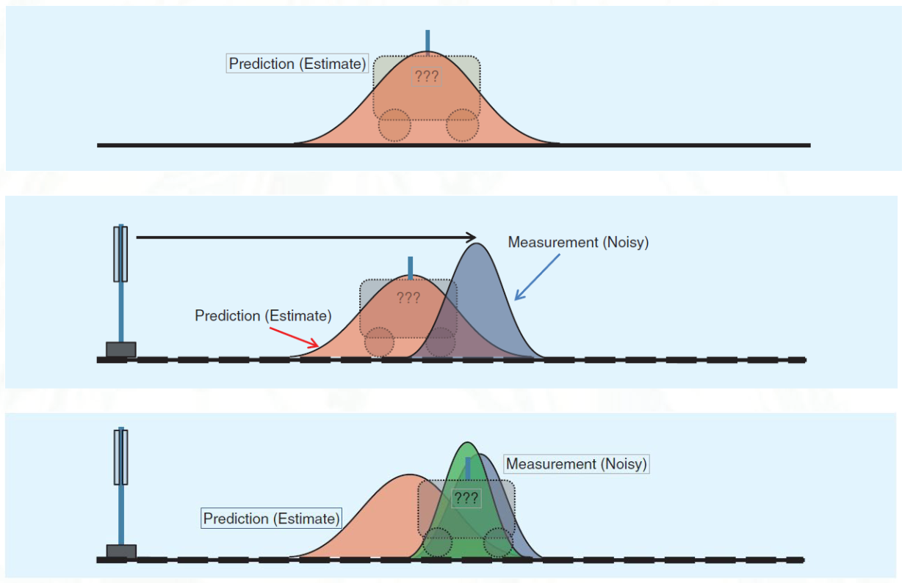

# Lecture 8, Oct 3, 2023

## Localization

* Localization is the process of determining where the robot is
	* Do we already have a map (i.e. landmarks) or do we need to build one?
	* How do we measure uncertainty arising from sensors and actuators?
	* How do we formulate the best estimate for localization from uncertain measurements?
* Any sensor measurement will invariably be corrupted by noise to some extent
	* Measurements are often distributed according to a Gaussian, due to the central limit theorem

## Propagation of Error -- Odometry Example

* How does uncertainty in measurements propagate?
* The covariance matrix generalizes variance to multiple dimensions
	* $\alignedeqntwo[t]{\bm\Sigma}{\mathbb E[(\bm x - \mathbb E(\bm x))(\bm x - \mathbb E(\bm x))^T]}{\matthreeb{\sigma _{x_1}^2}{\sigma _{x_1x_2}}{\cdots}{\sigma _{x_2x_1}}{\sigma _{x_2}^2}{\cdots}{\vdots}{\vdots}{\ddots}}$
	* If we take the covariance between two different variables, it is known as the *cross-covariance*
	* $\cov(\bm x, \bm  y) = \mathbb E[(\bm x - \bm \mu _x)(\bm y - \bm\mu _y)^T]$
* Note some important properties of covariance:
	1. $\bm\Sigma = \mathbb E[\bm x\bm x^T] - \bm\mu\bm\mu^T$
	2. $\bm\Sigma^T = \bm\Sigma \geq 0$, i.e. the covariance matrix is semi-definite
	3. $\cov(\bm x, \bm y) = \cov(\bm y, \bm x)^T$
	4. $\cov(\bm x_1 + \bm x_2, \bm y) = \cov(\bm x_1, \bm y) + \cov(\bm x_2, \bm y)$, i.e. covariance is bilinear
	5. $\cov(\bm A\bm x + \bm a, \bm B\bm y + \bm b) = \bm A\cov(\bm x, \bm y)\bm B^T$
	6. $\cov(\bm x, \bm y) = \bm 0$ if $\bm x$ and $\bm y$ are independent (but a zero covariance does not mean no correlation)
* Let $\bm y = \bm f(\bm x)$, then in general we can see how $\bm\Sigma _y$ relates to $\bm\Sigma _x$
	* By Taylor expansion $\bm y = \bm y_0 + (\del\bm f)_0(\bm x - \bm x_0)$
		* Then $(\del\bm f)_0\bm x = \bm A\bm x$ and $\bm y_0 - (\del\bm f)_0\bm x_0 = \bm a$
		* By property 5 above, $\bm\Sigma _y = (\del\bm f)_0\bm \Sigma _x(\del\bm f)_0^T$
* Consider the problem of determining pose using only odometry, i.e. movement of the wheels $\Delta\bm s = \cvec{\Delta s_l}{\Delta s_r}$
	* $\Delta\bm x = \cvec{\Delta x}{\Delta y}{\Delta \theta} = \cvec{\frac{\Delta s_r + \Delta s_l}{2}\cos\theta}{\frac{\Delta s_r + \Delta s_l}{2}\sin\theta}{\frac{\Delta s_r - \Delta s_l}{b}} = \cvec{\Delta s\cos\theta}{\Delta s\sin\theta}{\frac{\Delta s_r - \Delta s_l}{b}}$
* Our new position is given by $\Delta x' = \bm f(\bm x + \Delta\bm s)$
	* Linearize: $\bm x' = \bm x + (\del _{\Delta s}\bm f)_0\Delta\bm s$ where $\del _{\Delta s}\bm f$ is the Jacobian $\matthreetwo{\frac{1}{2}\cos\theta}{\frac{1}{2}\cos\theta}{\frac{1}{2}\sin\theta}{\frac{1}{2}\sin\theta}{-b^{-1}}{b^{-1}}$
	* Assume uncorrelated odometry error and $\bm\Sigma _\Delta = \mattwo{\sigma _{\Delta, l}^2}{0}{0}{\sigma _{\Delta, r}^2}$
	* Error propagates as $\bm\Sigma _{x'} = \bm\Sigma _x + (\del _{\Delta s}\bm f)\bm\Sigma _\Delta(\del _{\Delta _s}\bm f)^T$
	* Notice that the part we add is always positive due to the positive-semidefiniteness of the covariance, so the error always grows!
* This means using odometry alone, our estimate of where the robot is will get worse with time

## 1D Kalman Filtering

* If we have $n$ measurements for a static variable $x$, how do we obtain the best estimate $\hat x$?
	* We can try to minimize $e = \sum _{k = 1}^n w_k(\hat x - x_k)^2$, i.e. weighted least squares
	* The weight can be $w_k = \frac{1}{\sigma _k^2}$, so that measurements with higher variance (uncertainty) are weighted less
	* The solution is given by $\hat x = \frac{\sum _k\sigma _k^{-2}x_k}{\sum _k\sigma _k^{-2}}$
		* This is a weighted average of all the $x_k$ with weights $\frac{1}{\sigma _k^2}$
* Consider the case where we have only 2 measurements, then $\hat x = \frac{\sigma _2^2}{\sigma _1^2 + \sigma _2^2}x_1 + \frac{\sigma _1^2}{\sigma _1^2 + \sigma _2^2}x_2$
	* Then the variance of $\hat x$ is $\var\hat x = \left(\frac{\sigma _2^2}{\sigma _1^2 + \sigma _2^2}\right)^2\sigma _1^2 + \left(\frac{\sigma _1^2}{\sigma _1^2 + \sigma _2^2}\right)^2\sigma _2^2 = \frac{\sigma _1^2\sigma _2^2}{\sigma _1^2 + \sigma _2^2}$
	* But note, this is less than both $\sigma _1^2$ and $\sigma _2^2$!
* Note also $\hat x = \frac{\sigma _2^2}{\sigma _1^2 + \sigma _2^2}x_1 + \frac{\sigma _1^2}{\sigma _1^2 + \sigma _2^2}x_2 = x_1 + \frac{\sigma _1^2}{\sigma _1^2 + \sigma _2^2}(x_2 - x_1)$
	* This is a much more convenient form for us, since we've turned it from batch form (needing all measurements at once) into a recursive form (where we can continuously update)
* If we have $\hat x_k, \hat\sigma _k$ as the previous estimate at the current timestep, and we get a new measurement $x_{k + 1}$ with variance $\sigma _{k + 1}^2$ then we can update:
	* $\hat x_{k + 1} = \hat x_k + \frac{\hat\sigma _k^2}{\hat\sigma _k^2 + \sigma _{k + 1}^2}(x_{k + 1} - \hat x) = \hat x_k + W_{k + 1}(x_{k + 1} - \hat x_k)$
	* $\hat\sigma _{k + 1} = \frac{\hat\sigma _k^2\sigma _{k + 1}^2}{\hat\sigma _k^2 + \sigma _{k + 1}^2} = \hat\sigma _k^2 - W_{k + 1}\hat\sigma _k^2$
	* $W$ is known as the *Kalman gain*
	* We can see that this is similar to a feedback control law -- the correction to the state is the gain multiplied by the "error"
* Kalman filtering is a special case of Bayesian filtering, where the distribution is a Gaussian
* But we still haven't accounted for the fact that $x$ may be dynamic, i.e. it can evolve over time; to account for this, we will predict what the new state should be based on the old estimate, and then compute the error from the measurement of the new state
	* Consider the 1D state update equation $x_{k + 1} = x_k + u_k + v_k$ where $u_k$ is the control input and $v_k$ is some noise
		* $v_k \sim \mathcal N(0, \varsigma _k^2)$, i.e. normally distributed, zero-mean with variance $\varsigma _k^2$
		* Assume that $u_k$ can be accurately delivered, i.e. there is no noise
	* Let $\hat x_{k|k}$ be the estimate of $x$ at step $k$, given measurements $\set{x_0, x_1, \dots, x_k}$
	* Let $\hat x_{k + 1|k}$ be the prediction of $x$ at step $k + 1$, given measurements $\set{x_0, x_1, \dots, x_k}$
		* $\hat x_{k + 1|k} = \hat x_{k|k} + u_k$ (note since the noise is zero-mean, we can disregard it)
	* Now to get $\hat x_{k + 1|k + 1}$, we can use the same Kalman update formula as above
		* $\hat\sigma _{k + 1|k}^2 = \hat\sigma _{k|k}^2 + \varsigma _{k + 1}^2$
		* $W_{k + 1} = \frac{\sigma _{k + 1|k}^2}{\sigma _{k + 1|k}^2 + \sigma _{k + 1}^2}$
		* $\hat x_{k + 1|k + 1} = \hat x_{k + 1|k} + W_{k + 1}(x_{k + 1} - \hat x_{k + 1|k})$
		* $\hat\sigma _{k + 1|k + 1}^2 = \hat\sigma _{k + 1|k}^2 - W_{k + 1}\hat\sigma _{k + 1|k}^2$
* Intuitively, Kalman filters combine an estimate and a new measurement, both of which have some uncertainty, and finds the most likely new state according to the distributions of error in both

{width=70%}

