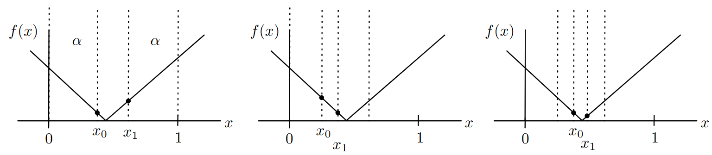
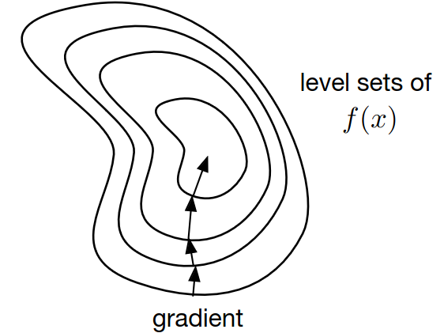
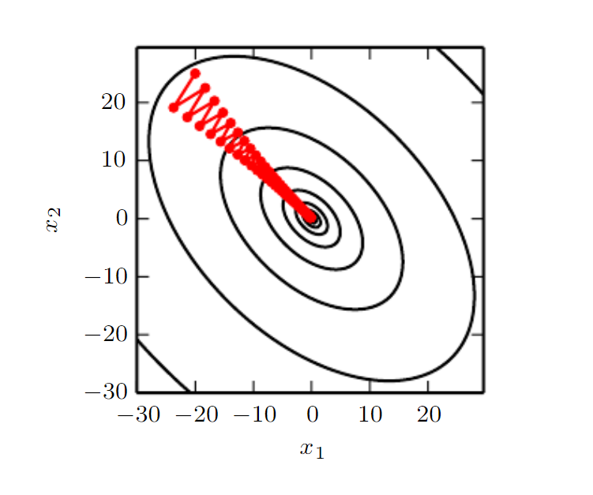

# Lecture 10, Oct 11, 2023

## Numerical Methods for Unconstrained Optimization

* Finding a global minimum is hard to do analytically because we need to find all stationary points, and then compute the value of the function at all stationary points and then the boundaries, which could be expensive
	* Often we will have to use a numerical root finding method to solve for where the gradient is zero
	* In this case it might be easier to solve for the minimum numerically to begin with

### One-Dimensional Methods

* We will focus on finding the stationary points $\del f(x^*) = 0$
* Newton's method can be used if the function is differentiable:
	* Approximate $f(x)$ locally by a quadratic: $f(x) \approx f(x_k) + f'(x_k)(x - x_k) + \frac{1}{2}f''(x_k)(x - x_k)^2$
	* $f'(x) \approx f'(x_k) + f''(x_k)(x - x_k) \implies x_{k + 1} = x_k - \frac{f'(x_k)}{f''(x_k)}$
		* Keep iterating until the gradient is below some tolerance
		* Once we find a stationary point, check if it is a minimum using the Hessian/second derivative
	* This is equivalent to applying Newton's method for root finding to solve for $f'(x) = 0$
	* This method has quadratic convergence (pretty fast!) provided we start close enough to the minimum
	* If derivatives are expensive to compute, we can fit a quadratic to three points to make the approximation, e.g. $f(x_{k - 2}), f(x_{k - 1}), f(x_k)$

\noteDefn{A function $f: [a, b] \mapsto \reals$ is \textit{unimodular} if there exists $x^* \in [a, b]$ such that $f$ is decreasing/nonincreasing for $x \in [a, x^*]$ and increasing/nondecreasing for $x \in [x^*, b]$, i.e. $f'(x) \leq 0$ for $x < x^*$ and $f'(x) \geq 0$ for $x > x^*$.}

* What if our function is non-differentiable? We can exploit other properties of the function such as unimodularity
	* Suppose we evaluate $f$ at $x_0$ and $x_1$; then if $f(x_0) > f(x_1)$ we know $x_0$ is not a minimum, so discard everything to the left; or if $f(x_0) < f(x_1)$ we know $x_1$ is not a minimum, so we discard everything to the right
	* Note that we can't discard both sides because that could potentially discard the section that the minimum is in
* This algorithm is called *golden section search*:
	* Steps:
		1. Without loss of generality, assume $a = 0, b = 1$ (rescale the function)
		2. Choose $x_0 = \alpha, x_1 = 1 - \alpha$ for $\alpha \in \left(0, \frac{1}{2}\right)$
		3. Discard one side of the interval based on $f(x_0)$ and $f(x_1)$, then rescale the interval and repeat
	* This algorithm has unconditional linear convergence as long as $f$ is unimodular
	* We can further optimize the algorithm by choosing $x_1$ at the next iteration to be $x_0$ from the previous iteration to save one function evaluation, so $\alpha = (1 - \alpha)^2 \implies 1 - \alpha = \frac{1}{2}(\sqrt 5 - 1)$
		* This gives us the golden ratio, hence the name
* If $f$ is neither unimodular nor differentiable, we need to exploit some other structure of $f$

{width=100%}

### Multidimensional Methods

* Suppose we want to minimize $f(\bm x)$ where $f: \reals^n \mapsto \reals$; assume $f(\bm x)$ is twice-differentiable
* Gradient descent requires only the first derivative, but is relatively slow (linear)
	* The idea is to iteratively take small steps in the local direction of steepest descent, which is in the opposite of direction as the gradient
	* For a sufficiently small $\alpha$, $f(\bm x - \alpha\del f(\bm x)^T) \leq f(\bm x)$
	* Steps:
		1. Let $g(\alpha) = f(\bm x_k - \alpha\del f(\bm x_k)^T)$
		2. Find $\alpha^* = \min _{\alpha} g(\alpha)$ through a one-dimensional line search on $g(\alpha)$ for $\alpha \geq 0$
		3. Update the estimate as $\bm x_{k + 1} = \bm x_k - \alpha^*\del f(\bm x_k)^T$
		4. Repeat until $\bm x_k$ changes sufficiently slowly
	* Note that this allows us to convert a multidimensional optimization problem down to a single-variable optimization
	* The linear search for $\alpha^*$ is so that we can get to the minimum faster and don't get stuck/jump around the minimum
	* In practice the line search is expensive, so suboptimal techniques such as fixed $\alpha$ and backtracking are used, but these have no convergence guarantees
	* Gradient descent is impacted by poor conditioning of $f(\bm x)$; i.e. if $f(\bm x)$ is changing rapidly in one dimension and slowly in another, it takes many iterations as the faster dimension is prioritized

{width=50%}

{width=50%}

* Newton's method can be adapted for multiple dimensions by replacing the derivative by the gradient and the second derivative by the Hessian
	* $f(\bm x) \approx f(\bm x_k) + \del f(\bm x_k)(\bm x - \bm x_k) + \frac{1}{2}(\bm x - \bm x_k)^T\bm H_f(\bm x_k)(\bm x - \bm x_k)$
	* Solving for $\del f(\bm x) = \bm 0$ for critical points gives $\bm H_f(\bm x_k)(\bm x_{k + 1} - \bm x_k) = -\del f(\bm x_k)$
	* Therefore we can iterate as $\bm x_{k + 1} = \bm x_k - \bm H_f^{-1}(\bm x_k)\del f(\bm x_k)$ and repeat until the change in $\bm x$ becomes small
	* This helps with poor conditioning because applying $\bm H_f^{-1}$ effectively unwarps the problem
	* The tradeoff is that Newton's method requires a Hessian to be inverted, which makes it slower and less applicable; there can also be issues with singularity of the Hessian
	* This has quadratic convergence
* Common variants of Newton's method:
	* The Gauss-Newton method approximates the Hessian using first derivatives instead, which is a common compromise between gradient descent and Newton's method
	* Levenberg-Marquardt provides adaptive regularization to the Hessian when it is close to singular (effectively downgrading to gradient descent)

\noteNote{In this course gradients are assumed to be row vectors, $\del f(\bm x) \in \reals^{1 \times n}$ for $x \in \reals^n$.}

## Example: Nonlinear Least Squares

* Let $e_i(\bm \theta) = y_i - g(x_i, \bm \theta)$; we want to find $\bm \theta^*$ such that $e_i(\bm \theta^*)$ is minimized
	* This is applicable in e.g. neural network training (where $\theta$ are the weights), or system identification (where $\theta$ are the system parameters)
* The nonlinear least squares problem is $\min _{\bm \theta} \sum _i \norm{e_i(\bm \theta)}^2$, or equivalently $\min _{\bm \theta} \bm e(\bm\theta)^T\bm e(\bm\theta)$
* Gradient: $\del f(\bm\theta _k) = \pdiff{f}{\bm e}\pdiff{\bm e}{\bm \theta} = 2\bm e(\theta)^T\pdiff{\bm e(\theta)}{\bm\theta}$ where $\pdiff{\bm e(\theta)}{\bm\theta} = \bm J$ is the Jacobian
* Hessian: $\bm H_f = \del^2 f(\bm\theta _k) = 2\left(\pdiff{\bm e(t)}{\bm \theta}^T\pdiff{\bm e(t)}{\bm \theta} + \bm e(\bm \theta)^T\del _{\bm\theta}^2\bm e(\bm \theta)\right)$
	* Note we get $\pdiff{\bm e(t)}{\bm \theta}^T\pdiff{\bm e(t)}{\bm \theta} = \bm J^T\bm J$ for free from the gradient, but the second term $\bm e(\bm \theta)^T\del _{\bm\theta}^2\bm e(\bm \theta)$ is expensive
	* Since the second term involves the error, we can approximate it as zero assuming that we are close to the optimum
* Using Newton's method, $\bm H_f\Delta\bm\theta = 2\bm e(\bm\theta _k)^T\bm J(\bm\theta _k) \implies \Delta\bm\theta = (\bm J\bm J^T)^{-1}\bm J^T\bm e(\bm\theta _k)$
* Making this Hessian approximation is known as the Gauss-Newton method
* In practice we use techniques to make sure $\bm J\bm J^T$ remains sparse, so it can be inverted quickly
* Most SLAM algorithms use some form of Gauss-Newton

