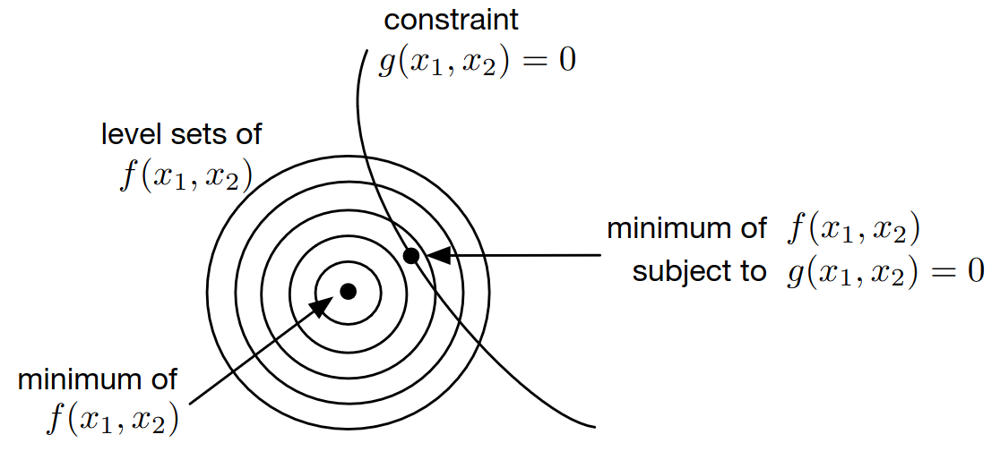

# Lecture 11, Oct 13, 2023

## Equality-Constrained Optimization

{width=60%}

\noteDefn{A \textit{feasible point} of a constrained optimization problem (minimize $f(\bm x)$ subject to $\bm g(\bm x) = \bm 0$, $\bm h(\bm x) \geq \bm 0$) is any point $\bm x$ satisfying the constraints $\bm g(\bm x) = \bm 0$ and $\bm h(\bm x) \geq \bm 0$. \tcblower The \textit{feasible set} is the set of all feasible points.}

\noteDefn{A \textit{critical point} of constrained optimization is a local maximum, minimum, or saddle point of $f$ within the feasible set.}

* Consider a simpler problem of minimizing $f(\bm x)$ subject to a single equality constraint $g(\bm x) = 0$
	* The feasible set is $S_0 = \Set{\bm x | g(\bm x) = 0}$
	* Consider taking a small step $\Delta\bm x$ from a feasible point; to stay on the level curve $g(\bm x) = 0$, this step must be taken in a directional orthogonal to $\del g(\bm x)$, i.e. $\del g(\bm x)\Delta\bm x = 0$
	* Now consider taking a small step $\Delta x$ from a minimum; then we must have $f(\bm x^* + \Delta\bm x) \geq f(\bm x^*)$, if the step is taken such that $g(\bm x) = 0$ is satisfied as above
		* This means $\del f(\bm x^*)\Delta\bm x \geq 0$ by Taylor expansion
		* But we also have $\del g(\bm x)(-\Delta\bm x) = 0$, so we know that $\del f(\bm x^*)(-\Delta\bm x) \geq 0$, which means $\del f(\bm x^*)\Delta\bm x = 0$ is the only way this can be true
* Since $\del f(x^*)\Delta\bm x = 0 = \del g(\bm x^*)\Delta\bm x$ we have $\del f(\bm x^*) = \lambda\del g(\bm x^*)$ for some $\lambda$ at a minimum (that is, the gradient of the function and the constraint are parallel)
	* $\lambda$ is known as the *Lagrange multiplier* (nothing to do with eigenvalues)
* Let the *Lagrangian* be $\Lambda(\bm x, \lambda) = f(\bm x) - \lambda g(\bm x)$, then the unconstrained stationary points of $\Lambda(\bm x, \lambda)$ with respect to both $\lambda$ and $\bm x$ are critical points of the optimization problem, since they satisfy:
	* $\pdiff{\Lambda}{\lambda} = -g(\bm x) = 0$
	* $\pdiff{\Lambda}{\bm x} = \del f(\bm x) - \lambda\del g(\bm x) = 0$
	* This allows us to convert a constrained optimization problem to an unconstrained one, so that any unconstrained solver we saw earlier can be used
	* This can be extended to multiple equality constraints

\noteThm{\textit{Method of Lagrange Multipliers}: The critical points of the equality-constrained optimization problem of minimizing $f(\bm x)$ subject to $\bm g(\bm x) = \bm 0$ are the unconstrained critical points of the \textit{Lagrangian}: $$\min _{\bm x, \bm\lambda}\Lambda(\bm x, \bm\lambda) = f(\bm x) - \bm\lambda^T\bm g(\bm x)$$ Note that the Lagrangian is minimized with respect to both $\bm x$ and $\bm\lambda$.}

* The Lagrange multiplier gives information about how the objective function changes if the constraints change by a small amount
* Example: maximizing a rectangle's area subject to a fixed perimeter of length $1$
	* We wish to minimize $f(\bm x) = f(w, l) = -wl$ subject to the constraint that $g(\bm x) = g(w, l) = 2w + 2l - 1 = 0$
	* Use the Lagrangian: $\Lambda(w, l, \lambda) = -wl - \lambda(2w + 2l - 1)$, which we can optimize without constraints
	* $\pdiff{\Lambda}{w} = -l^* - 2\lambda^*, \pdiff{\Lambda}{l} = -w^* - 2\lambda^*, \pdiff{\Lambda}{\lambda} = 1 - 2w^* - 2l^*$
	* In matrix form: $\matthreeb{0}{-1}{-2}{-1}{0}{-2}{2}{2}{0}\cvec{w^*}{l^*}{\lambda^*} = \cvec{0}{0}{1}$
	* We get the solution $w^* = l^* = \frac{1}{4}, \lambda^* = -\frac{1}{8}$, which is a square as expected
* Example: minimize $f(\bm x) = x_1^2 + x_2^2 = \bm x^T\bm x$ subject to $g(\bm x) = x_1 + x_2 - 1 = \rvec{1}{1}\bm x - 1 = \bm a^T\bm x - 1 = 0$
	* The level curves are circles centered at the origin, and the constraint is a line passing through $(0, 1)$ and $(1, 0)$
	* $\Lambda = f(\bm x) - \lambda g(\bm x) = \bm x^T\bm x - \lambda(\bm a^T\bm x - 1)$
	* $\pdiff{\Lambda}{\lambda} = \bm a\bm x - 1 = 0 = g(x)$ (we can always just take the constraint; no need to take this derivative)
	* $\pdiff{\Lambda}{x} = 2\bm x^T - \lambda\bm a^T = 0 \implies x = \frac{\lambda}{2}\bm a$
	* $\bm a^T\bm a\frac{\lambda}{2} = 1 \implies 2\frac{\lambda}{2} = 1 \implies \lambda = 1, \bm x = \cvec{\frac{1}{2}}{\frac{1}{2}}$
* Example: $f(\bm x) = \bm x^T\bm A\bm x, \bm A = \mattwo{3}{\sqrt{2}}{\sqrt{2}}{2}, g(\bm x) = \bm x^T\bm x - 1 = 0$
	* The level curves are skewed ellipses around the origin; the constraint is a circle of radius 1
	* $\Lambda = \bm x^T\bm A\bm x - \lambda(\bm x^T\bm x - 1)$
	* $\pdiff{\Lambda}{\bm x} = 2\bm x^T\bm A - 2\lambda\bm x^T = 0 \implies \bm A\bm x = \lambda\bm x$ which is an eigenvalue equation
		* Substituting this back in: $\Lambda = \bm x^T\bm x\lambda - \lambda(\bm x^T\bm x - 1) = \lambda$
	* The eigenvalues are $\lambda = 1, 4$, so we choose $\lambda = 1$ and its eigenvector normalized to unit length (for constraint $g$)
	* Note that there are actually two solutions here ($\pm$ on the unit eigenvector)

## Inequality Constraints: Introduction

* There are 2 possible cases for each inequality constraint; consider a minimum $\bm x$, then either $h_i(\bm x) = 0$ this point (active), or $h_i(\bm x) > 0$ (inactive)
	* In the first case, the inequality constraint is the same as an equality constraint and the optimum will be on the boundary of the inequality region
	* In the second case, the inequality constraint has effectively no impact on where the optimum is, since it lies fully within the inequality region
	* If there are multiple active inequality constraints, then the solution lies on the intersection of their boundaries

