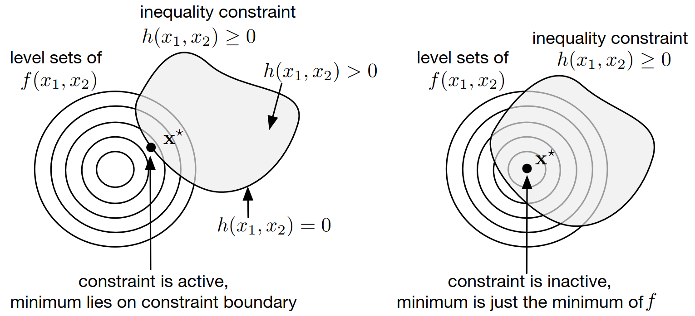
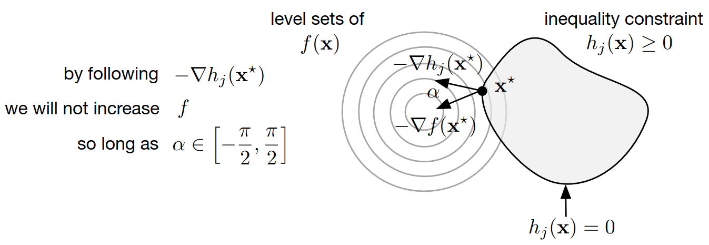
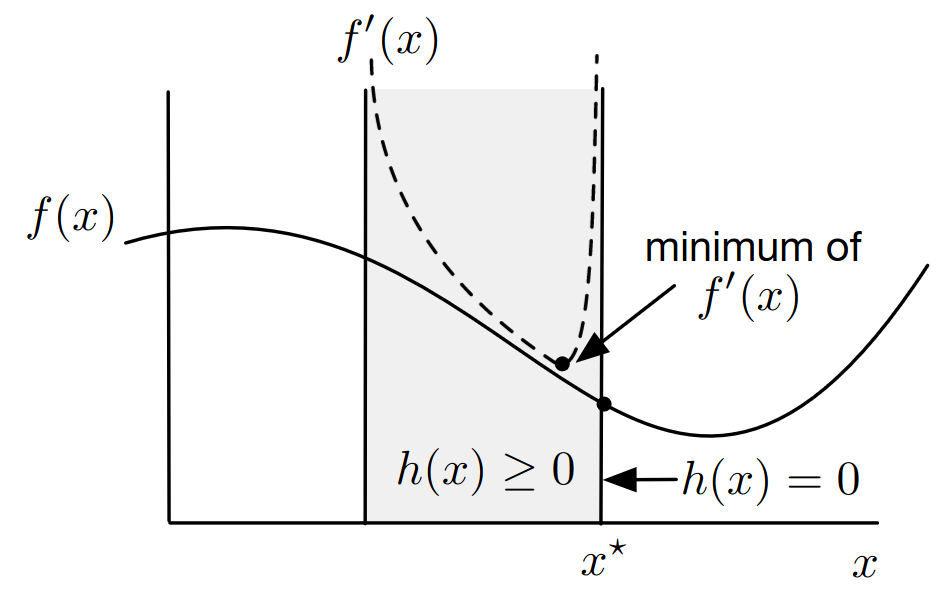
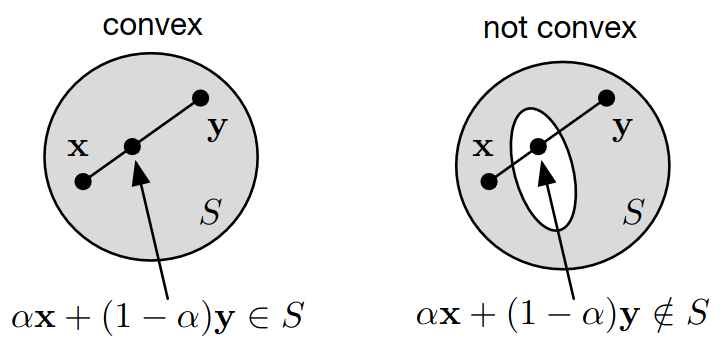

# Lecture 12, Oct 18, 2023

## Inequality-Constrained Optimization

{width=80%}

* We will now consider the full optimization problem of minimizing $f(\bm x)$ subject to $\bm g(\bm x) = \bm 0$ and $\bm h(\bm x) \geq \bm 0$
* There are 2 possible cases for each inequality constraint $h_i$; consider a minimum $\bm x$, then either $h_i(\bm x) = 0$ this point (active), or $h_i(\bm x) > 0$ (inactive)
	* In the first case, the inequality constraint is the same as an equality constraint and the optimum will be on the boundary of the inequality region
	* In the second case, the inequality constraint has effectively no impact on where the optimum is, since it lies fully within the inequality region
	* If there are multiple active inequality constraints, then the solution lies on the intersection of their boundaries
* If we assume that all inequality constraints are active, we can then treat them as equality constraints and use the Lagrange multiplier approach
	* $\Lambda(\bm x, \bm\lambda, \bm\mu) = f(\bm x) - \bm\lambda^T\bm g(\bm x) - \bm\mu^T\bm h(\bm x)$
	* Then for a critical point $\del f(\bm x) - \sum _i\lambda _i\del g_i(\bm x) - \sum _j\mu _j\del h_j(\bm x) = \bm 0$ and $g_i(\bm x) = h_j(\bm x) = \bm 0, \forall i, j$
* If we let $\mu _j = 0$ whenever the inequality constraint $h_j$ is inactive (i.e. $h_j(\bm x) \neq 0$), then the inactive constraints drop out and the above condition holds for the general case
	* Let $\forall j, \mu _jh_j(\bm x) = \bm 0$, then the condition above holds in general
	* This condition is known as *complementary slackness*

{width=80%}

* Note that in the equality constraint case, our Lagrange multipliers can be positive or negative; but for inequality constraints, this is not the case
	* Consider the diagram above where $\bm x^*$ is a critical point and $\Delta\bm x$ is some perturbation; let constraint $h_j(\bm x)$ be active
	* Note that $\del h_i(\bm x)$ is pointing inwards of the feasible set
	* Intuitively, if $\del f(\bm x)$ and $\del h_i(\bm x)$ have a negative dot product (i.e. they point at least somewhat in the opposite direction), then we can move into our feasible set while decreasing $f(\bm x)$
		* But if $\del f(\bm x)$ and $\del h_i(\bm x)$ have a positive dot product, then we cannot both decrease $f(\bm x)$ while keeping the inequality constraint satisfied
	* Let $\Delta \bm x = \del h_i(\bm x^*)^T$, then
		* $h_i(\bm x^* + \Delta\bm x) \approx h_i(\bm x^*) + \del h_i(\bm x^*)\Delta\bm x = h_i(\bm x^*) + \del h(\bm x^*)\del h(\bm x^*)$
		* Since both terms on the right are positive, we know that $h_i(\bm x^* + \Delta\bm x) \geq 0$, i.e. this perturbation is still feasible
		* $f(\bm x^* + \Delta x) \approx f(\bm x^*) + \del f(\bm x^*)\Delta\bm x = f(\bm x^*) + \del f(\bm x^*)\del h_i(\bm x^*)^T$
		* If the second term is negative, then we know that the perturbation decreases $f$, which means $\bm x^*$ is no longer a critical point -- contradiction
	* Therefore we must have that $\del f(\bm x^*)\del h_i(\bm x^*)^T \geq 0$ at a local minimum, hence $\del f(\bm x^*) = \mu _i\del h_i(\bm x^*)$ where $\mu _i \geq 0$ (strictly greater if $h_i$ must be active)
	* This condition is known as *dual feasibility*
* Note that we can always take an equality constraint and rewrite it in terms of 2 inequality constraints, i.e. $g_i(\bm x) = 0 \iff g_i(\bm x) \geq 0, -g_i(\bm x) \geq 0$
	* This lets us write the critical point condition in terms of only inequality constraints

\noteThm{\textit{Karush-Kuhn-Tucker (KTT) Conditions}: The vector $\bm x^* \in \reals^n$ is a critical point for minimizing $f(\bm x)$ subject to $\bm g(\bm x) = 0$, $\bm h(\bm x) \geq \bm 0$ when there exists $\bm\lambda \in \reals^m$ and $\bm\mu \in \reals^p$ such that:
\begin{enumerate}
	\item Stationarity: $\del f(\bm x^*) - \sum _i \lambda _i\del g_i(\bm x^*) - \sum _j \mu _j\del h_j(\bm x^*) = \bm 0$
	\item Primal feasibility: $\bm g(\bm x^*) = \bm 0$ and $\bm h(\bm x^*) \geq \bm 0$
	\item Complementary slackness: $\forall j, \mu _jh_j(\bm x^*) = 0$
	\item Dual feasibility: $\forall j, \mu _j \geq 0$
\end{enumerate}}

* To find whether $\bm x^*$ is a local minimum (instead of a maximum or saddle point), we need to check the Hessian constrained to the subspace of $\reals^n$ in which $\bm x$ can move without violating the constraints
* Example: optimal rectangle: same rectangle optimization constraint from last time, but we enforce $w \leq \bar w$
	* The inequality constraint can be expressed as $\bar w - w \geq 0$
	* The Lagrangian becomes $\Lambda(w, l, \lambda, \mu) = -wl - \lambda(2w + 2l - 1) - \mu(\bar w - w)$
	* Using the KTT optimality conditions:
		* Stationarity:
			* $\pdiff{\Lambda}{w} = -l^* - 2\lambda^* + \mu^* = 0$
			* $\pdiff{\Lambda}{l} = -w^* - 2\lambda^* = 0$
		* Primal feasibility:
			* $2w^* + 2l^* - 1 = 0$
			* $\bar w - \bar w^* \geq 0$
		* Complementary slackness: $\mu^*(\bar w - \bar w^*) = 0$
		* Dual feasibility: $\mu^* \geq 0$
	* We now need to consider 2 cases:
		* $\mu^* = 0$, where the inequality constraint is inactive, so we have $w^* = l^* = \frac{1}{4}$ as before
			* We can see that all our equations reduce to the same thing we had previously
		* $\mu^* \neq 0$, where the inequality constraint is active
			* We have $w^* = \bar w$ from complementary slackness
			* $\lambda^* = -\frac{\bar w}{2}, l^* = \frac{1}{2} - \bar w$
			* Substituting into the first stationary equation, $\mu^* = \frac{1}{2} - 2\bar w$
			* Since $\mu^* \geq 0$, this only holds if $\bar w \leq \frac{1}{4}$ -- i.e. the constraint would only be active if $\bar w \leq \frac{1}{4}$ (above this value we just get the normal solution)
	* In summary: when $\bar w \leq \frac{1}{4}$, the constraint is active and we have $w^* = \bar w, l^* = \frac{1}{2} - \bar w$; when $\bar w \geq \frac{1}{4}$, then the inequality constraint is active and $w^* = l^* = \frac{1}{4}$
	* In general inequality constraints complicate the problem since now we need to consider multiple cases

## Numerical Optimization Methods

* We will discuss two broad categories of algorithms:
	* *Sequential quadratic programming (SQP)*: iteratively solve a set of simpler, less constrained problems that approximate the fully constrained problem
	* *Barrier methods*: replace the constraints with penalties in the objective function, and then optimize the new function using unconstrained methods
* SQP approximates $f, \bm g, \bm h$ by simpler functions
	* $f$ is replaced by a quadratic objective while the constraints are replaced by linear constraints
	* This is similar to Newton's method -- taking a quadratic approximation, solving for the minimum, and then approximate again
	* The active set method checks which constraints are active
		* Given an active set, all constraints are treated as equality constraints and Lagrange multipliers are used to minimize
	* SQP only converges if we start with an instal guess in the neighbourhood of the true minimum, similar to Newton's method
	* Most model predictive controllers (MPC controllers) use SQP methods

{width=40%}

* Barrier methods add penalties to the objective for violating constraints, then optimizes the new objective without constraints
	* e.g. define a new objective as $f'(x) = f(x) + \rho\frac{1}{h(x)}$ with $\rho$ being some weight
	* If constraints are not satisfied closely enough, increase $\rho$ to penalize the cost more
	* $\rho$ is decreased iteratively if we are close enough to the constraints, which brings us closer to the true minimum

## Convex Optimization

* We want to develop methods for identifying convex problems

{width=50%}

\noteDefn{A set $S \subseteq \reals^n$ is \textit{convex} if $$\forall\bm x, \bm y \in S, \alpha \in [0, 1], \alpha\bm x + (1 - \alpha)\bm y \in S$$}

* Additional useful properties:
	* The intersection of convex sets is also a convex set
		* This means if we combine two convex constraints, we also get a convex constraint back
	* The sum and maximum of convex functions is also a convex function
	* If $f$ is convex, then $\Set{\bm x | f(\bm x) \leq c}$ is a convex set for a fixed $c \in \reals$
		* We can "chop off" a function below some line to get a convex set

\noteThm{If the objective function $f$ and feasible set of an optimization problem are both convex, then the optimization problem possesses a unique minimum.}

* An optimization problem is convex if its objective function is convex and its feasibility region is also a convex set
	* When a problem is convex, we can make strong convergence guarantees
	* Intuition: if both $\bm x$ and $\bm y$ are in the feasible set, then any potential minimum that lies between them is also in the feasible set
* Example: consider the constrained least-squares problem of minimizing $\norm{\bm A\bm x - \bm b}_2^2$ subject to $\bm x \in {\bm x \in \reals^n | \bm x \geq \bm 0}$
	* The objective function is convex since it expands to $\bm x^T\bm A^T\bm A\bm x - 2b^T\bm A\bm x + \bm b^T\bm b$, which has a Hessian of $\bm A^T\bm A$, which is positive semi-definite for any $\bm A$
	* We can also show that the feasible set is convex since the positive weighted sum of any two positive numbers is also positive
	* Therefore this problem is convex
* Example: optimizing the 1-norm, $\norm{\bm x}_1 = \abs{x_1} + \abs{x_2} + \cdots + \abs{x_n}$
	* We can rewrite it as minimizing $\sum _i y_i$ with respect to $\bm x, \bm y$, subject to $\bm x, \bm y \in \Set{\bm x, \bm y \in \reals^n | y_i \geq x_i, y_i \geq -x_i}$
	* We're forcing $\abs{x_i} \geq y_i$ and trying to minimize the sum of $y_i$
	* This is now a convex problem: the objective function is convex since all $y_i$ are convex, so their sum is convex; the feasible set is convex since $y_i - x_i \geq 0$ and $y_i + x_i \geq 0$ are both convex functions, so if we let $h_{i_1}(y, x) = y_i - x_i$, then $h_{i_1} \leq 0$ is also convex; the intersection of both convex constraints gives a convex feasible set
* Note that our optimal rectangle problem is not convex but we still found the global minimum
* Minimizing $\bm c^T\bm x$ subject to $\bm A\bm x = \bm b$ is referred to as a *linear program*, which is a special convex problem that can be solved very quickly
* Second-order cone programs are $\bm c^T\bm x$ subject to $\norm{\bm A_i\bm x - \bm b_i}_2 \leq d_i + \bm c^T\bm x$ which are also convex
* What about nonconvex problems?
	* We can try to approximate $f(\bm x)$ with an easier (convex) problem
	* We can sample the space of feasible $\bm x$ as "seeds" for starting points of a local optimization, optimize all of them, and then picking the minimum
	* Randomized algorithms also exist (e.g. simulated annealing)
* Sometimes we want to do *online optimization*, where the objective function changes over time
	* A simple strategy is to use the old optimum $\bm x^*$ as the initial guess for the new problem

