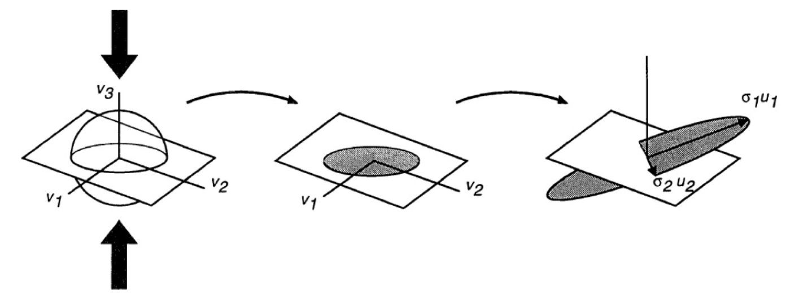
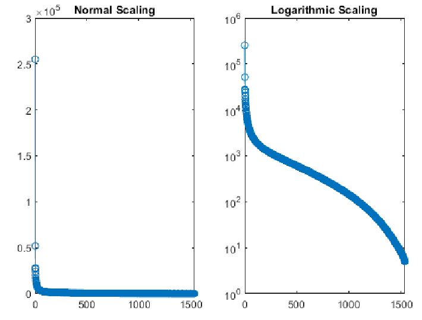

# Lecture 15, Oct 27, 2023

## Interpretations of the SVD

* If $\bm A$ is a linear mapping, we can interpret the SVD as breaking up $\bm A$ into a rotation/projection $\bm V^T$, a scaling $\bm\Sigma$ and reconstructing in the basis $\bm U$
	* The input vector $\bm x$ is projected into the orthonormal basis $\bm V^T$
	* Each component gets scaled by a singular value
	* The rescaled components are reconstructed into an output vector using the basis $\bm U$
	* Note that since the singular values are ordered, $\bm v_1$ is the "highest gain" input vector direction and $\bm u_2$ is the "highest gain" output vector direction
* We can approximate $\bm A$ with a lower rank matrix $\tilde{\bm A}$
	* $\tilde{\bm A}_l = \sum _{i = 1}^l \sigma _i\bm u_1\bm v_i^T$
	* Since the singular values are in descending order, we're basically keeping the "more important" parts of the matrix
	* This is linked to dimensionality reduction techniques

{width=80%}

* Geometrically, consider how the SVD transforms a vector on the unit sphere:
	* Let $\bm z = z_1\bm v_1 + z_2\bm v_2 + \dots + z_n\bm v_n$ for $\sum _i z_i^2 = \bm z^T\bm z = 1$
	* $\alignedeqntwo[t]{\bm A\bm z}{\bm U\bm\Sigma\bm V^T\bm z}{\bm U\bm\Sigma\bm V^T(\bm z = z_1\bm v_1 + z_2\bm v_2 + \dots + z_n\bm v_n)}{\sigma _1z_1\bm u_1 + \dots + \sigma _kz_k\bm u_k}{w_1\bm u_1 + w_2\bm u_2 + \dots + w_k\bm u_k}$
	* Since $\sum _{i = 1}^k \frac{w_i^2}{\sigma _i}^2 = \sum _{i = 1}^k z_i^2 \leq \sum _{i = 1}^n z_i^2 = 1$ we have an ellipsoid in $k$ dimensions
		* If $k = n$ (full rank), then we have an equality, so we get the surface of the ellipsoid (no collapse)
		* If $k < n$, we have the inequality so we get the solid interior of the ellipsoid (some dimensions are collapsed)
	* We can interpret the SVD as first collapsing the unit sphere by $n - k$ dimensions, then stretching the remaining $k$ dimensions and then embedding the result in $\reals^m$

## Applications of the SVD

* SVD has many applications, the most common of which are dimensionality reduction techniques -- we can throw away parts of the matrix that are less important

{width=50%}

* Image compression: treat the image as a big matrix, take the SVD, and truncate the singular values below a certain threshold
	* In general with data matrices we don't really have a clear "rank", so we will see a "continuous" spectrum of singular values -- they decrease relatively smoothly instead of having a cutoff
	* We can now store the singular values and singular vectors above a certain threshold instead of the full image matrix
	* SVD compression is good at picking up patterns that align with the axes of the image (since these correspond to lower rank patterns)
		* e.g. a checkerboard would be very efficient when compressed since it has an effective rank of almost 1; but if we warp this checkerboard so that it is no longer axis-aligned, it becomes worse
* Principal component analysis (PCA): given $\bm A$ as the covariance matrix for a large number of high dimensional data points, we can use an SVD to get a lower dimensional subset that gives us more insight
	* The axes of the SVD are the axes of the error ellipsoid and the singular values are how large the ellipsoid is along each axis
* Dynamic mode decomposition (DMD): finding the best linear operator that represents the nonlinear dynamics of a system: $\dot{\bm z} = \bm f(\bm z) \leftrightarrow \dot{\bm x} = \bm A\bm x$
	* The system dynamics are often lifted into higher dimensional space where things become more linear
	* We get *emergent dynamics* from the system, e.g. the behaviour of vortices shed by an object
	* DMD uses a large number of samples of the time series evolution of the dynamics in higher dimensional space: $\Set{\bm x(t_0), \bm x(t_1), \dots, \bm x(t_N)} = \Set{\bm x_0, \bm x_1, \dots, \bm x_N}$
		* Each $\bm x$ is a stacked vector of all the data (state) of the system at a particular time sample
	* Assume there is some matrix $\bm A$ such that $\bm x_{k + 1} = \bm A\bm x_k$
		* $\bm X' = \bm A\bm X$ where $\bm X' = \rvec{\bm x_1}{\cdots}{\bm x_N}, \bm X = \rvec{\bm x_0}{\cdots}{\bm x_{N - 1}}$
	* Now we need to find $\bm A$, but it can be very large, so we can approximate it with a smaller matrix $\bm A_r$ using the SVD of the data matrix
		* $\bm X = \bm U\bm\Sigma\bm V^T \implies \bm X' = \bm A\bm U\bm\Sigma\bm V^T$
		* Truncate the SVD to get the dominant modes: $\bm X' \approx \bm A\bm U_r\bm\Sigma _r\bm V^T$
		* Therefore $\bm U_r^T\bm X'\bm V_r\bm\Sigma _r^{-1} = \bm U_r^T\bm A\bm U_r = \bm A_r$
	* Now we have the transition matrix we can perform an eigendecomposition $\bm A_r\bm W = \bm W\bm\Lambda$ to look at its modes
		* Map the eigenspace back to the original space: $\bm\Phi = \bm X'\bm V_r\bm\Sigma _r^{-1}\bm W$
		* The eigenvalues corresponding these modes allow us to see how they evolve -- whether they grow or shrink with time, oscillations, etc, just like a linear system
	* This can also be used to predict the future steps of the dynamics
* Frame-to-frame visual odometry: finding the coordinate transformation that maps one point cloud to another
	* This can be performed using an SVD of the point cloud data

