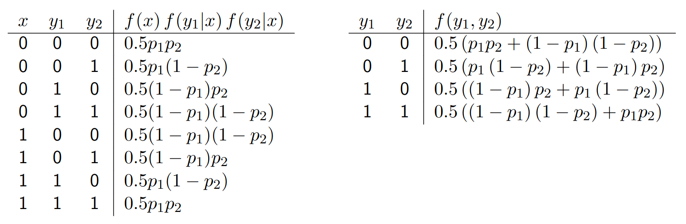

# Lecture 18, Nov 17, 2023

## More Probability

\noteDefn{The \textit{expected value} of $\bm x$ over a distribution $f_x(\bm x)$ is defined as: $$E[\bm x] = \sum _{\bm x \in \mathcal X} xf_x(\bm x)$$
The sum is replaced by an integral for a continuous distribution.
\tcblower
The \textit{variance} of $\bm x$ is defined as $$\Var[\bm x] = E[(\bm x - E[\bm x])(\bm x - E[\bm x])^T]$$}

* $E[\bm x]$ is also known as the *mean* and is generally a vector
* $\Var[\bm x]$ is generally a matrix; called a *covariance* when a matrix
	* Diagonal entries are variances in each entry of $\bm x$ while the off-diagonal entries describe the correlation in the variances
	* If we look at a Gaussian, the spread looks like an ellipse; the eigenvalues describe the length of the axes of the ellipse, while the eigenvectors describe how it's aligned/skewed
* Mean and variance are first and second-order *moments* of $\bm x$; we can also have higher order moments
* If $\mathcal Y = \Set{y | y = g(x), x \in \mathcal X}$, then $E[y] = E[g(x)]$; i.e. to find the mean of $y$ we don't need to find its PDF, we just need to apply $g$ to every element of $\mathcal X$
	* This is known as the *Law of the Unconscious Statistician*
* Let $f_y(y)$ be a discrete PDF; consider some $x = g(y)$, then what is $f_x(x)$?
	* We assume that multiple $y$ values can map to the same $x$ (but the same $y$ can't map to multiple $x$)
	* Let $\mathcal X = g(\mathcal Y)$; for each $x_j \in \mathcal X$, let $\mathcal Y_j = \Set{y_{j,i}}$ be the set of all $y \in \mathcal Y$ such that $g(y_{j,i}) = x_j$ (i.e. $\mathcal Y_j$ contains all elements in $\mathcal Y$ that map to $x_j$)
	* Claim: $f_x(x_j) = \sum _{y_{j,i}} f_y(y_{j,i})$, that is, to find the probability of $x_j$ we just sum the probabilities of all $y_{j,i}$ that map to it
		* $f_x(x_j) = \Pr(x = x_j) = \Pr(y \in \mathcal Y_j) = \sum _{y_{j,i} \in \mathcal Y_j} f_y(y_{j,i})$
		* Assume $\mathcal Y_j \cap \mathcal Y_k = \emptyset$ when $j \neq k$, and $\mathcal Y_1 \cup \mathcal Y_2 \cup \cdots \cup \mathcal Y_n = \mathcal Y$ (this is true because the same $\mathcal Y$ can't map to multiple $\mathcal X$)
		* $\sum _{x_j \in \mathcal X} f_x(x_j) = \sum _{x_j \in \mathcal X}\sum _{y_{j,i} \in \mathcal Y_j} f_y(y_{j,i}) = \sum _{j = 1}^m \sum _{y_{j,i} \in \mathcal Y_j} f_y(y_{j,i}) = \sum _{y \in \mathcal Y} f_y(y) = 1$
* For a continuous probability distribution, we assume $g(y)$ is continuously differentiable and strictly monotonic (i.e. strictly increasing or decreasing) and that $f_y(y)$ is continuous
	* Claim: $f_x(x) = \frac{f_y(y)}{\diff{g(y)}{y}}$
		* $\Pr(y \in [\bar y, \bar y + \Delta y]) = \int _{\bar y}^{\bar y + \Delta y} f_y(y)\,\dy \approx f_y(\bar y)\Delta y$
		* Let $\bar x = g(\bar y)$ and $g(\bar y + \Delta y) = g(\bar y) + \diff{g(\bar y)}{y}\Delta y = \bar x + \Delta x$
		* $\Pr(x \in [\bar x, \bar x + \Delta x]) = \int _{\bar x}^{\bar x + \Delta x} f_x(x)\,\dx \approx f(\bar x)\Delta x$
		* But we also have $\Pr(x \in [\bar x, \bar x + \Delta x]) = \Pr(y \in [\bar y, \bar y + \Delta y])$ because these are the same intervals
		* $f_x(\bar x)\Delta x = f_y(\bar x)\Delta y \implies f_x(\bar x)\diff{g(\bar y)}{y}\Delta y = f_y(\bar y)\Delta y \implies f_x(x) = \frac{f_y(y)}{\diff{g(y)}{y}}$
	* We can also think about this as a change of variables; we need $\int _\mathcal Y f_y(y)\,\dy = 1$, and since $x = g(y)$, $\diff{g(y)}{y}\,\dy \implies \dy = \frac{1}{\diff{g(y)}{y}}\,\dx$, then $\int _\mathcal X f_y(y)\frac{1}{\diff{g(y)}{y}}\,\dx = 1$, so the expression inside the integral must be the PDF of $x$

## Bayes' Theorem in Practice

* We will use Bayes' Theorem to create a recursive filter; given a prior belief distribution and some measurement info, we use Bayes' Theorem to construct a new posterior belief/distribution
	* The measurement info itself is probabilistic since there may be errors
	* This can be done in a variety of ways, e.g. particle filters, Kalman filter
* $f(x|y) = \frac{f(y|x)f(x)}{f(y)}$
	* $x$ is some unknown quantity of interest, e.g. the system state
	* $y$ is some observation related to the state, e.g. sensor measurements
	* $f(x)$ is some prior belief
	* $f(y|x)$ is the observation model; for each state $x$, what is the likelihood of observing $y$?
	* $f(x|y)$ is the posterior belief, which takes the new observation into account
	* $f(y) = \sum _x f(y|x)f(x)$ is the probability of observing $y$ (independent of $x$); this can be seen as a normalization constant since it's a constant multiplier as far as $x$ is involved
* Given $f(x|y)$, we can then find the "most likely" state; this is often defined as the mode or mean
* We can generalize to $N$ observations $y_1, \dots, y_N$, each of which may be vector-valued; assume conditional independence so that $f(y_1, \dots, y_N|x) = f(y_1|x)\cdots f(y_N|x)$
	* The conditional independence means that the noise corrupting each state $x$ is independent
	* $y_i = g_i(x, w_i)$ where $w_i$ are noise; then we assume $f(w_1, \dots, w_N) = f(w_1)\cdots f(w_N)$
* Then $f(x|y_1, \dots, y_N) = \frac{f(x)\prod _i f(y_i|x)}{f(y_i, \dots, y_N)} = \frac{f(x)\prod _i f(y_i|x)}{\sum _{x \in \mathcal X} f(x)\prod _i f(y_i|x)}$
* Example: Let $x \in \Set{0, 1}$ represent the truthful answer to a question (0 -- no, 1 -- yes); the response (i.e. observation) from person $i$ modelled as $y_i = x + w_i$, where $w_i$ is some independent noise (0 -- truth, 1 -- lie)
	* Note the + operator works like an XOR here
	* We ask 2 people the same question, and estimate what the truth is
	* The prior is $f(x) = \frac{1}{2}$ for both $x = 0, 1$ (i.e. we have no information and all states are equally likely)
	* We model the truthfulness as $f_{w_i}(0) = p_i, f_{w_i}(1) = 1 - p_i$, i.e. person $i$ tells the truth with probability $p_i$
	* By Bayes' theorem $f(x|y_1, y_2) = \frac{f(x)f(y_1|x)f(y_2|x)}{f(y_1,y_2)}$
	* We build tables for the numerator and denominator to find the probabilities (see figure below)
		* Note terms in the table on the right are obtained by summing over all possible values of $x$; e.g. for $y_1 = 0, y_2 = 0$ we are taking the sum of $x = 0, y_1 = 0, y_2 = 0$ and $x = 1, y_1 = 0, y_2 = 0$ in the left table
	* Note that all the information in the tables could have been obtained from just $f(x|y_1), f(x|y_2)$

{width=80%}

