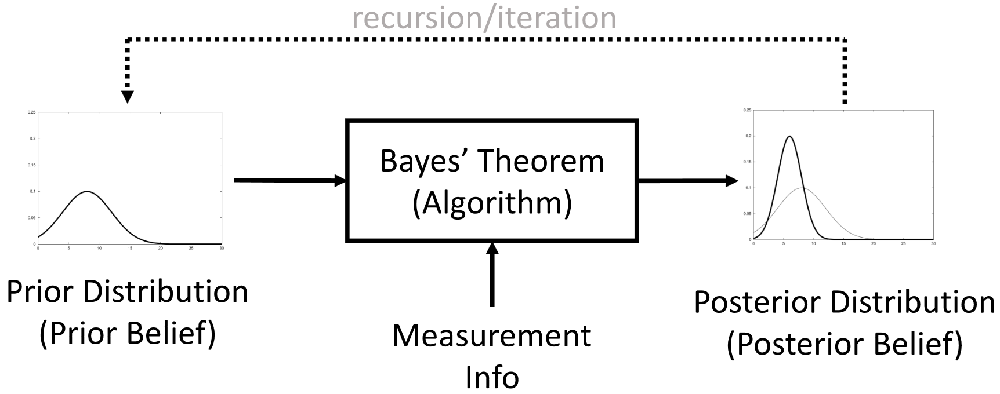
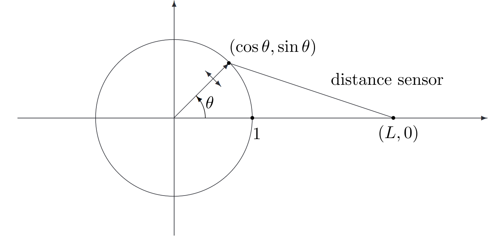

# Lecture 19, Nov 22, 2023

## Bayesian Tracking

{width=80%}

* We wish to derive a recursive state estimation algorithm (i.e. iterating at each timestep) for a system with a finite state space, consisting of two main steps:
	1. The *prior update*, where the state estimate is predicted forward using the process model
	2. The *measurement update*, where the prior is combined with observation and measurements to correct it
* Let $\bm x_k \in \mathcal X$ be the vector-valued state at time $k$ (assumed discrete, i.e. $\mathcal X$ is finite); let $\bm y_k$ be a vector-valued measurement that we can observe (continuous or discrete)
* We have a motion model $\bm x_k = \bm f_{k - 1}(\bm x_{k - 1}, \bm v_{k - 1})$ and the observation model $\bm y_k = \bm h_k(\bm x_k, \bm w_k)$, where $\bm v_k, \bm w_k$ are independent noise terms with known PDFs; we also assume noise is independent of the initial condition $\bm x_0$
	* Note $\bm u_{k - 1}$ is not explicitly included, but we can incorporate it by absorbing it into $\bm f_{k - 1}$ and $\bm h_k$
* Let $\bm y_{1:k} = \Set{\bm y_1, \dots, \bm y_k}$; we want to calculate $f(\bm x_k | \bm y_{1:k})$, i.e. the probability distribution of the state at time $k$, given all our measurements
* Assuming the *Markov property* (i.e. each state only depends on the prior state, and not the state history), we can formulate the problem as computing $f(\bm x_k | \bm y_{1:k})$ from $f(\bm x_{k - 1} | \bm y_{1:k - 1})$
* Prior update: compute $f(\bm x_k | \bm y_{1:k - 1})$ in terms of $f(\bm x_{k - 1} | \bm y_{1:k - 1})$
	* By total probability, $f(\bm x_k | y_{1:k - 1}) = \sum _{x_{k - 1} \in \mathcal X} f(\bm x_k|\bm x_{k - 1}, \bm y_{1:k - 1})f(\bm x_{k - 1}|\bm y_{1:k - 1})$
		* i.e. we introduce $\bm x_{k - 1}$ and marginalize across it
	* $\bm x_k$ and $\bm y_{1:k - 1}$ are conditionally independent given $\bm x_{k - 1}$, because the distribution of $\bm x_{k - 1}$ already incorporates the information from all previous measurements
		* $\bm x_k$ is a function of $\bm v_{k - 1}$ only (because $\bm x_{k - 1}$ is known)
		* $\bm y_{k - 1}$ is a function of $\bm w_{k - 1}$
		* $\bm y_{k - 2}$ is a function of $\bm x_{k - 2}$ and $\bm w_{k - 2}$, but $\bm x_{k - 2}$ is a function of $\bm x_{k - 3}$ and $\bm v_{k - 3}$, and so on
		* Therefore $\bm y_{1:k - 1}$ is a function of $\bm x_{k - 1}, \bm v_{1:k - 3}, \bm w_{1:k - 1}, \bm x_0$
		* $\bm x_k$, and $y_{1:k - 1}$ depend only on random variables that are independent, so these two variables must be independent
	* Therefore the prior update is $f(\bm x_k|\bm y_{1:k - 1}) = \sum _{x_{k - 1} \in \mathcal X} f(\bm x_k | \bm x_{k - 1})f(\bm x_{k - 1}|\bm y_{1:k - 1})$
		* The distribution $f(\bm x_k | \bm x_{k - 1})$ can be calculated exactly from our process model and noise distribution using change of variables
* Measurement update: compute $f(\bm x_k | y_{1:k - 1})$, given $\bm y_k$ and $f(\bm x_k | \bm y_{1:k - 1})$
	* Using Bayes' rule, $\alignedeqntwo[t]{f(\bm x_k | \bm y_{1:k})}{f(\bm x_k | \bm y_k, \bm y_{1:k - 1})}{\frac{f(\bm y_k|\bm x_k, \bm y_{1:k - 1})f(\bm x_k|\bm y_{1:k - 1})}{f(\bm y_k | \bm y_{1:k - 1})}}$
	* Once again, $\bm y_k$ and $\bm y_{1:k - 1}$ are conditionally independent, given $\bm x_k$
		* $\bm y_k$ is a function of only $\bm w_k$, if given $\bm x_k$
		* Using a similar procedure we can show $\bm y_{1:k - 1}$ is a function of $\bm v_{0:k - 2}, \bm w_{1:k - 1}, \bm x_0$, all of which are independent of $\bm w_k$
		* Therefore $\bm y_k, \bm y_{1:k - 1}$ are conditionally independent on $\bm x_k$
		* $f(\bm y_k|x_k, \bm y_{1:k - 1}) = f(\bm y_k | \bm x_k)$, and can be computed from our measurement model
	* The term in the denominator is simply a normalization constant
		* We can compute it as $f(\bm y_k | \bm y_{1:k - 1}) = \sum _{\bm x_k \in \mathcal X}f(\bm y_k|\bm x_k)f(\bm x_k|\bm y_{1:k - 1})$ by total probability
	* Therefore the measurement update is $f(\bm x_k | \bm y_{1:k}) = \frac{f(\bm y_k|\bm x_k)f(\bm x_k|\bm y_{1:k - 1})}{\sum _{\bm x_k \in \mathcal X}f(\bm y_k|\bm x_k)f(\bm x_k|\bm y_{1:k - 1})}$

### Implementation

* Enumerate the state as $\mathcal X = \Set{1, 2, \dots, N}$
* Define $\bm a_{k|k}^i = \Pr(\bm x_k = i | \bm y_{1:k - 1}), i = 1, \dots, N$ as an array of $N$ elements in which we store the posterior
	* Initialize $\bm a_{0|0}^i = \Pr(\bm x_0 = i)$
* Define $\bm a_{k|k - 1}^i = \Pr(\bm x_k = i|\bm x_{1:k - 1}), i = 1, \dots, N$ to store the prior
* Recursive update:
	* $\bm a_{k|k - 1}^i = \sum _{j = 1}^N \Pr(\bm x_k = i|\bm x_{k - 1} = j)\bm a_{k - 1|k - 1}^j$
		* $\Pr(\bm x_k = i|\bm x_{k - 1} = j)$ can be calculated from $\bm x_k = \bm f_{k - 1}(\bm x_{k - 1}, \bm v_{k - 1})$ and the distribution of $\bm v_k$
	* $\bm a_{k|k}^i = \frac{f(\bm y_k|\bm x_k = i)\bm a_{k|k - 1}^i}{\sum _{j = 1}^N f(\bm y_k|\bm x_k = j)\bm a_{k | k - 1}^j}$
		* $f(\bm y_k|\bm x_k = i)$ can be calculated from $\bm y_k = \bm h_k(\bm x_k, \bm w_k)$ and the distribution of $\bm w_k$

{width=80%}

* Example: consider an object moving randomly on a circle, in discrete steps; our measurement is the distance to the object from a distance sensor located at $(L, 0)$
	* Let $x_k$ be the object's location on the circle, then $\theta _k = \frac{2\pi x_k}{N}$
	* Set up the models:
		* The process model is $x_k = f(x_{k - 1}, v_{k - 1}) = (x_{k - 1} + v_{k - 1}) \bmod N$
		* The process noise is 1 with probability $p$, and -1 with probability $1 - p$
		* The measurement model is $y_k = h(x_k, w_k) = \sqrt{(L - \cos\theta _k)^2 + \sin^2\theta _k} + w_k$
		* The measurement noise is uniformly distributed over $[-e, e]$
	* Using a change of variables we can now compute the PDFs of the process and sensor models
		* $f(x_k | x_{k - 1}) = \threecond{p}{x_k = (x_{k - 1} + 1) \bmod N}{1 - p}{x_k = (x_{k - 1} - 1) \bmod N}{0}{\text{otherwise}}$
		* $f(y_k | x_k) = \twocond{\frac{1}{2e}}{\abs*{y_k - \sqrt{(L - \cos\theta _k)^2 + \sin\theta^2\theta _k}} \leq e}{0}{\text{otherwise}}$
	* Initialize as $f(x_0) = \frac{1}{N} \forall x_0 \in \Set{0, 1, \dots, N - 1}$ which assumes a state of maximum ignorance

