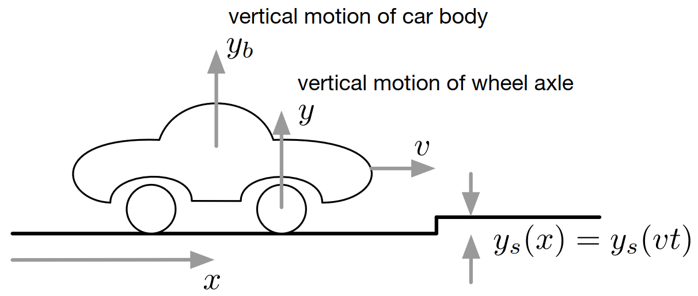
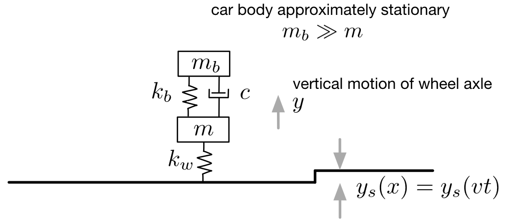
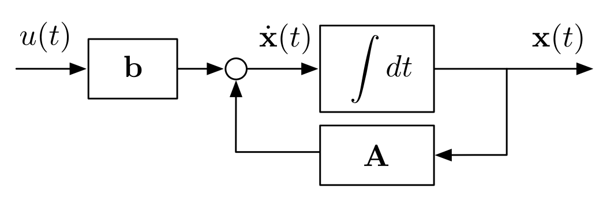
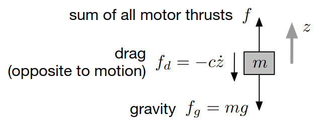

# Lecture 2, Sep 13, 2023

## System Modeling (Continuous and Discrete Time)

{width=40%}

{width=40%}

* Example 1: modeling the wheel motion of a car when it encounters a bump in the road
	* Assumptions: constant velocity, 2D system model, variable step height $y_s(x)$
	* Begin with a simple mechanical system:
		* $k_w$ is a spring representing the wheel; $m$ is the mass of the wheel axle
		* The spring-damper system $k_b$ and $c$ model the shock absorber in the car
		* In addition, we assume $m_b \gg m$, so that the car itself is approximately stationary and only the wheel axle moves; we also assume the suspension is 1D and that the car is at rest in the vertical direction before we hit the bump
	* Now we can use Newton's second law to form a mathematical model:
		* $m\ddot y = \sum f = -c\dot y - k_by - k_w(y - y_s)$
		* $m\ddot y + c\dot y + (k_b + k_w)y = m\ddot y + c\dot y + ky = k_wy(s) = u(t)$
			* This is a second order, linear, nonhomogeneous, time-invariant system
			* The initial conditions are $y(0) = \dot y(0) = 0$ and we wish to find $y, \dot y, \ddot y$ for $t \geq 0$
		* Now we need to represent it in a standard form
			* $\cvec{\dot y}{\ddot y} = \mattwo{0}{1}{-\frac{k}{m}}{-\frac{c}{m}}\cvec{y}{\dot y} + \cvec{0}{\frac{1}{m}}u$
			* This is now in standard form: $\dot{\bm x} = \bm A\bm x + \bm bu, \bm x(0) = \cvec{y(0)}{\dot y(0}$
			* This form corresponds to the following simulation block diagram:

{width=35%}

{width=30%}

* Example 2: modelling how a drone reacts to given motor inputs
	* Assumptions: horizontal motion is stabilized
	* Applying Newton's laws:
		* $m\ddot z = -mg - c\dot z + f$
		* We again have a second order, linear, nonhomogeneous, time-invariant system
	* In standard form: $\cvec{\dot z}{\ddot z} = \mattwo{0}{1}{0}{-\frac{c}{m}}\cvec{z}{\dot z} + \cvec{0}{\frac{1}{m}}u$
	* But how do we actually perform the simulation?

\noteSummary{In general for any linear system we have: a set of inputs $\bm u(t)$ (which we partially control); a set of outputs $\bm y(t)$ which we can measure; and states $\bm x(t)$ that are internal to the system which we cannot directly manipulate or measure.

To model a linear system in continuous time:
$$\begin{aligned} \dot{\bm x}(t) &= \bm A\bm x(t) + \bm B\bm u(t), \bm x(0) = \bm x_0 \\ \bm y(t) &= \bm C\bm x(t) + \bm D\bm u(t)\end{aligned}$$
where $\bm A, \bm B, \bm C, \bm D$ are \textit{state matrices}.

To model a nonlinear system in continuous time:
$$\begin{aligned}\dot{\bm x}(t) &= \bm f(\bm x(t), \bm u(t)), \bm x(0) = \bm x_0 \\ \bm y(t) &= \bm h(\bm x(t), \bm u(t))\end{aligned}$$}

* If we have $n$ states, $m$ inputs and $p$ outputs, then $\bm A$ is $n \times n$, $\bm B$ is $n \times m$, $\bm C$ is $p \times n$ and $\bm D$ is $p \times m$
* In practice, we often need to represent things in discrete time, since the computers running simulations are discrete
* To represent things in discrete time, we replace continuous signals with a sequence of regular samples at $t_k = kh$
	* $t_k = kh$ is the *sampling time*
	* $f_s = \frac{1}{h}$ is the *sampling frequency*
* So how do we convert our continuous model to a discrete one?
	* Recall that the solution for $\dot{\bm x}(t) = \bm A\bm x$ is $\bm x = e^{\bm At}\bm x_0$
	* Over a short time interval $t_k \leq t \leq t_{k + 1}$ the solution evolves as:
		* $\alignedeqntwo[t]{\bm x(t)}{e^{\bm A(t - t_k)}\bm x(t_k) + \int _{t_k}^t e^{\bm A(t - \tau)}\bm B\bm u(\tau)\,\dd\tau}{e^{\bm A(t - t_k)}\bm x(t_k) + \int _{t_k}^t e^{\bm A(t - \tau)}\bm B\,\dd\tau\bm u(t_k)}{\bm\Phi(t, t_k)\bm x(t_k) + \Gamma(t, t_k)\bm u(t_k)}$
			* Note that we have assumed $\bm u(\tau) = \bm u(t_k)$ (i.e. $\bm u$ stays constant over the timestep), which is referred to as a *zero-order hold*
		* $\bm x(t_{k + 1}) = \bm\Phi(t_{k + 1}, t_k)\bm x(t_k) + \Gamma(\bm t_{k + 1}, t_k)\bm u(t_k) = \bm A_d\bm x(t_k) + \bm B_d\bm u(t_k)$
			* We have discretized the system
* We now have difference equations for the system ($h$ is the sampling period):
	* $\bm x_{k + 1} = \bm A_d\bm x_k + \bm B_d\bm u_k$
	* $\bm y_k = \bm C\bm x_k + \bm D\bm u_k$
	* $\bm A_d = \bm\Phi(t_{k + 1}, t_k) = e^{\bm Ah}$
	* $\bm B_d = \Gamma(t_{k + 1}, t_k) = \int _0^h e^{\bm A\tau'}\,\dd\tau'\bm B$
* To solve for $\bm A_d$ and $\bm B_d$:
	* Note that $\diff{}{t}\bm\Phi(t) = \bm\Phi(t)\bm A$ and $\diff{}{t}\bm\Gamma(t) = \bm\Phi(t)\bm B$
	* Using this we have: $\diff{}{t}\mattwo{\bm\Phi(t)}{\bm\Gamma(t)}{\bm 0}{\bm I} = \mattwo{\bm\Phi(t)}{\bm\Gamma(t)}{\bm 0}{\bm I}\mattwo{\bm A}{\bm B}{\bm 0}{\bm 0}$
		* Now we can use another matrix exponential to solve this
	* $\mattwo{\bm A_d}{\bm B_d}{\bm 0}{\bm I} = \exp\left(\mattwo{\bm A}{\bm B}{\bm 0}{\bm 0}h\right)$

\noteNote{The matrix exponential can be calculated with the Matlab function \texttt{expm()} or scipy function \texttt{scipy.linalg.expm()}. We can also manually do a series expansion of the matrix exponential function. Alternatively, \texttt{c2d()} in Matlab or \texttt{control.matlab.c2d()} can be used to do the same conversion (which computes the matrix exponentials internally).}

* We can now recursively apply the difference equations to propagate the state:
	* $\bm x_1 = \bm A_d\bm x_0 + \bm B_d\bm u_0$
	* $\bm x_2 = \bm A_d(\bm A_d\bm x_0 + \bm B_d\bm u_0) + \bm B_d\bm u_1$
	* $\bm x_3 = \bm A_d(\bm A_d^2\bm x_0 + \bm A_d\bm B_d\bm u_0 + \bm B_d\bm u_1) + \bm B_d\bm u_2$ and so on
	* We can stack all these together: $\cvec{\bm x_1}{\bm x_2}{\vdots}{\bm x_N} = \bm F\cvec{\bm u_0}{\bm u_1}{\vdots}{\bm u_{N - 1}} + \bm F_0\bm x_0$

\noteDefn{A system is \textit{reachable} or \textit{controllable} if and only if $$\rank\rvec{\bm A_d^{N - 1}\bm B_d}{\bm A_d^{N - 2}\bm B_d}{\cdots}{\bm B_d} = N$$ where $N$ is the dimension of the state $\bm x_k$.
Physically this means that there is a given sequence of control inputs to reach any state.}

\noteDefn{A system is \textit{observable} if and only if $$\rank\cvec{\bm C}{\bm C\bm A_d}{\vdots}{\bm C\bm A_d^{N - 1}} = N$$
Physically this means that given some sequence of outputs, we can derive the system state.}

* Example: consider the system: $\dot x(t) = u(t), y(t) = x(t), x(0) = x_0$; find the difference equations assuming a zero-order hold at the input and sampled output, with sampling period $h$
	* Note that we have $\bm A = 0$ and $\bm B = 1$
	* For $t_k \leq t \leq t_{k + 1}$:
		* $\alignedeqntwo[t]{x(t)}{x(t_k) + \int _{t_k}^t u(\tau)\,\dd\tau}{x(t_k) + \int _{t_k}^t 1\,\dd\tau u(t_k)}{x(t_k) + (t - t_k)u(t_k)}$
		* Applying this at $t = t_{k + 1} = t_k + h$ we get $x_{k + 1} = x_k + hu_k$
* Example: $\ddot x = u$
	* State: $\bm z = \cvec{x}{\dot x}$
	* Continuous time: $\dot{\bm z} = \mattwo{0}{1}{0}{0}\bm z + \cvec{0}{1}u = \bm A\bm z + \bm Bu$
	* $\mattwo{\bm A_d}{\bm B_d}{\bm 0}{\bm I} = \exp\left(\mattwo{\bm A}{\bm B}{\bm 0}{\bm 0}h\right) = \exp\left(\matthreeb{0}{1}{0}{0}{0}{1}{0}{0}{0}h\right) = \exp(\bm Eh)$
	* Notice that $\bm E^2 = \matthreeb{0}{0}{1}{0}{0}{0}{0}{0}{0}$ and $\bm E^3 = \bm 0$ so $\bm E$ is nilpotent
	* Using the series expansion: $\exp(\bm Eh) = \bm I + \bm Eh + \frac{1}{2}\bm E^2h^2 = \matthreeb{1}{h}{\frac{1}{2}h^2}{0}{1}{h}{0}{0}{1}$
	* Therefore $\bm A_d = \mattwo{1}{h}{0}{1}, \bm B_d = \cvec{\frac{1}{2}h^2}{h}$
	* $\bm z_{k + 1} = \mattwo{1}{h}{0}{1}\bm z_k + \cvec{\frac{1}{2}h^2}{h}u_k$
		* Notice that if we substitute the definition of $\bm z$, we get the simple kinematic equations $x_{k + 1} = x_k + hv_k + \frac{1}{2}h^2u_k, v_{k + 1} = v_k + hu_k$
		* Assuming a zero-order hold, we can see that this is exact

\noteSummary{Given some linear continuous system given by
$$\begin{aligned} \dot{\bm x}(t) &= \bm A\bm x(t) + \bm B\bm u(t), \bm x(0) = \bm x_0 \\ \bm y(t) &= \bm C\bm x(t) + \bm D\bm u(t)\end{aligned}$$
we can discretize it to find discrete state matrices $\bm A_d$ and $\bm B_d$ so that the system can be equivalently modelled discretely by:
$$\begin{aligned}\bm x_{k + 1} &= \bm A_d\bm x_k + \bm B_d\bm u_k \\ \bm y_k &= \bm C\bm x_k + \bm D\bm u_k\end{aligned}$$
which is an exact model with the assumption of a zero-order hold on the input. The matrices $\bm A_d, \bm B_d$ can be found by the matrix exponential
$$\mattwo{\bm A_d}{\bm B_d}{\bm 0}{\bm I} = \exp\left(\mattwo{\bm A}{\bm B}{\bm 0}{\bm 0}h\right)$$
where $h$ is the size of each discrete time step.}

