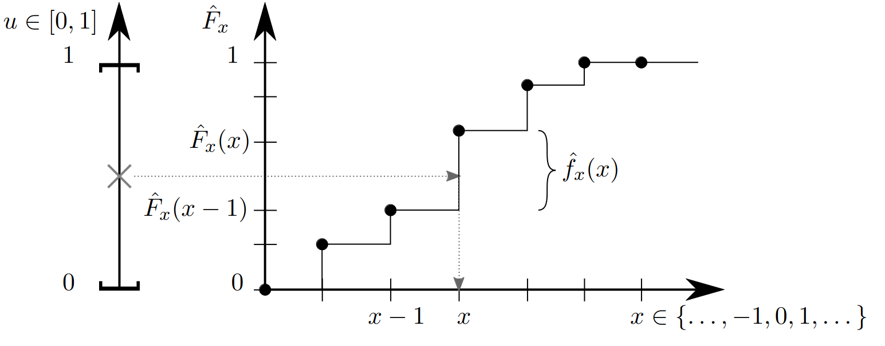

# Lecture 20, Nov 24, 2023

## Sampling Distributions in Practice

* Most math libraries have functions that generate uniformly distributed random real numbers in the range $(0, 1)$
	* e.g. `rand()` in MATLAB, `np.random.rand()` in Python
	* This interval will sometimes be closed or half-open, but practically we don't care
	* $f_u(u) = \twocond{1}{u \in (0, 1)}{0}{\text{otherwise}}$
* Repeated calls to the RNG are independent
* The generator can usually be seeded, e.g. with `np.random.seed()`; this gives the same sequence of random numbers for the same seed
* How do we draw samples from arbitrary, non-uniform PDFs?

### One Variable, Discrete

{width=70%}

* Given a desired PDF $\hat f_x(x)$ for a DRV $x$, we want to come up with a procedure to generate $x$ from $u$
* WLOG let $\mathcal X = \integers$ (note we can remap any DRV to be over the integers)
* The *cumulative distribution function* (CDF) of $\hat f_x$ is $\hat F_x(x) = \sum _{\bar x = -\infty}^x \hat f_x(\bar x)$
	* Note $\hat F_x(-\infty) = 0$ and $\hat F_x(\infty) = 1$, and $\hat F_x$ is a non-decreasing function
	* We will make use of the fact that both $\hat F_x$ and the output of the RNG range from 0 to 1
* Let $u$ be generated from $f_u(u)$; solve for $x$ such that $\hat F_x(x - 1) < u, \hat F_x(x) \geq u$; we claim that $x$ will have PDF $\hat f_x(x)$
	* Intuition: we chop up the interval $[0, 1]$, so that each $x$ gets a portion of the interval that is proportional to $\hat f_x(x)$
		* To see this note $\hat F_x(x) - \hat F_x(x - 1) = \hat f_x(x)$
* Note that we can always solve for such an $x$ given $u$, since $\hat F_x$ ranges from 0 to 1
	* There may be issues with $u = 0$ and $u = 1$, but this probability is technically 0 $u$ is a CRV
	* In practice we can explicitly check for these cases and re-sample if we obtain them
* For a fixed $x$, to have $\hat F_x(x - 1) < u \leq \hat F_x(x)$ we need $\hat F_x(x - 1) < u \leq \hat F_x(x - 1) + \hat f_x(x)$
	* Therefore $\int _{\hat F_x(x - 1)}^{\hat F_x(x)} f_u(u)\,\du = \int _{\hat F_x(x - 1)}^{\hat F_x(x - 1) + \hat f_x(x)} 1\,\du = \hat f_x(x)$
	* So the probability that we get $x$ is $\hat f_x(x)$

### Multiple Variables, Discrete

* If we want $\hat f_{xy}(x, y)$
* If $\mathcal X$ and $\mathcal Y$ are finite, with $N_x$ and $N_y$ elements respectively, let $\mathcal Z = \Set{1, 2, \dots, N_xN_y}$, and define a one-to-one mapping between elements of $\mathcal Z$ and $(x, y)$, and sample with the one-variable algorithm
* Otherwise, decompose $\hat f_{xy}(x, y) = \hat f_{x|y}(x|y)\hat f_y(y)$
	* Apply the one-variable algorithm to sample $y$ first from $\hat f_y(y)$ (obtained by marginalizing the joint PDF)
	* Then apply the same algorithm again to get a value for $x$ from $\hat f_{x|y}(x|y)$
* These algorithms both apply to any number of DRVs

### One Variable, Continuous

* Let $\hat F_x(x) = \int _{-\infty}^x \hat f_x(\bar x)\dd\bar x$
* Let $u$ be generated from $f_u(u)$; then have $x = \hat F_x^{-1}(u)$, and $x$ will have PDF $f_x(x) = \hat f_x(x)$
	* $x$ is any value that satisfies $u = \hat F_x(x)$; this will still work even if $\hat f_x$ is zero sometimes
* Assume that $\hat F_x$ is strictly increasing, then we can solve for a unique $x$ given any $u$
	* For some arbitrary $a$, $F_x(a) = \Pr(x \leq a) = \Pr(\hat F_x^{-1}(u) \leq a)$
	* Applying $\hat F_x$ to both sides, this becomes $\Pr(u \leq \hat F_x(a))$
	* Since $u$ is uniform, $\Pr(u \leq \hat F_x(a)) = \hat F_x(a)$
	* Therefore $F_x(a) = \hat F_x(a)$, so we must have $f_x(x) = \hat f_x(x)$

### Multiple Variables, Continuous

* For multiple CRVs, again decompose $\hat f_{xy}(x, y) = \hat f_{x|y}(x|y)\hat f_y(y)$, and apply the one-variable algorithm to get values for $y$ first from $\hat f_y(y)$, and then $x$ from $\hat f_{x|y}(x|y)$

