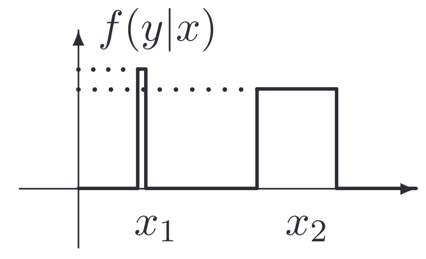
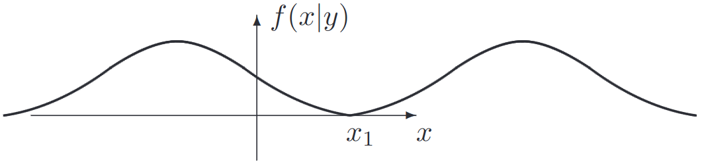

# Lecture 21, Nov 29, 2023

## Extracting Estimates from PDFs

### Maximum Likelihood (ML)

* This method is often used when $\bm x$ is an unknown constant parameter without a known probabilistic description, i.e. we have no prior information about $\bm x$
	* e.g. in Bayesian estimation, we had a prior (prediction) for $\bm x$, but here we are assuming no knowledge of that
* For a given observation $\bm y$ and observation model $f(\bm y | \bm x)$, the method seeks a value of $\bm x$ that maximizes the likelihood of observing $\bm y$, i.e. $\hat{\bm x}^{ML} = \argmax _{\bm x \in \mathcal X} f(\bm y | \bm x)$
	* $f(\bm y | \bm x)$ as a function of $\bm x$ is the *likelihood function*
	* $\bm x$ is a parameter of the observation model; e.g. the model can be a Gaussian, and $\bm x$ may denote its mean or variance, etc
* Example: Consider two measurements of a scalar quantity $x \in \reals$: $y_1 = x + w_1, y_2 = x + w_2$ where $w_1, w_2 \sim \mathcal N(0, 1)$
	* Note $\mathcal N(\mu, \sigma)$ denotes a Gaussian with mean $\mu$ and variance $\sigma$
	* $f(w_i) = \frac{1}{\sqrt{2\pi}}\exp\left(-\frac{w_i^2}{2}\right)$
	* We can consider $w_1, w_2$ as additive noise parameters; this essentially makes $y_i \sim \mathcal N(x, 1)$
		* Note formally we would use a change of variables: $y_i = x + w_i \implies w_i = y_i - x$
		* Now we can just substitute $w_i$ into the Gaussian equation since we have a linear relationship
	* $y_1, y_2$ are conditionally independent on $x$, so $f(y_1, y_2|x) = f(y_1|x)f(y_2|x) = \frac{1}{2\pi}e^{-\frac{1}{2}\left((y_1 - x)^2 + (y_2 - x)^2\right)}$
	* This is now an unconstrained optimization problem; we can differentiate with respect to $x$ and set this to 0
	* We get $(y_1 - \hat x) + (y_2 - \hat x) = 0 \implies \hat x = \frac{y_1 + y_2}{2}$, which is just the average
* Suppose we generalize the last example to a collection of measurements $\bm z = \bm H\bm x + \bm w$ where $\bm z, \bm w \in \reals^m, \bm x \in \reals^n$ and $m > n$; as above $w_i \sim \mathcal(0, 1)$ are independent
	* Let $\bm H = \cvec{\bm h_1^T}{\vdots}{\bm h_m^T}$ where $\bm h_i^T = \rvec{h_{i_1}}{\cdots}{h_{in}}$
	* Then $z_i = \bm h_i^T\bm x + \bm w_i$
	* As before $f(\bm z|\bm x) \propto \exp\left(-\frac{1}{2}\left((z_1 - \bm h_1^T\bm x)^2 + \dots + (z_m - \bm h_m^T\bm x)^2\right)\right)$
	* Differentiating with respect to each $x_j$ we have $(z_1 - \bm h_1^T\hat{\bm x})h_{1j} + \cdots + (z_m - \bm h_m^T\hat{\bm x})h_{mj} = \rvec{h_{1j}}{\cdots}{h_{mj}}(\bm z - \bm H\hat{\bm x}) = 0$
	* With all the rows, we get $\bm H^T(\bm z - \bm H\hat{\bm x}) = \bm 0 \implies \hat{\bm x} = (\bm H^T\bm H)^{-1}\bm H^T\bm z$, which is the least squares solution
		* Note we can write $\bm w(\bm x) = \bm z - \bm H\bm x$, so $\bm w$ is some error term; then $\hat{\bm x} = \argmin _{\bm x} \bm w^T\bm w$
		* If not all the errors have the same variance, then we have weighted least squares

{width=30%}

* Limitations of ML:
	* In general ML is more sensitive to outliers and modelling error
	* The maximum of the distribution may not always be what we want -- we may lose robustness
		* In the example above, ML will give $x_1$ if there are measurements on it, which is very sensitive to changes in the data or model -- small variations in the model might cause $x_1$ to have a likelihood of zero instead
		* Choosing $x_2$ is more robust; since the distribution is wider, we're less sensitive to changes in the data or model
		* Outliers that happen to line up with a peak can give us an incorrect estimate
	* We might also have prior knowledge about $x$ (i.e. its PDF), which ML cannot incorporate

### Maximum *a Posteriori* (MAP)

* If we have a PDF for $\bm x$, we can use MAP
* From Bayes's theorem: $f(\bm x|\bm y) = \frac{\bm f(\bm y | \bm x)\bm f(\bm x)}{\bm f(\bm y)}$
* With MAP, we have $\hat{\bm x}^{MAP} = \argmax _{\bm x} f(\bm y | \bm x)f(\bm x)$
	* We want to maximize the choice of the parameter that makes both the observations and the parameter itself most likely
* If $f(\bm x)$ is constant, then $\hat{\bm x}^{MAP} = \hat{\bm x}^{ML}$
* As with ML, we are still maximizing a function over $\bm x$, so the same sensitivity to outliers and modelling error still applies
* Example: consider the scalar observation $y = x + w$, where $w \sim \mathcal N(0, 1), x \sim \mathcal N(\bar x, \sigma _x^2)$ and $x, w$ independent
	* $f(x) \propto \exp\left(-\frac{1}{2}\frac{(x - \bar x)^2}{\sigma _x^2}\right)$
	* $f(y|x) \propto \exp\left(-\frac{1}{2}(y - x)^2\right)$
	* $f(y|x)f(x) \propto \exp\left(-\frac{1}{2}\left(\frac{(x - \bar x)^2}{\sigma _x^2} + (y - x)^2\right)\right)$
	* Differentiating with respect to $x$ and setting to zero gives the following solution:
	* $\hat x^{MAP} = \frac{1}{1 + \sigma _x^2}\bar x + \frac{\sigma _x^2}{1 + \sigma _x^2}y$
		* Notice that this is a weighted sum between the mean of the prior distribution and the new measurement
	* Consider the extreme cases:
		* $\sigma _x^2 = 0 \implies \hat x^{MAP} = \bar x$ (if we're certain about $x$ before any measurements, we just get the max of the prior)
		* $\sigma _x^2 \to \infty \implies \hat x^{MAP} = y$ (if we're uncertain about $x$, we just get the new measurement; note this is the same as maximum likelihood)
* This is most often used in state estimation

### Minimum Mean Squared Error (MMSE)

* The MMSE is the a posteriori estimate that minimizes the mean squared error
* $\hat{\bm x}^{MMSE} = \argmin _{\hat{\bm x}} E_{x|y}\left[(\bm x - \hat{\bm x})^T(\bm x - \hat{\bm x})|y\right]$
	* Expand and differentiate with respect to $\hat{\bm x}$: $2\hat{\bm x} - 2E[x|y] = 0 \implies \hat{\bm x} = E[x|y]$
	* The MMSE estimate is the expected value of $\bm x$ conditioned on $\bm y$
* While MAP is the maximum of the posterior, MMSE is the mean of the posterior
* Note we did not constrain $\hat{\bm x}$ in our minimization, but for some applications we might want to introduce constraints
	* e.g. for a discrete random variable with sample space $\mathcal X$, we need to constrain the minimization to $\hat{\bm x} \in \mathcal X$

{width=60%}

* MMSE always takes the whole probability mass into consideration, whereas MAP and ML just pick the maximum probability -- in some cases, this is desirable, while in other cases it is not
	* Consider the bimodal distribution of $f(x|y)$ above; MMSE would give $x_1$, but the probability of having $x$ actually being near $x_1$ is zero
		* MAP would have picked one of the two peaks
	* On the other hand, the MMSE is typically more robust to modelling errors and outliers, since it is not as sensitive to sharp peaks

