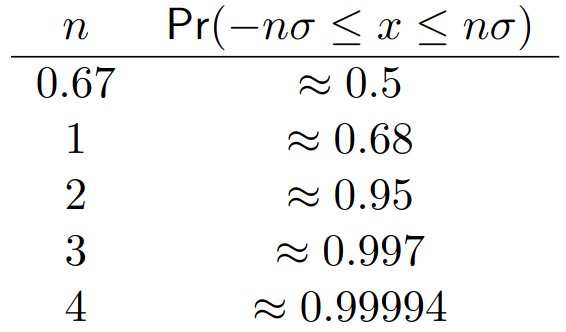

# Lecture 22, Dec 1, 2023

## Gaussian Probability Distributions

* A 1-dimensional Gaussian PDF is given by $f(x|\mu, \sigma^2) = \frac{1}{\sqrt{2\pi\sigma^2}}\exp\left(-\frac{1}{2}\frac{(x - \mu)^2}{\sigma^2}\right)$
* Why are Gaussians common?
	* Central limit theorem: averages of independently drawn random variables become normally distributed when the number of random variables is sufficiently large
		* If we don't actually know the distributions, we can usually approximate it as a Gaussian
		* Let $y_1, \dots, y_n$ be a sequence of $n$ independent random variables drawn from a distribution with finite mean and variance and let $\bar y = y_1 + \dots + y_n$, then for some $a, b \in \reals$, $\lim _{n \to \infty} \Pr\left(a < \frac{\bar y - n\mu}{\sqrt{n}\sigma} < b\right) = \int _a^b \frac{1}{\sqrt{2\pi}}e^{-\frac{1}{2}y^2}\,\dy$, i.e. $\bar y$ is Gaussian distributed with mean $n\mu$ and variance $n\sigma^2$
		* This still holds if the $y_i$ come from different distributions, provided the mean and variance are finite for each PDF
	* They are easy to handle mathematically -- you only need the mean and variance
	* They remain Gaussian under many operations (summation, marginalization, conditioning, etc)
* In multiple variables, $f(\bm x | \bm\mu, \bm \Sigma) = \frac{1}{\sqrt{(2\pi)^M\det\bm \Sigma}}\exp\left(-\frac{1}{2}(\bm x - \bm\mu)^T\bm \Sigma^{-1}(\bm x - \bm\mu)\right)$
	* $\bm\mu \in \reals^M$ is the mean and $\bm\Sigma \in \reals^{M \times M}$ is the symmetric, positive definite covariance matrix
	* This can be visualized as an ellipse around the mean

{width=30%}

* The above table shows the probability of a sample lying within a certain number of standard deviations of the mean
	* Note that this is for 1 dimension only; in higher dimensional space we need to look at probability ellipses
* Given some multivariate Gaussian $\bm x \sim \mathcal N(\bm\mu, \bm\Sigma)$, we can partition it as $\bm x = \cvec{\bm x_1}{\bm x_2}, \bm\mu = \cvec{\bm\mu _1}{\bm\mu _2}, \bm\Sigma = \mattwo{\bm\Sigma _{11}}{\bm\Sigma _{12}}{\bm\Sigma _{21}}{\bm\Sigma _{22}}$, then we can write $f(\bm x) = f(\bm x_1, \bm x_2)$
	* We can marginalize to find $f(\bm x_1) = \mathcal N(\bm\mu _1, \bm\Sigma _{11}) = \int _{-\infty}^\infty f(\bm x_1, \bm x_2 | \bm\mu, \bm\Sigma)\,\dd\bm x_2$ and likewise for $\bm x_2$
		* Marginalization picks out the relevant subblocks of the partitioned Gaussian, and gives Gaussian marginals
	* For conditioning, $f(\bm x_1 | \bm x_2) = \mathcal N(\bm\mu _1 + \bm\Sigma _{12}\bm\Sigma _{22}^{-1}(\bm x_2 - \bm\mu _2), \bm\sigma _{11} - \bm\Sigma _{12}\bm\Sigma _{22}^{-1}\bm\Sigma _{21})$
		* The factors are Gaussian
		* This can be derived using the Schur complement
			* Using an LDL decomposition we can find the inverse of $\bm\Sigma$, and then substitute into $(\bm x - \bm\mu)^T\bm \Sigma^{-1}(\bm x - \bm\mu)$
* The sum of two independent Gaussians is Gaussian: $\bm y_1 \sim \mathcal N(\bm a_1, \bm B_1), \bm y_2 \sim \mathcal N(\bm a_2, \bm B_2) \implies c_1\bm y_1 + c_2\bm y_2 \sim \mathcal N(c_1\bm a_1 + c_2\bm a_2, c_1^2\bm B_1 + c_2^2\bm B_2)$
	* This extends to matrix coefficients, since the transformation is linear
	* In general passing a Gaussian through a linear transformation preserves the Gaussian property
	* $\bm C_1\bm y_1 + \bm C_2\bm y_2 \sim \mathcal N(\bm C_1\bm a_1 + \bm C_2\bm a_2, \bm C_1^T\bm B_1\bm C_1 + \bm C_2^T\bm B_2\bm C_2)$
* However, Gaussians don't remain Gaussian after passing through a nonlinear mapping
	* We can approximate using a linear function around the mean, so that if $y = g(x)$, then $x \sim \mathcal N(\mu _x, \sigma _x^2) \implies y \sim \mathcal N(\mu _y, a^2\sigma _x^2)$
		* $\delta y = y - \mu _y \approx \eval{\diff{g(x)}{x}}{x = \mu _x}(x - \mu x) = a\delta x$
		* $\sigma _y^2 = E[\delta y^2] = a^2E[\delta x^2] = a^2\sigma _x^2$
	* If the nonlinear function can be approximated as linear in $[-3\sigma, 3\sigma]$, then the resulting Gaussian is a good approximation
	* In multiple variables: $\bm x \sim \mathcal N(\bm\mu _x, \bm\Sigma _x), \bm y = \bm g(\bm x) \implies \bm y \sim \mathcal(\bm g(\bm\mu _x), \bm A\bm\Sigma _x\bm A^T)$, where $\bm A = \eval{\pdiff{\bm g(\bm x)}{\bm x}}{\bm x = \bm\mu _x}$ is the Jacobian of $\bm g(\bm x)$, $A_{ij} = \pdiff{g_i}{x_j}$
		* To see this, note $\Delta\bm y = \eval{\pdiff{\bm g(\bm x)}{\bm x}}{\bm x = \bm\mu _x}\Delta\bm x$, so $\bm\Sigma _y = E[\Delta\bm y \Delta\bm y^T] = \bm AE[\Delta\bm x\Delta\bm x^T]\bm A^T = \bm A\bm\Sigma _x\bm A^T$
* We can fuse two Gaussians by multiplying them together and then renormalizing; this gives another Gaussian
	* This comes up when we want to combine multiple sources of information with different uncertainties
	* For two Gaussians with means $\mu _1, \mu _2$ and variances $\sigma _1^2, \sigma _2^2$, then $\frac{1}{\sigma^2} = \frac{1}{\sigma _1^2} + \frac{1}{\sigma _2^2}, \frac{\mu}{\sigma^2} = \frac{\mu _1}{\sigma _1^2} + \frac{\mu _2}{\sigma _2^2}$
		* Notice the means are weighted by the inverse of their variances, since a lower variance means more certainty
		* The inverse variance is sometimes referred to as the *precision* of the Gaussian
	* The direct product of two Gaussians has the exponent $\frac{(x - \mu)^2}{\sigma^2} = \frac{(x_1 - \mu _1)^2}{\sigma _1^2} + \frac{(x_2 - \mu _2)^2}{\sigma _2^2}$
		* $\frac{x^2 - 2\mu x + \mu^2}{\sigma^2} = \frac{(\sigma _1^2 + \sigma _2^2)x^2 - 2(\sigma _2^2\mu _1 + \sigma _1^2\mu _2)x + (\sigma _2^2\mu _1^2 + \sigma _2^2\mu _2^2)}{\sigma _1^2\sigma _2^2}$
		* Comparing the $x^2$ terms gives $\frac{1}{\sigma ^2} = \frac{\sigma _1^2 + \sigma _2^2}{\sigma _1^2\sigma _2^2} = \frac{1}{\sigma _1^2} + \frac{1}{\sigma _2^2}$
		* Comparing the $x$ terms gives $\frac{\mu}{\sigma^2} = \frac{\sigma _2^2\mu _1 + \sigma _1^2\mu _2}{\sigma _1^2\sigma _2^2} = \frac{\mu _1}{\sigma _1^2} + \frac{\mu _2}{\sigma _2^2}$
		* Note the constant terms are not equal, but this is fixed by normalization
	* Note the product of Gaussians is not normalized, so we need to find the normalization constant so that the distribution integrates to 1
		* In practice however we almost never have to compute this, since we usually only keep track of the mean and variance
	* In the multivariate case, $\mathcal N(\bm\mu, \bm\Sigma) = \beta\prod _{n = 1}^N \mathcal N(\bm\mu _n, \bm\Sigma _n)$
		* $\bm\Sigma^{-1} = \sum _{n = 1}^N\bm\Sigma _n^{-1}$
		* $\bm\Sigma^{-1}\bm\mu = \sum _{n = 1}^N \bm\Sigma _n^{-1}\bm\mu _n$
* Since Gaussians remain Gaussian under many different useful operations, it often suffices to keep track of only the sum and (co)variance of the distributions
* Under the assumption that random variables are Gaussian, analytic results for state estimation and other applications are available (e.g. a Kalman filter); without this assumption PDFs often have to be propagated through sampling (e.g. Monte Carlo methods)

