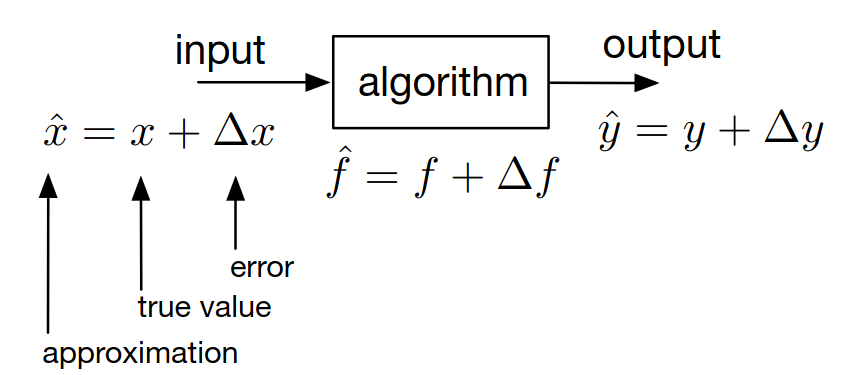
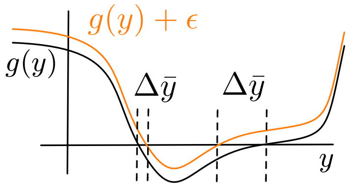

# Lecture 3, Sep 15, 2023

## Numerical Methods and Stability

{width=30%}

* Any numerical system will accumulate errors in a variety of ways; how can we quantify and evaluate these errors?
* Some common sources of error are:
	* Rounding/truncation errors, due to finite precision
	* Approximate numerical algorithms, in which we simplify complex models for efficiency
	* Input error, where the inputs to our algorithm are the outputs of an upstream algorithm which itself has errors
	* Modelling errors, where the model itself is a simplified representation of the real world (e.g. discretization)
* These errors can be categorized into two general sources: input error ($\Delta x$) and algorithm/approximation error ($\Delta f$) which combine to result in an output error ($\Delta y$)
* *Absolute* errors are simply the absolute value of the error, $\abs{\Delta x}$; *relative* errors are the absolute errors divided by the parameter, $\delta \frac{\abs{\Delta x}}{x}$
	* If the true values of $x, f, y$ are not known, we cannot compute the relative error and might have to settle for an upper bound instead

### Well- and Ill-Conditioned Problems

* First we will consider what happens when we have an ideal algorithm with some input error
* Intuitively, a problem is *well-conditioned* if, assuming an ideal algorithm ($\Delta f = 0$), the input error does not grow when propagated through the algorithm, i.e. $\Delta\bar y < \Delta x$
	* Consider the Taylor expansion: $f(x + \Delta x) = f(x) + \diff{f}{x}\Delta x + O(\Delta x^2) = y + \Delta\bar y$
	* $\frac{\Delta\bar y}{y} = \frac{1}{y}\left(f(x) + \diff{f}{x} \cdot x\frac{\Delta x}{x} + O(\Delta x^2)\right) = \diff{f}{x}\frac{x}{f(x)} \cdot \frac{\Delta x}{x} + O(\Delta x^2) = K_x\delta x + O(\Delta x^2)$
	* If $\abs{\delta x} \leq \varepsilon$ then $\abs{\delta y} \approx \abs{K_x\delta x} \leq \abs{K_x}\varepsilon$, so given a bound on $\delta x$ we can find a bound on $\delta y$

\noteDefn{The \textit{absolute condition number} is defined as $$\operatorname{Cond}_x = \abs*{\frac{\Delta\bar y}{\Delta x}} \approx \abs*{\diff{f}{x}}$$
The \textit{relative condition number} is defined as $$\operatorname{cond}_x = \abs*{\frac{\delta\bar y}{\delta x}} \approx \abs{K_x} = \abs*{\diff{f}{x} \cdot \frac{x}{f(x)}}$$
(note, multiplication not differentiation)
\tcblower
A problem is \textit{well-conditioned}:
\begin{enumerate}
	\item If and only if $\operatorname{Cond}_x$ is small (using absolute error)
	\item If and only if $\operatorname{cond}_x \leq 1$ (using relative error)
\end{enumerate}}

* We typically want the absolute condition number to be small (but how small depends on the problem), and we want the relative condition number to be less than 1; so most of the time the relative condition number is used since it is easier to interpret
* Conditioning is a property of the *problem*, not a particular algorithm (since we assumed a perfect algorithm to begin with)
* Example: linear function: $y = ax$
	* $\diff{f}{x} = a \implies K_x = \diff{x}{f} = a\frac{x}{ax} = 1$
	* The condition number is 1, so the relative error stays the same and the problem is well-conditioned
	* The absolute error is smaller than the absolute input error if $\abs*{\diff{f}{x}} = \abs{a} < 1$
		* Intuitively, for a steeper function the error will get bigger, but for a smaller slope the error is smaller
* Example: linear equation: find $y$ such that $ay + b = 0$ where $b$ is the input and $a$ is fixed
	* $y = -\frac{b}{a} = f(b)$
	* $\diff{f}{b} = -\frac{1}{a} \implies K_b = \diff{f}{b} \cdot \frac{1}{f(b)}b = -\frac{1}{a} \cdot -\frac{a}{b} \cdot b = 1$
	* This is another well-conditioned problem
	* $\abs*{\diff{f}{b}} = \abs*{\frac{1}{a}}$ so for small $a$, the absolute condition number is large
* Example: differential equation: find $y$ such that $\dot y = (\lambda + \Delta\lambda)y, y(0) = y_0$ where $\lambda$ is the input
	* $\hat y(t) = y_0e^{(\lambda + \Delta\lambda)t} = y_0e^{\lambda t}e^{\Delta\lambda t} \approx y_0e^{\lambda t} + y_0te^{\lambda t} \cdot \Delta\lambda = y + \Delta\bar y$
		* Note we used $e^x \approx 1 + x$
	* The absolute condition number is $\frac{\Delta\bar y}{\Delta\lambda} = y_0te^{\lambda t}$
	* $\lim _{t \to \infty}\abs*{\frac{\Delta\bar y}{\Delta\lambda}} = \twocond{0}{\lambda < 0}{\infty}{\lambda \geq 0}$
	* This shows that asymptotically stable differential equations (DEs that approach some fixed value) are well-conditioned
		* Exercise: what we think of the error as being on the initial condition? $\dot y = \lambda y, y(0) = y_0 + \Delta y_0$

{width=30%}

* Example: root finding: find $y$ such that $g(y) = 0$
	* $y$ is the output, but the input is hard to define since it is a function
	* We can think of it as $g(y) = 0, g(y + \Delta\bar y) + \varepsilon = 0$ so $\varepsilon$ is an "input" representing an additive error in $g$ (see diagram above); if we shift $g$ up or down, the location of the root $y$ will also change by an amount
	* Taylor series expand: $g(y) + g'(y)\Delta\bar y + \varepsilon = g'(y)\Delta\bar y + \varepsilon \approx 0 \implies \abs*{\frac{\Delta\bar y}{\varepsilon}} \approx \frac{1}{\abs{g'(y)}}$
	* We find that the absolute condition number is inversely proportional to slope; notice that for the same shift, the left root with a larger slope is shifted a lot less

### Order and Consistency

* We shall now consider what happens when we have an algorithmic error, while the input is ideal

\noteDefn{Let $\varphi(x, \Delta)$ represent some approximate algorithm that models $f(x)$, where $\Delta$ are the parameters of the algorithm; $\varphi$'s accuracy is of \textit{order} $p$ (alternatively, $\varphi$ is $O(\Delta^p)$) if $$\tilde y = \varphi(x, \Delta) - f(x) \propto \Delta^p$$
\tcblower
$\varphi$ is \textit{consistent} if $$\lim _{\Delta \to 0} \varphi(x, \Delta) = f(x)$$ i.e. the approximate algorithm $\varphi$ approaches the real model as the parameter approaches zero.}

* The parameters can be e.g. a step size for numerical ODE solving; note that we assume that $\Delta$ is typically smaller than 1
* Example: numerical differentiation: $y = f'(x), \varphi(x, \Delta) = \frac{f(x + \Delta) - f(x)}{\Delta}$
	* Taylor expansion: $\varphi(x, \Delta) = \frac{f(x) + f'(x)\Delta + f''(x)\frac{\Delta^2}{2} + \cdots - f(x)}{\Delta} = f'(x) + f''(x)\frac{\Delta}{2} + \cdots$
	* Therefore $\varphi(x, \Delta) - f'(x) = f''(x)\frac{\Delta}{2} + f'''(x)\frac{\Delta^2}{6} + \cdots$ so $\varphi$ is $O(\Delta)$, i.e. order 1

### Stability and Convergence

* If we have both an input error and an approximate algorithm, the errors compound
* $\Delta y = \varphi(x + \Delta x, \Delta) - f(x) = \underbrace{(\varphi(x + \Delta x, \Delta) - \varphi(x, \Delta))}_{\Delta\tilde y} + \underbrace{(\varphi(x, \Delta) - f(x))}_{\tilde y} = \Delta\tilde y + \tilde y$
	* $\Delta\tilde y$ is the result of our input error, and $\tilde y$ is the result of our approximate algorithm
* The propagated error is $\Delta\tilde y = \varphi(x + \Delta x, \Delta) - \varphi(x, \Delta) \approx \diff{\varphi}{x} \cdot \Delta x$

\noteDefn{$\varphi$ is \textit{numerically stable} if the ratio $$\abs*{\frac{\Delta\tilde y}{\Delta x}} = \abs*{\diff{\varphi}{x}} < 1$$ If this ratio is greater than 1, then $\varphi$ is \textit{unstable}; if the ratio is exactly 1, then $\varphi$ is \textit{marginally stable}.}

* The idea is that if you iteratively apply the algorithm, each time the error will be multiplied by this ratio; therefore a numerically stable algorithm will decrease in error, but an unstable algorithm will increase

\noteThm{The numerical solution $\hat y = \varphi(\hat x, \Delta)$ with input $\hat x = x + \Delta x$ \textit{converges} for $\Delta \to 0$ towards the exact solution $y = f(x)$ if
\begin{enumerate}
	\item $\varphi(x, \Delta)$ is consistent, i.e. $\lim _{\Delta \to 0} \varphi(x, \Delta) = f(x)$
	\item $\varphi(x, \Delta)$ is at least marginally stable for $\Delta \to 0$, i.e. $\lim _{\Delta \to 0}\abs*{\diff{\varphi}{x}} \leq 1$
\end{enumerate}}

