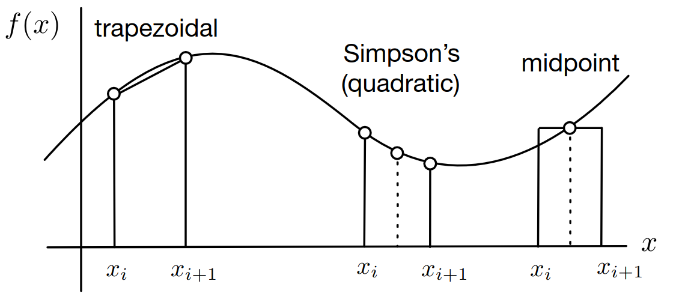

# Lecture 5, Sep 22, 2023

## Numerical Integration and Differentiation

* Note, numerical integration can refer to two things: computing an integral or solving an ODE
	* Solving an integral is an open-loop process, since the derivative of the function does not depend on its current value
	* Integrating an ODE requires a feedback process, since the derivative is dependent on the current state
		* The existence of feedback means numerical stability must be studied -- otherwise errors can accumulate and lead to divergence
	* We will start with the former

### Numerical Integration

* Numerical integration is sometimes referred to as quadrature or cubature in higher dimensions
* We want to approximate $\int _a^b f(x)\,\dx$ with a finite number of evaluations of $f$
	* There is often a tradeoff between accuracy and speed

{width=70%}

* Common numerical integration rules include:
	* Midpoint rule (1 point of evaluation): $\int _{x_i}^{x_{i + 1}} f(x)\,\dx \approx (x_{i + 1} - x_i) \cdot f\left(\frac{x_{i + 1} + x_i}{2}\right)$
		* The function is approximated as constant between the two bounds
		* $O(\Delta^2)$
	* Trapezoidal rule (2 points of evaluation): $\int _{x_i}^{x_{i + 1}} f(x)\,\dx \approx (x_{i + 1} - x_i) \cdot \frac{f(x_{i + 1}) + f(x_i)}{2}$ 
		* The function is approximated as linear between the two points
		* $O(\Delta^2)$
	* Simpson's rule (3 points of evaluation): $\int _{x_i}^{x_{i + 1}} f(x)\,\dx \approx (x_{i + 1} - x_i) \cdot \frac{f(x_{i + 1}) + 4f\left(\frac{x_{i + 1} + x_i}{2}\right) + f(x_i)}{6}$
		* The function is approximated as quadratic between the two points
		* $O(\Delta^4)$
* The accuracy of integration depends on:
	* The step size $\Delta _i = x_{i + 1} - x_i$ -- smaller step sizes are more accurate but take more time
	* The type of approximation rule used (midpoint, trapezoidal, Simpson's, etc)
	* The evolution of $f(x)$ (i.e. the nature of the function) -- functions that are rougher are inherently harder to integrate
* Techniques exist to adapt the step size dynamically based on where the function is changing the fastest

### Numerical Differentiation

* Derivatives can be approximated by a finite difference:
	* Forward difference: $f'(x) \approx \frac{f(x + \Delta) - f(\Delta)}{\Delta}$
		* $O(\Delta)$
	* Backward difference: $f'(x) \approx \frac{f(x) - f(x - \Delta)}{\Delta}$
		* $O(\Delta)$
	* Centered difference: $f'(x) \approx \frac{f(x + \Delta) - f(x - \Delta)}{2\Delta}$
		* $O(\Delta^2)$
* Choosing $\Delta$ involves a tradeoff between the approximation accuracy and resilience to numerical errors and noise
	* Choosing $\Delta$ makes the algorithm prone to noise and numerical issues because $f(x) \approx f(x + \Delta)$ as $\Delta \to 0$
* Example: order of accuracy for the central difference
	* $\tilde f'(t) = \frac{f(x + \Delta) - f(x - \Delta)}{2\Delta}$
	* We wish to find $\Delta y = \tilde f'(x) - f'(x)$ and its relationship to $\Delta$
	* $\alignedeqntwo[t]{\tilde f'(x)}{\frac{\splitfrac{(f(x) + \Delta f'(x) + \frac{1}{2}\Delta^2 f''(x) + \frac{1}{6}\Delta^3 f'''(x) + O(\Delta^4))}{- (f(x) - \Delta f'(x) + \frac{1}{2}\Delta^2 f''(x) - \frac{1}{6}\Delta^3 f'''(x) + O(\Delta^4))}}{2\Delta}}{f'(x) + \frac{1}{6}\Delta^2 + O(\Delta^3)}$
	* $\Delta y = \tilde f'(t) - f'(t) = \frac{1}{6}\Delta^2 + O(\Delta^3)$
	* Therefore $\Delta y$ is of order $\Delta^2$

### Numerical ODE Solving

* Even for asymptotically stable and well-conditioned ODEs, if we choose the wrong solver or step size, the solution can diverge
* If the function that defines the derivative is continuous and Lipschitz, then the ODE has exactly one solution for all $t \geq 0$, for each initial condition
* If we have a time-varying ODE $\dot{\bm x}(t) = \bm f(\bm x(t), t)$, we can convert this into a time-invariant ODE using an *augmented state*, $\bm x'(t) = \cvec{\bm x(t)}{g(t)}$ where $g(t) = t$, so then we have $\diff{}{t}\cvec{\bm x(t)}{g(t)} = \cvec{f(\bm x(t), g(t))}{1}$
	* This allows us to change any time-varying ODE into a time-invariant ODE, but it will become nonlinear

