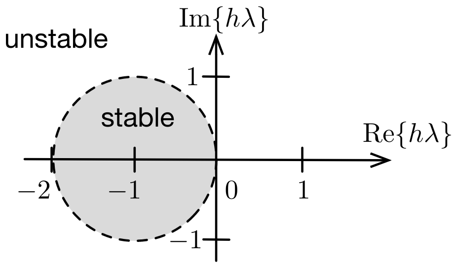

# Lecture 6, Sep 27, 2023

## Numerical ODE Solving

* We will consider a linear ODE $\dot x(t) = f(t) = \lambda x(t), x(0) = x_0$ as our test problem
* We want the test problem to be well-conditioned so we can separate the error resulting from the algorithm from the error resulting from the input/problem
	* This allows us to analyze the algorithm, not the problem itself
* The exact solution to our test problem is $x(t) = x_0e^{\lambda t}$ so with error if we simulate until time $T$, $x(T) = (x_0 + \Delta x_0)e^{\lambda T} \implies \Delta\bar x = \Delta x_0e^{\lambda T}$
	* The absolute conditioning number is $\abs*{\frac{\Delta\bar x}{\Delta x_0}} = e^{\lambda T}$
	* For $\lambda < 0$ this will shrink, so our problem is well-conditioned for $\lambda < 0$
* For any ODE solver, we can analyze two types of error: the *local truncation error* (error per iteration) or the *global truncation error* (error accumulated over time)
	* The global truncation error is typically an order lower than the local truncation error
	* When we say an algorithm is of a certain order, we refer to the global truncation error
* Note that all error discussion assumes numerical stability; if the algorithm is unstable the algorithm will diverge

### Forward Euler's Method

* Approximate the derivative as $\dot x_k = f_k = \frac{x_{k + 1} - x_k}{h} + O(h) \implies x_{k + 1} = x_k + hf_k$
* This is an *explicit* method because $x_{k + 1}$ depends on past values $x_k, f_k$
* Local truncation error: let $\hat x$ be the exact solution, then for each step:
	* $\alignedeqntwo[t]{\hat x(t_{k + 1})}{x(t_k) + h\dot x(t_k) + \frac{h^2}{2}\ddot x(t_k) + O(h^3)}{x_k + hf_k + O(h^2)}{x_{k + 1} + O(h^2)}$
	* This makes the local truncation error second-order
* Global truncation error:
	* To get the state at $T_{sim}$ we have to go through $\frac{T_{sim}}{h} = O\left(\frac{1}{h}\right)$ times
	* This gives a global truncation error of $O\left(\frac{1}{h}\right)O(h^2) = O(h)$
	* Therefore forward Euler is a first-order method

{width=40%}

* Stability:
	* Consider the linear test equation: $\hat x_{k + 1} = x_k + h\lambda x_k$
	* With an initial error of $\Delta x_0$: $\alignedeqntwo[t]{\hat x_1}{(x_0 + \Delta x_0) + h\lambda(x_0 + \Delta x_0)}{\underbrace{(1 + h\lambda)x_0}_{x_1 + \tilde x_1} + \underbrace{(1 + h\lambda)\Delta x_0}_{\Delta\tilde x_1}}$
	* $\Delta\tilde x_1 = (1 + h\lambda)\Delta x_0 \implies \abs*{\frac{\Delta\tilde x_{k + 1}}{\Delta x_k}} = \abs{1 + h\lambda} < 1$ for stability
	* This makes forward Euler *conditionally stable* (even when the problem is well-conditioned, we still need additional conditions for stability)
	* With a larger $\lambda$ the function is changing faster, so it makes sense that we require a smaller timestep
* If we have a *stiff* system (i.e. ratio of fastest to slowest eigenvalue is large), we need to make $h$ small to accommodate the fast mode which wastes resources on the slow mode

### Backward Euler's Method

* The backward Euler's method instead uses $x_{k + 1} = x_k + hf_{k + 1}$
	* The derivative at the next timestep is used instead
* This is an *implicit* time-stepping scheme because $x_{k + 1}$ no longer depends only on past variables
* To actually implement this we have a number of options, including inverting $f$, using a numerical root finding algorithm, or making further approximations
	* For some cases, including the test equation, it is still straightforward to solve for $x_{k + 1}$
	* For the test equation $x_{k + 1} = x_k + h\lambda x_{k + 1} \implies x_{k + 1} = \frac{x_k}{1 - h\lambda}$
* The stability conditions are $\abs{1 - h\lambda} < 1$, so this time we're stable everywhere except a circle around 1
	* Since the system is always stable for $\Re\lambda < 0$, it is *unconditionally stable*
* Backward Euler can be harder to implement but has much better stability; this gives us more freedom to choose $h$, which helps with stiff systems in particular (where forward Euler struggles)

