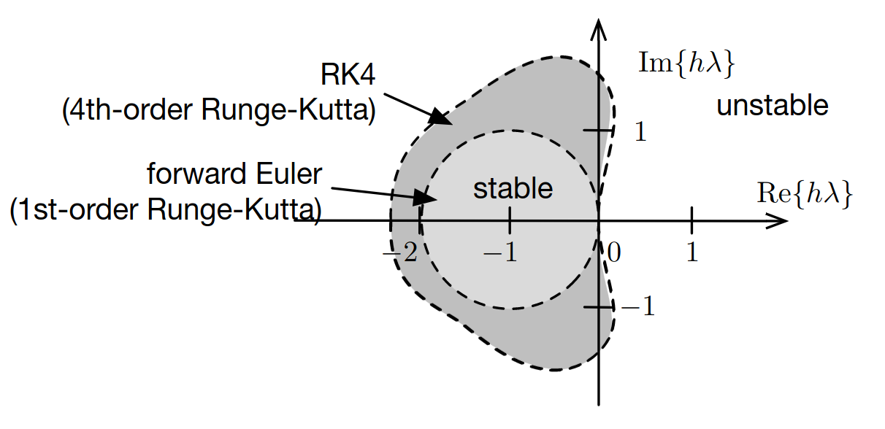

# Lecture 7, Sep 29, 2023

## Numerical ODE Solving Continued

* Recall that we were able to convert a continuous system to a discrete system exactly for a linear system with a zero-order hold; however in practice our systems are nonlinear, so these numerical ODE solvers are used
* Example: $\dot x = -\frac{1}{\tau}x, x(0) = x_0, \tau > 0$
	* $\tau = -\frac{1}{\lambda}$ is known as the time constant of the system; it is the time taken for the output to decay to approximately $37\%$ of the initial response
	* The analytical solution is $x(t) = x_0e^{-\frac{1}{\tau}t}$
	* Using forward Euler we require $\abs*{1 + h\lambda} = \abs*{1 - \frac{h}{\tau}} < 1 \implies 0 < h < 2\tau$
		* Smaller $\tau$ requires smaller step sizes to avoid divergence
* Example: simple harmonic oscillator $\ddot x + \omega^2x = 0, x(0) = 0, \dot x(0) = v_0$
	* The analytical solution is $x(t) = \frac{v_0}{\omega}\sin(\omega t)$
	* Put into first-order form: $\dot{\bm x} = \cvec{x}{v} = \mattwo{0}{1}{-\omega^2}{0}\cvec{x}{v}, \bm x(0) = \cvec{0}{v_0}$
		* The eigenvalues are clearly $\lambda = \pm j\omega$
	* If we diagonalize the system using these eigenvalues we get $\diff{}{t}\cvec{y_1}{y_2} = \mattwo{\lambda _1}{0}{0}{\lambda _2}\cvec{y_1}{y_2}$ which gives us a new decoupled system whose eigenvalues are the same as the original system
	* Each equation's stability can now be checked independently
	* $\abs{1 + h\lambda _i} < 1 \implies \abs{1 \pm j\omega h} < 1$ but $\abs{1 + j\omega h} = \sqrt{1 + (h\omega)^2} \geq 1$, so regardless of $\omega$ or $h$ forward Euler is unstable
* We can generalize the consistency of time-stepping methods such as forward and backward Euler
	* All time-stepping methods are in some way trying to approximate the average slope $s(x_k, x_{k + 1}, h)$ in the interval $(t_k, t_{k + 1})$, so $x_{k + 1} = x_k + hs(x_k, x_{k + 1}, h)$
	* Therefore for consistency we require $\lim _{h \to 0} s(x_k, x_{k + 1}, h) = \dot x(t_k) = f(x(t_k))$
	* For example with forward Euler $\lim _{h \to 0} s(x_k, x_{k + 1}, h) = \lim _{h \to 0} f_k = f_k$
* Instead of using derivative approximations, what if we try to approximate the integral instead?
	* $x_{k + 1} = x_k + \int _{t_k}^{t_{k + 1}} \dot x(t)\,\dt = x_k + \int _{t_k}^{t_{k + 1}} f(x(t))\,\dt$
	* There are many ways to approximate this derivative, each one leads to a different numerical solving scheme

### Trapezoidal Method

* This approximates the integral using the trapezoidal rule
* $x_{k + 1} = x_k + \frac{h}{2}(f_{k + 1} + f_k) + O(h^3)$
* This is an implicit method and it is second-order
* The stability condition is $\abs*{\frac{1 + \frac{1}{2}h\lambda}{1 - \frac{1}{2}h\lambda}} < 1$
	* This is unconditionally stable for $\lambda < 0$, but it requires that we can find $f_{k + 1}$, so it may still be unstable if we don't have a good way of doing so
* However, to implement this we must turn it into an explicit scheme by approximating $f_{k + 1}$ with order $O(h^2)$ or higher
	* e.g. we can simply use a forward Euler scheme so $f(x_{k + 1}) = f(x_k + hf(x_k)) + O(h^2)$
	* We need at least a second-order approximation scheme so that after multiplication by the timestep $h$, we still get a third-order error, so the order of the trapezoidal method remains intact
	* This leads to a family of time-stepping schemes known as the *Runge-Kutta methods*

### Second-Order Runge-Kutta (Heun's Method)

* *Heun's method*, also known as RK2 (second-order Runge-Kutta) is what we get when we apply the forward Euler's method to approximate $f_{k + 1}$ and then use the trapezoidal rule
* $x_{k + 1} = x_k + \frac{h}{2}(f(x_k + hf(x_k)) + f_k) + O(h^3)$
* This is an explicit, second-order accurate method that is conditionally stable
* For $\dot x = \lambda x$ we have $\alignedeqntwo[t]{x_{k + 1}}{x_k + \frac{h}{2}(\lambda(x_k + h\lambda x_k) + \lambda x_k)}{\left(1 + \lambda h + \frac{1}{2}h^2\lambda^2\right)x_k}{Mx_k}$
	* Stability requires that $\abs*{\frac{\Delta\tilde x_{k + 1}}{\Delta x_k}} = \abs{M} < 1 \implies -4 < 2h\lambda + h^2\lambda^2 < 0$
	* Therefore stability is conditional
	* The region of stability is slightly larger than that of Euler's method but it is not a significant improvement when it comes to stability

### Fourth-Order Runge-Kutta

* RK4 uses Simpson's rule for approximating the integral
* $x_{k + 1} = x_k + \frac{h}{6}(k_1 + 2k_2 + 2k_3 + k_4)$ where:
	* $k_1 = f(x_k)$
	* $k_2 = f\left(x_k + \frac{1}{2}hk_1\right)$
	* $k_3 = f\left(x_k + \frac{1}{2}hk_2\right)$
	* $k_4 = f(x_k + hk_3)$
* This is an explicit, fourth-order accurate method that is conditionally stable
* We can see that the method is consistent pretty easily by showing $\lim _{h \to 0} \frac{1}{6}(k_1 + 2k_2 + 2k_3 + k_4) = f(x_k)$
* Stability is cumbersome to derive but the standard approach can be used

{width=60%}

* The region of stability is larger but still conditional, however it now includes part of the imaginary axis, which is very good because this allows us to simulate simple harmonic oscillators as their poles lie on the imaginary axis
	* This applies for both SHOs with no damping and very lightly damped SHOs, which is important for structural analysis applications

### Multi-Step Methods

* These methods try to interpolate $f(x(t)) = \dot x(t)$ over multiple intervals
	* Information about previous values of $f(t)$ can be used to fit a polynomial, which is used to extrapolate the behaviour
	* This is then fed back to the integration rule
* e.g. we can use a second-order polynomial $\xi(\tau) = a_0 + a_1\tau + a_2\tau^2, -h \leq \tau \leq h$ so $x_{k + 1} = \xi(h)$
* Typically additional approximations on $f$ are used to get different methods
* Example multi-step methods:
	* Midpoint scheme: $x_{k + 1} = x_{k - 1} + 2hf_k$
		* This uses $x_k = \xi(0) = a_0, f_k = a_1, x_{k - 1} = a_0 - a_1h + a_2h^2$
		* This is equivalent to assuming that $f$ is constant over the interval $t_{k - 1}, t_k, t_{k + 1}$
			* If we then integrate $f$ then the area under the curve between these two points is $2hf_k$
	* Adams-Bashforth scheme: $x_{k + 1} = x_{k - 1} + \frac{h}{2}(3f_k - f_{k - 1})$
		* This uses $x_k = \xi(0) = a_0, f_k = a_1, f_{k - 1} = a_1 - 2a_2h$
		* This corresponds to assuming that $f$ is constant over the interval
* Multi-step methods can be more efficient since they attempt to make use of previous information

