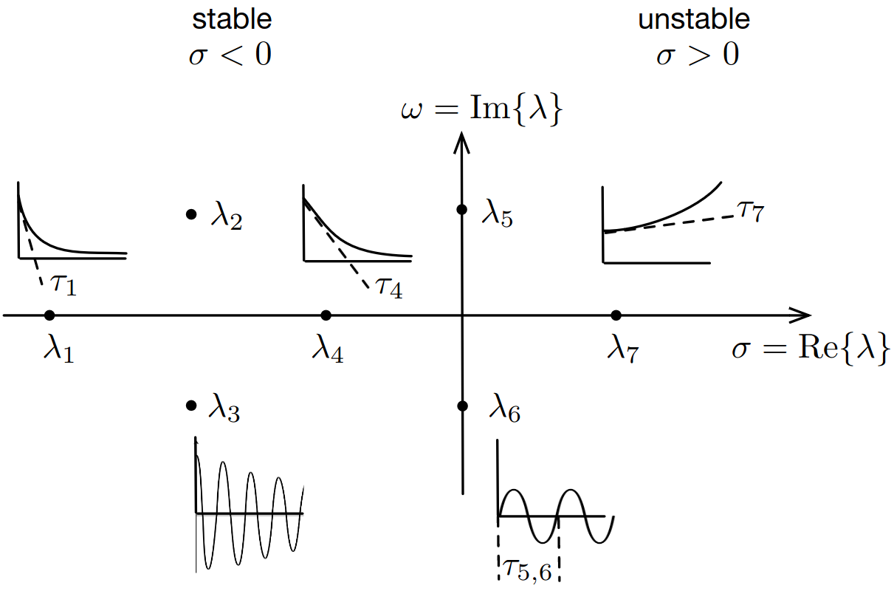

# Lecture 8, Oct 4, 2023

## Rules of Thumb for ODEs

* Consider the ODE: $\dot x = -\frac{1}{\tau}x, x(0) = x_0$
	* The solution is $x_0e^{-\frac{1}{\tau}t}$
	* $\tau$ is the *time constant* of the system
	* Numerical stability for forward Euler requires $\abs*{1 - \frac{h}{\tau}} < 1 \implies 0 \leq h \leq 2\tau$
	* So for the system to be stable, $h$ depends on $\tau$
	* In general, how can we determine the simulation parameters such as simulation step size $h$ and simulation time $T$ for an arbitrary ODE?
* Consider $\dot{\bm x} = \bm A\bm x$ with no input
	* Depending on the eigenvalues the solution can behave differently shown in the diagram below

{width=80%}

* We can assign a time constant based on the eigenvalues
	* Purely real eigenvalue: $\tau _i = \frac{1}{\abs{\lambda _i}}$
		* In this case $\tau$ describes the rate of decay of the system
	* Purely imaginary: $\tau _i = \frac{2\pi}{\abs{\lambda _i}}$
		* In this case $\tau$ is the period of the oscillation; faster oscillations means smaller $\tau$
	* For a complex eigenvalue, we will consider both: $\tau _i = \Set{\frac{1}{\Re\Set{\lambda _i}}, \frac{2\pi}{\Im\Set{\lambda _i}}}$
* We define the *stiffness* of the system as $\gamma = \frac{\tau _{max}}{\tau _{min}}$ as the ratio between the maximum and minimum time constants; the ODE is considered *stiff* when $\tau > 10^3$
	* We only care about the max and min time constants since if we can compute the fastest and slowest behaviours of our system, we can compute anything in-between
* General rule of thumb:
	* Take the simulation time to be $T = 5\tau _{max}$ if the system is stable
		* If the system is unstable, stop when a component of $x$ exceeds a threshold
	* Take the step size to be $h = \min\Set{\frac{\tau _{min}}{10}, \frac{T}{200}}$
		* This gives the number of steps as $k = \frac{T}{h} = \max\Set{50\gamma, 200}$
	* For plotting, take the step size to be $H = \frac{T}{200} = \frac{\tau _{max}}{40}$, since we do not need to plot every step
	* For stiff ODEs, fixed-step solvers are generally very expensive, so variable step-size solvers with an initial step size of $\frac{\tau _{min}}{10}$ should be used
		* In MATLAB, solvers ending with "s" are good for stiff systems, e.g. `ode23s`, `ode15s`

