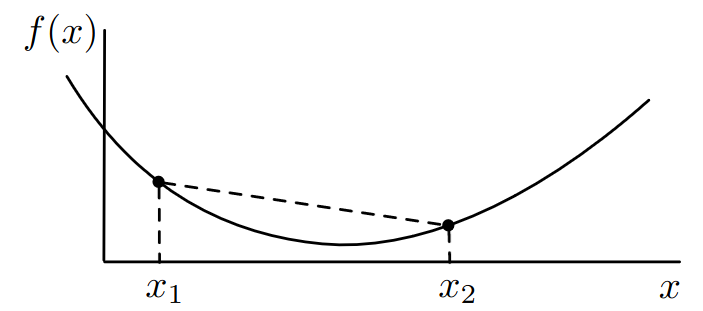

# Lecture 9, Oct 6, 2023

## Optimization

\noteDefn{An \textit{optimization} problem in general seeks to minimize $f(\bm x)$, subject to $\bm g(\bm x) = \bm 0$ (equality constraints) and $\bm h(\bm x) \geq \bm 0$ (inequality constraints), where $f: \reals^n \mapsto \reals, \bm g: \reals^n \mapsto \reals^m, \bm h: \reals^n \mapsto \reals^p$}

* Note that $\argmin f(\bm x) = \argmax (-f(\bm x))$, so maximisation and minimization are interchangeable
* Some applications in robotics:
	* Motion planning: finding the most efficient path through a cluttered environment
	* Control: finding the sequence of inputs that cause a system to stay as close to a desired trajectory as possible
	* Machine learning: find a hypothesis/model that best explains the input data
	* Computer vision: matching an image to an existing map for localization
	* Reinforcement learning: optimizing a robot's performance over many training runs
* Example: steering a unicycle robot to follow the $x$ axis by controlling $\omega _k$ with a constant $v_k$
	* Dynamics: $\underbrace{\cvec{y_{k + 1}}{\theta _{k + 1}}}_{\bm x_{k + 1}} = \underbrace{\cvec{y_k}{\theta _k}}_{\bm x_k} + h\cvec{v_k\sin\theta _k}{\omega _k}$
	* Problem: given an initial condition $(y_0, \theta _0)$ find a sequence $\Set{\omega _0, \dots, \omega _K}$ such that the cost function, $f = \sum _{k = 0}^K (\bm x_k^T\bm Q\bm x_k + r\omega _k^2)$, is minimized
	* $\bm Q, r$ are the *optimization parameters*
		* In this problem, if we're following our desired trajectory, then the optimal $\bm x_k = \bm x^*$ for all $k$ should be zero, therefore $\bm x_k$ is the error
		* $\bm Q$ is a matrix that weights each component of the error
		* The term $r\omega _k^2$ encourages the algorithm to make less aggressive turns
	* The decision variable is $\bm\omega = \rvec{\omega _0}{\omega _1}{\cdots}{\omega _K}^T$
	* The vehicle dynamics are the equality constraints
	* Inequality constraints can be e.g. $\abs{\omega _k} \leq \omega _\text{max}$
	* This is an example of *model predictive control*: finding the optimal set of control inputs to execute a trajectory for the next time period

## Unconstrained Optimization

* *Unconstrained optimization* is optimization without equality or inequality constraints, i.e. minimizing only $\bm f(\bm x)$

\noteDefn{A point $\bm x^* \in \reals^n$ is a \textit{global minimum} of $f: \reals^n \mapsto \reals$ if $$\forall \bm x \in \reals^n, f(\bm x^*) \leq f(\bm x)$$
\tcblower
$\bm x^*$ is a \textit{local minimum} if $$\exists \varepsilon > 0\text{ s.t. } \forall \bm x \in \reals^n, \norm{\bm x - \bm x^*}_2 < \varepsilon \implies f(\bm x^*) \leq f(\bm x)$$}

* Assuming $f(\bm x)$ is differentiable, then $\del f = \rvec{\pdiff{f}{x_1}}{\pdiff{f}{x_2}}{\cdots}{\pdiff{f}{x_n}}^T \in \reals^{1 \times n}$ describes the direction of steepest ascent; so $-\del f$ is the direction of steepest descent
* If $\bm x_o$ is a local minimum, then $\del f(\bm x_o) = \bm 0$, which is a necessary but not sufficient condition for minimization

\noteDefn{A \textit{stationary point} of $f$ is a point $\bm x \in \reals^n$ satisfying $\del f(\bm x) = \bm 0$.}

\noteThm{\textit{First-Order Optimality condition}: If $\bm x$ is a local minimum of $f$, then $\bm x$ is a stationary point. Note that being a stationary point does not imply that $\bm x$ is a local minimum.}

* A common strategy is to then find all stationary points $\bm x_i$, compute $f(\bm x_i)$ for all the points, and find the point with the lowest $f(\bm x_i)$
	* This is guaranteed to work, but it can be very hard to find all the local minima
	* Note we also need to check the boundaries with $\bm x \to \pm\infty$, e.g. if the function asymptotically converges

\noteDefn{The \textit{Hessian} matrix for a twice-differentiable $f$ is the symmetric matrix $$\bm H_f(\bm x) = \matthreeb{\ppdiff{f}{x_1}{x_1}}{\cdots}{\ppdiff{f}{x_1}{x_n}}{\vdots}{\ddots}{\vdots}{\ppdiff{f}{x_n}{x_1}}{\cdots}{\ppdiff{f}{x_n}{x_n}}$$
\tcblower
If (and only if) $\bm x^*$ is a stationary point, and $\bm H_f(\bm x^*)$ is positive-definite (i.e. $\forall\bm v, \bm v^T\bm H_f\bm v > 0$, or that all eigenvalues are real and positive), then $\bm x^*$ is a local minimum. This is the \textit{Second-Order Optimality Condition}.}

* Note the Hessian reduces to a second derivative in the single-dimensional case
* This condition works because at a stationary point $f(\bm x) \approx f(\bm x^*) + \frac{1}{2}(\bm x - \bm x^*)\bm ^T\bm H_f(\bm x^*)(\bm x - \bm x^*)$ since the gradient disappears, so if $\bm H_f(\bm x^*)$ is positive-definite, this expression is guaranteed to be greater than $f(\bm x^*)$
* Note also:
	* If $\bm H_f(\bm x^*)$ is negative definite, then $\bm x^*$ is a local maximum
	* If $\bm H_f(\bm x^*)$ is indefinite (positive and negative eigenvalues), then $\bm H_f(\bm x^*)$ is a saddle point
	* If $\bm H_f(\bm f^*)$ is noninvertible (at least one zero eigenvalue), then odd things can happen, e.g. multiple local minima next to each other (flat function)

\noteDefn{A function $f: \reals^n \mapsto \reals$ is \textit{convex} if $$\forall \bm x_1 \neq \bm x_2, \forall \alpha \in (0, 1), f((1 - \alpha)\bm x_1 + \alpha\bm x_2) \leq (1 - \alpha)f(\bm x_1) + \alpha f(\bm x_2)$$
$f$ is said to be \textit{strictly convex} if the $\leq$ is replaced with a $<$ in the above expression.}

{width=40%}

* Intuitively, this says that if we took two values $\bm x_1, \bm x_2$, then all the values of $f$ in between the points will lie below the line connecting the two points

\noteThm{A local minimum of a convex function $f: \reals^n \mapsto \reals$ is necessarily a global maximum.}

* This can be proven by contradiction
* $f$ is convex if $\bm H_f(\bm x)$ is positive definite for all $\bm x$
* Convex functions are much easier to work with, but in the real world, few functions are actually convex
	* Sometimes we can reformulate or relax specific parameters to make the function convex

