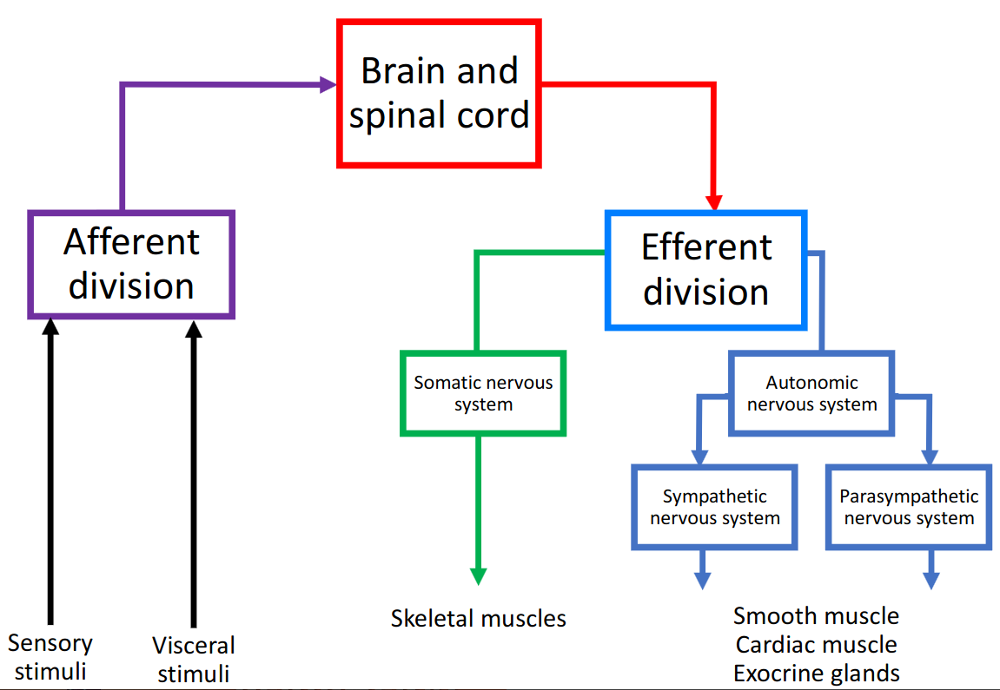

# Lecture 10, Feb 14, 2023

## White and Grey Matter

* Grey matter is where the synapses are (inner region of the spinal cord)
* White matter are the tracks for messages to run through
	* Myelinated axons

{width=60%}

## Mechanically-Gated Ion Channels

* Also known as mechanoreceptors
* PIEZO channels open and let ions through when the membrane is being depressed through mechanical force
* These are non-selective cation channels, so more sodium is going to come in and depolarize the cell
	* This can then open the voltage gated ion channels and generate an action potential
* There are also other receptor cells, e.g. photoreceptor cells

## Triggering Receptors

* MILD: modality, intensity, location, duration
* Modality
	* Mechanoreceptors:
		* Somatosensory: touch
		* Barorceptors: pressure
		* Proprioceptors: joint angles
		* Osmoreceptors: osmotic pressure between cells
	* Thermoreceptors: temperature
	* Nociceptors: pain
	* Photoreceptors: light
	* Chemoreceptors: smell
	* No sensor that detects "wet" directly
* Nerve endings can be free or encapsulated (e.g. in tissue layers)
* Sensory cells release neurotransmitters to activate a synapse
	* e.g. photoreceptors
	* These have cell bodies midway along the neuron
* For peripheral processes (e.g. olfactory receptor, stomach) the cell body is at the tip

{width=50%}

* Intensity
	* Frequency coding: the higher the receptor potential, the greater the frequency of action potentials
	* Larger signals are generated when more receptors or neurons are activated (e.g. with more pressure, larger area of force)
* Location
	* Receptive field: in some places there are more receptors closer together
		* Smaller receptive field means greater acuity
	* Lateral inhibition: to figure out where exactly the stimulus comes from, the sensory neuron connects with interneurons with IPSPs and inhibits the neurons next to it
		* In places with more receptors, often multiple receptors are triggered by a single stimulus
		* Lateral inhibition reduces the signal coming from sensory neurons next to where the stimulus is the strongest, so the signal is sharper
		* Good lateral inhibition happens in places like touch on the skin
		* Poor lateral inhibition would be like cold or pain, which aren't often localized

{width=25%}

* Duration
	* *Phasic* receptors are rapidly adapting; *tonic* receptors are slowly adapting
	* Phasic receptors activate immediately to stimulus, then return back to normal; when the stimulus goes away there is also a small depolarization and repolarization
		* This gives action potentials immediately when the stimulus comes, and a few more when the stimulus is removed
		* If the stimulus is held down, there are no action potentials
		* Meissner's corpuscle detect things like grip; they are phasic receptors
		* Pacinian corpuscles are also phasic and have even more rapidly adapting action potentials
			* This is for perception of vibrations
	* Tonic receptors stay depolarized while the stimulus is held (might gradually repolarize); the receptor repolarizes when the stimulus is removed
		* Action potentials fire continuously while the stimulus is held
		* Ruffini endings are tonic; there may be background activity happening stochastically when there is no stimulus; when there is a stimulus it behaves tonically
			* This is for muscles and sensing where limbs are
		* Merkel's discs are also tonic (this one has no background activity)
			* This is for continuous touch and pressure
			* There are a lot of them so there is great resolution
	* Phasic receptors have an on-response and off-response; tonic receptors adapt slowly and have sustained action potentials

