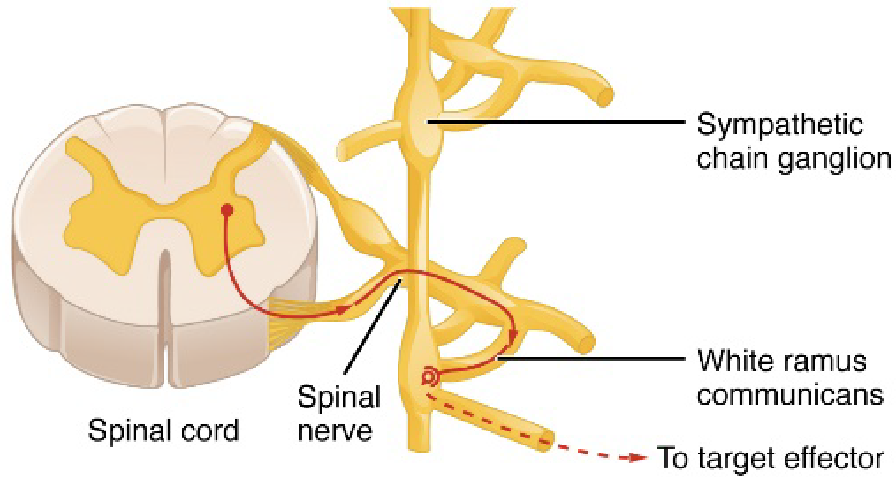
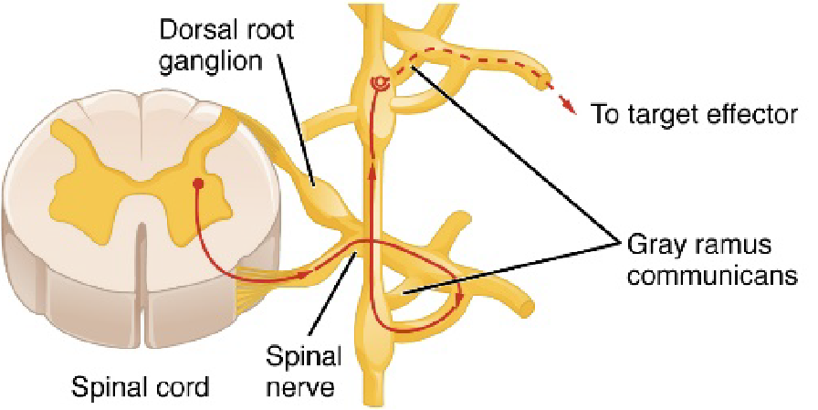
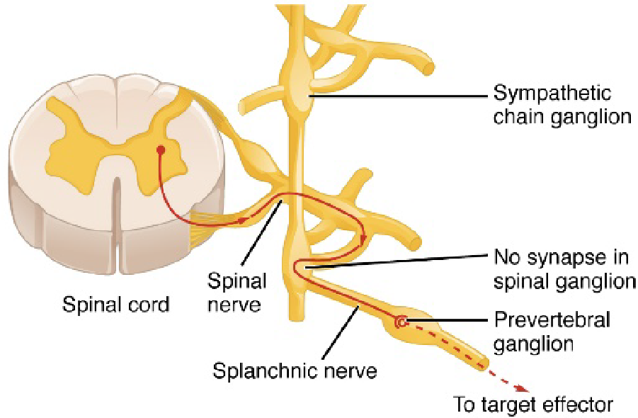
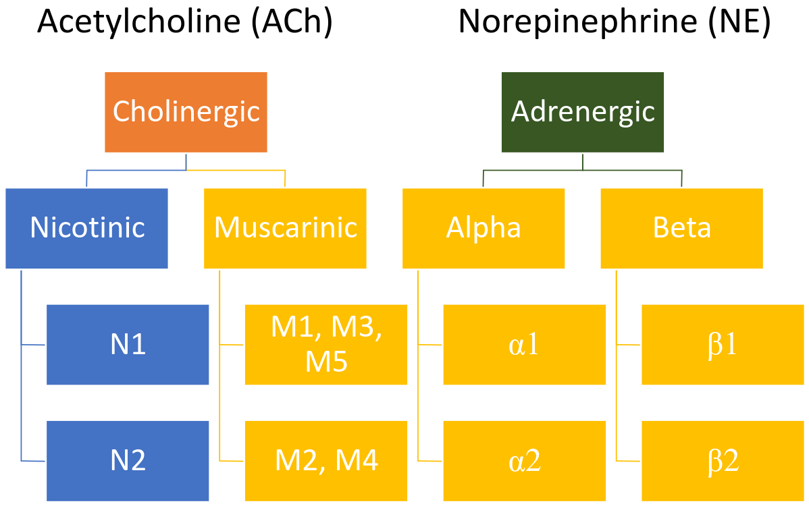

# Lecture 11, Feb 16, 2023

## Somatic Nervous System

* The somatic motor system consists of a somatic neuron exciting a muscle
	* The synapse between the neuron and the muscle is called a neuromuscular junction
		* Works on the same mechanism with calcium
		* Acetylcholine (ACh) is used as neurotransmitter
	* The neuron is myelinated

## Autonomic Nervous System

* The autonomic motor system has a chain of two neurons
	* The cell body outside the CNS is the ganglion
	* The preganglionic neuron is myelinated, the postsynaptic neuron is not
	* The postganglionic fibre can go to gland cells, smooth muscles (surrounding organs and blood vessels) or cardiac muscles (heart)
* The autonomic nervous system is split into the *sympathetic* and *parasympathetic* nervous systems 
	* These systems work against each other -- sympathetic is the accelerator, parasympathetic is the brake
	* Almost every organ is controlled by both systems, but in different ways
	* Note there is always some tonic activity happening -- it's not either on or off

{width=40%}

{width=40%}

{width=40%}

* In the sympathetic nervous system:
	* The nerves come out of the thorax and lumbar regions (middle of the spine)
	* The preganglionic fibre is very short -- the synapse is almost right outside the spinal cord and the postsynaptic fibre goes to the organ
		* Near the spinal cord there are chain ganglia, which nerves can travel up and down and then go out
		* Some of them might have the synapse (collateral ganglion) past the chain (this is usually with abdominal muscles related to digestion)
	* The adrenal gland, sweat glands, and arterials (vasoconstriction, constriction of blood vessels) only have sympathetic nerves
* In the parasympathetic system:
	* Most nerves come out from the cranial nerves
	* The vagus nerve goes to all the organs
		* This has a very long preganglionic fibre and goes to a bunch of organs
	* At the very bottom of the spine there are a few more nerves
	* The postganglionic fibre is very short -- the ganglion is almost on the organ
	* The cranial and sacral nerves only have parasympathetic nerves
* Sensory and somatic motor neurons are big and heavily myelinated, so they are the fastest; the preganglionic autonomic neurons are myelinated and the postganglionic ones are not, so the parasympathetic nervous system is faster, as it has a longer preganglionic nerve and shorter postganglionic nerve
	* Myelination takes up a lot of room, so there is a tradeoff

## Cholinergic and Adrenergic Receptors

{width=60%}

* The autonomic nervous system has a web of connections
	* Varicosities hold neurotransmitters, which are released when calcium triggers exocytosis
	* This is called a neuroeffector junction (NEJ)
* The sympathetic nervous system uses norepinephrine to signal the effector cells
	* Adrenergic receptors respond to NE and E, separated into alpha and beta receptors
		* Alpha receptors respond more to NE than to E
			* $\alpha 1$ excites, $\alpha 2$ inhibits (e.g. inhibiting digestive organs during a sympathetic response)
		* Beta receptors
			* $\beta1$ excites (responds equally to NE and E), $\beta2$ inhibits (responds more to E than NE)
	* Epinephrine is used indirectly
* The parasympathetic nervous system always uses acetylcholine (vagusstoff)
	* Cholinergic receptors respond to ACh, separated into nicotinic and muscarinic receptors
		* Nicotinic are ionotropic (fast-acting)
		* Muscarinic, alpha and beta adrenergic receptors are metabotropic (slow-acting)
	* Nicotinic receptors are all excitatory; there are N1 and N2 subtypes
		* N1 go at the neuromuscular junctions
		* N2 excite the dendrites on the postganglionic nerve fibres (these are faster, goes on the postganglionic fibres for both sympathetic and parasympathetic systems)
	* Muscarinic receptors have 5 subtypes; M1, M3, M5 excite, M2, M4 inhibit
* For both systems, the preganglionic fibres all release ACh, with nicotinic receptors on the postsynaptic neuron to respond quickly
	* In the parasympathetic system, ACh is released by the postsynaptic neurons and muscarinic receptors respond to them
	* In the sympathetic nervous system E and NE are released by the postsynaptic neurons, with adrenergic receptors responding to them
* The sympathetic nervous system actives chromaffin cells (via ACh) in the kidney which release mostly E (80%) and some NE (20%)
	* The NE goes into the blood stream and becomes a hormone to reach its target
* Sweat glands have cholinergic muscarinic receptors

