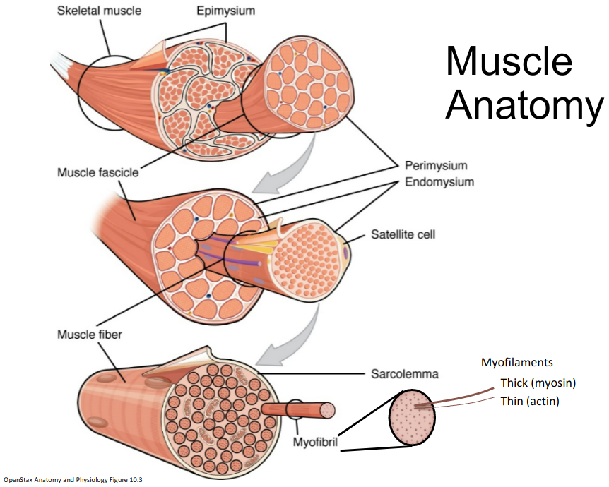
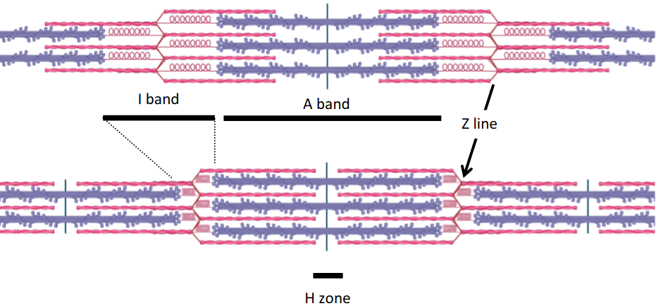
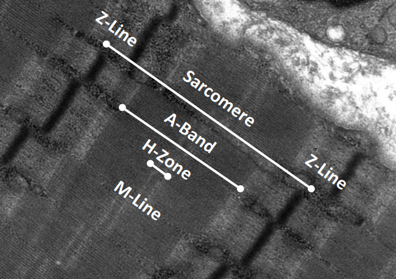
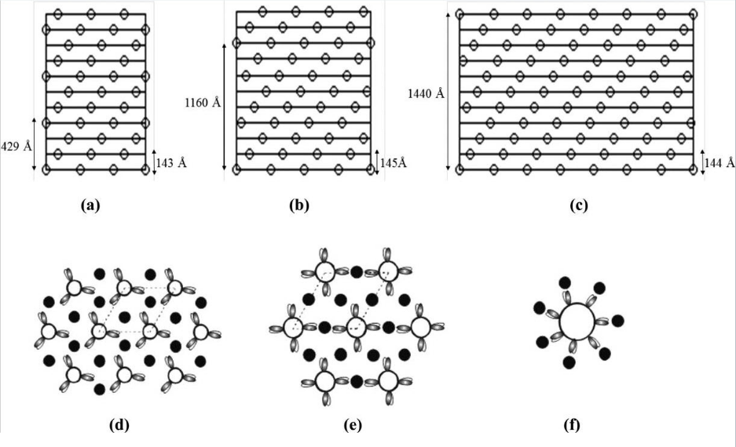
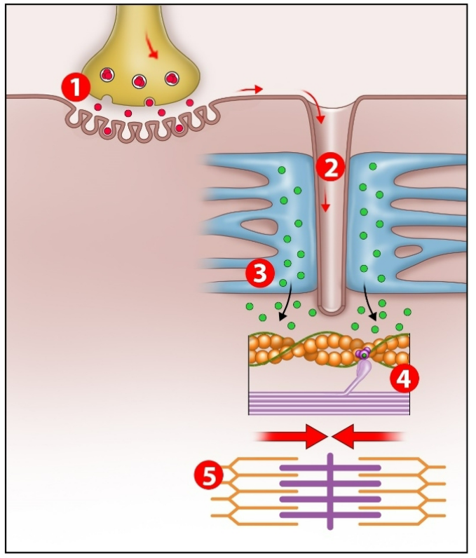

# Lecture 12, Mar 7, 2023

## Skeletalmuscular System Structure

* Muscle surrounds bone like concrete surrounds rebar; muscle provides flexibility while bone provides stability
* 3 types of contractions:
	* Concentric: muscle contraction
	* Eccentric: muscle extension
	* Isometric: no movement, but still exerting a force

## Skeletal Muscle Structure

* Sarcolemma: cell membrane of a muscle cell (aka muscle fibre)
* Muscle fibres are bound together into muscle fascicles, packed together with blood vessels and satellite cells (which help repair muscle cells)
* Each nerve will stimulate a collection of muscle fibres, which are all in the same motor unit
	* A bigger muscle has more fibres/fascicles in the motor unit
* Muscle cells are packed full of myofibrils, which do the actual contraction
	* Within myofibrils there are myofilaments, which can be thick (myosin) or thin (actin)
	* Myofilaments are attached together and overlap in some places
	* Within the myofibrils there are repeating patterns called sarcomeres
	* The thick (myosin) fibres have little extrusions called myosin ATPase
	* The Z-line is the zigzag pattern in the middle of the actin pattern
	* The M-line is in the middle of the sarcomere
	* The titin are where the myosin attach to which have a spring structure
	* I-bands are where the thin filament is, A-bands are where the thick filaments are
	* The H-zone is in the middle of the A-band and appears a little brighter
	* When the muscle contracts, the I band gets shorter; the A band doesn't change size; there is more overlap between the two filament types (the H zone also gets smaller)
* Skeletal muscles are striated, which has bands

{width=50%}

{width=70%}

{width=40%}

{width=50%}

## Neuromuscular Junction

* Axon terminals attach to terminal buttons, which have wavy patterns that give them a high surface area and thus high sensitivity
* The process of a potential travelling through the junction is the same as any other synapse, except ACh is always used
	* 2 ACh binds to each receptor to open it
	* An end-plate potential is the sarcolemma depolarizing, an action potential in the muscle; this then spreads through the muscle fibre
	* After excitation ACh is removed by acetylcholinesterase (AChE)
		* AChE is an enzyme that lives on the membrane of the muscle cells (instead of just floating around)
* Since ACh is always used, these junctions are always excitatory, so if a signal were to be inhibited, we need an inhibitory interneuron higher up in the chain
* Some toxins that can mess with these junctions:
	* Black widow spider venom causes explosive release of ACh
	* Botulism toxin blocks release of ACh so muscles cannot move
	* Curare (reversibly) binds to ACh receptors and blocks ACh from attaching

## Excitation-Contraction Coupling

* Transverse-tubules (T-tubules) allow the action potentials to quickly travel from the sarcolemma to the myofibrils, so that when the membrane is depolarized, almost all the myofibrils get depolarized simultaneously to get coordinated action
	* These dive deep into the cell, with reservoirs (sarcoplasmic reticulum, SR) of calcium for excitation
		* The calcium can't just be floating around because too much of it signals a cell to self-destruct
	* The combination of the T-tubules and SR on each side form a triad
* Process of excitation:
	1. ACh release at the NMJ from a neuron
	2. Action potential along the surface of the sarcolemma, travels along the T-tubules
	3. Action potential in the T-tubules causes the sarcoplasmic reticulum to release calcium
	4. Calcium ions unlocks the actin (thin) filaments (kind of like opening a latch)
		* Once the filaments are unlocked, binding can occur
	5. Binding between myosin and actin leads to contraction
		* The myosin heads create the cross-bridge to the actin filaments
		* The troponin-tropomyosin structure is the latch that opens and allows binding

{width=40%}

