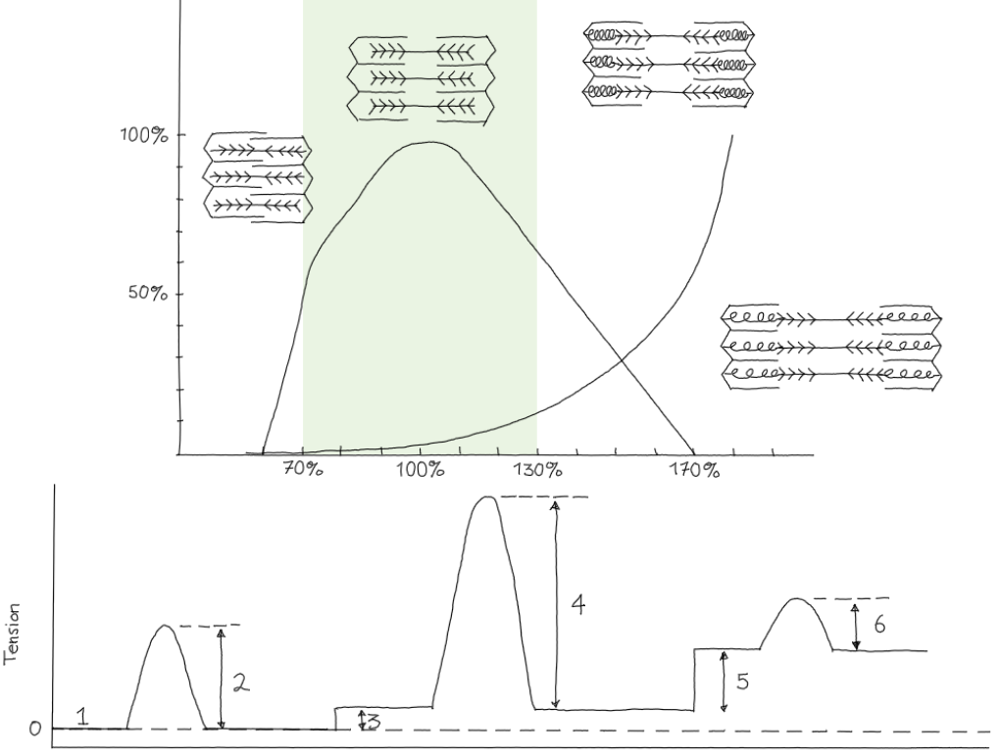
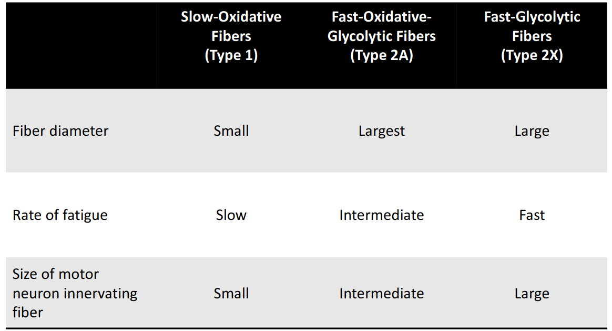
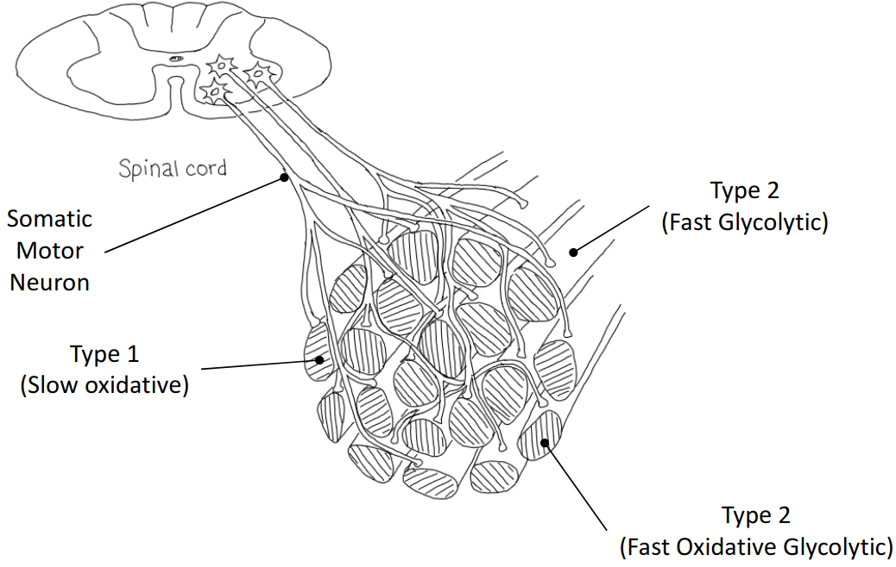

# Lecture 13, Mar 9, 2023

## Cross-Bridge Cycle

1. Binding
	* Calcium from the SR (released when muscles are excited via ACh) allows the attachment of myosin heads to binding sites on the actin
	* This forms cross-bridges that attach the myosin to the actin
	* Without calcium binding cannot start
	* ATP is used to push calcium back into the reservoirs using SERCA pumps
2. Bending
	* Once the binding happens, the head of the myosin rotates
	* Each head is about 5 piconewtons of force
	* ADP is used here to power this
3. Detachment
	* ATP attaches to the myosin head, which breaks the cross-bridge
	* Without ATP, the myosin heads are stuck and cannot be detached, so no further muscle movement can occur
	* This is the reason for rigor mortis -- without ATP muscles are stuck
4. Energization
	* As soon as ATP is attached, it becomes ADP, and the head becomes energized
	* If there's more calcium available, the cycle repeats again

## What Affects Tension of a Single Fibre?

1. Action potential frequency
	* Each action potential causes a muscle twitch
	* For a single action potential, after a few ms to allow the calcium being pumped, tension increases during the contraction phase; then tension decreases during the relaxation phase
		* The latent period is the time between the stimulation and contraction
		* Contraction and relaxation time together is about 100 ms
	* Multiple action potentials cause twitch summations like spatial summations of action potentials
	* As the frequency of action potentials increase, the tension increases up to an upper limit (*tetanus*) and the muscle stays contracted instead of twitching
		* This happens at around 60 Hz for some muscles
2. Fibre length
	* Muscles can be much longer or shorter than resting length
	* At resting muscle length, there is optimal overlap, when the most tension could be produced; if the muscle gets longer or shorter the force decreases
		* At 70% (contracted muscle) there is more overlap, and force drops sharply
		* At 130% (stretched muscle) there is less overlap, force also drops but less sharply
	* Between 70% and 130% is usually what happens within the body; under experimental conditions it's possible to stretch the muscle so much that there is no more binding so no tension can be produced
	* There is also some passive tension produced by the muscle as it gets stretched, like a spring
		* The passive tension is added onto the active tension
3. Fibre diameter
	* If each myofibril gets bigger, it can develop more tension (fibre hypertrophy)
	* If more myofibril gets packed into a single fibre, it can also develop more tension (fibre splitting/hyperplasia)
		* Bigger filaments will exert more tension on z-disc connections when fibres contract, which can cause it to snap
		* When z-discs snap, they become separate myofibrils which is how hyperplasia happens
4. Fatigue
	* Different types of fibre types have their tension fall off in different ways
		* Slow-oxidative fibres have nearly constant tension, up to an hour
		* Fast-oxidative glycolytic fibres exert good tension up to 10 minutes but decrease after that; after an hour they exert nearly no tension
		* Fast-glycolytic fibres get fatigued much faster, with tension dropping rapidly at around 2 seconds
			* e.g. chicken breast because chickens can fly for a very short duration
5. Fibre Type

{width=70%}

{width=70%}

## What Affects Tension of Multiple Fibres?

1. Number of fibres per motor unit
	* Motor units are stimulated together by nerves
	* More fibres in a single motor unit means more power
	* Motor units can consist of multiple muscle cells in a single fascicle, but they don't have to consist of the whole fascicle
		* This can account for fatigue as different motor units are switched around
	* Different types of fibres can be stimulated to produce tension that is a sum of the different types
2. Number of active motor units
	* Different neurons excite different motor units
	* More neurons stimulate more motor units which creates more power
	* All these motor units would be within the same fascicle

{width=80%}

