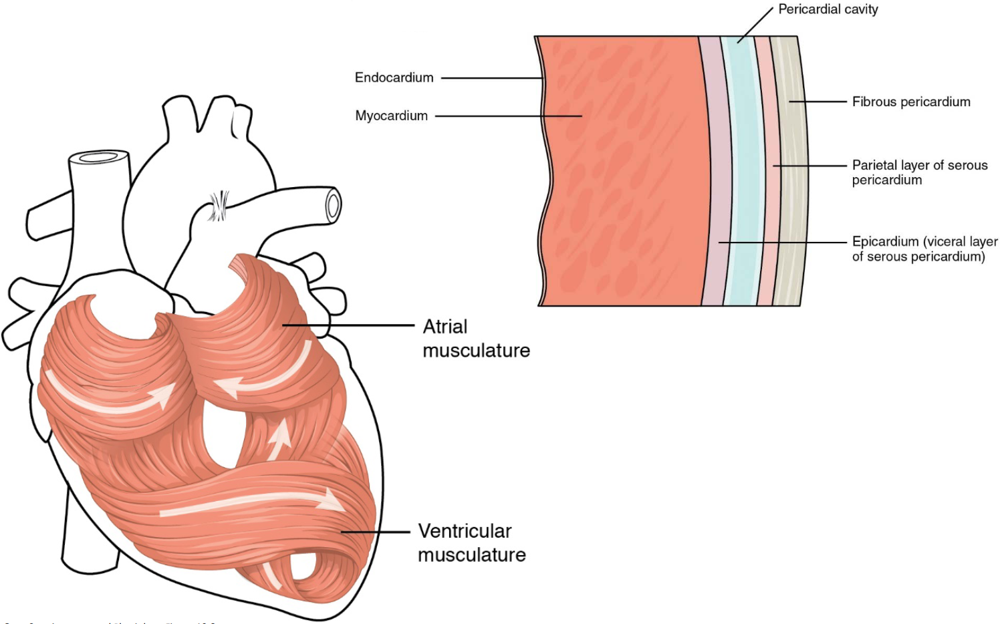
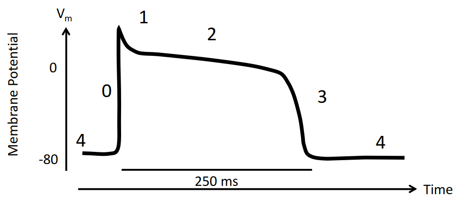
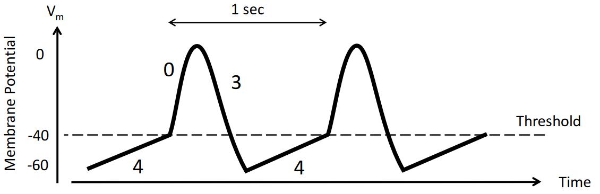
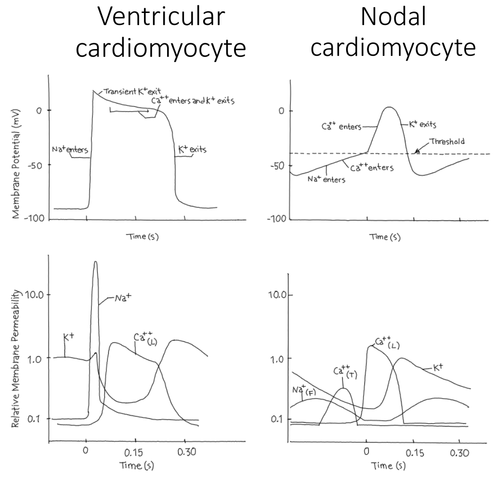

# Lecture 14, Mar 14, 2023

## Cardiac Muscle

{width=80%}

* Controlled by the autonomic nervous system
	* Both types are striated muscles, but the heart is involuntarily controlled
* Cardiac muscles are myogenic (they initiate themselves, without the need of a signal from the nervous system)
	* The nervous system just modifies the contraction strength and speed
* Unlike skeletal muscles the length of fibre controls the strength and the calcium concentration
* Hormones also modify the effect of cardiac muscle
* The SR isn't as developed, so the ECF is playing a larger role in bringing calcium in
* Gap junctions exist, unlikely in skeletal muscle
	* Gap junctions in an electrical synapse let ions pass from one cell to another if they are open
	* Once an action potential is started, it spreads through the whole heart
* While skeletal muscles are linear, cardiac muscle has branches; they are connected by desmosomes and gap junctions
* Cardiac muscle cells only have a single nucleus while a skeletal muscle cell can have multiple nuclei
* RMP is about -80 mV
* There are 2 sub-types of voltage gated calcium channels: L-type (long-lasting) and T-type (transient)
	* Different areas of the heart have different types of channels, to allow for different patterns of action potential

## Types of Action Potentials

{width=60%}

* Ventricular myocyte action potential (main muscle in the heart)
	0. Membrane depolarization
		* This happens very fast
	1. Rapid, transitory repolarization
		* Potassium channels open, but only a small number of them open for a short period of time
	2. Plateau phase
		* Other potassium channels open
		* Calcium channels also open
		* Since these act against each other, this makes the membrane potential change slowly
		* The length of this phase can be altered by hormones
		* Functionally this causes a very long refractory period, which matches the contractile response of the heart; this way we won't get a tetanic response (because that does not pump blood)
	3. Repolarization
		* More potassium channels open, overwhelming the calcium channels, which are now closing
	4. Electrical diastolic phase
		* Kind of like a resting membrane potential (for this type of action potential)
		* Heart relaxes in this phase

{width=60%}

* Nodal cell (aka pacemaker) potential (autorhythmic cells that drive the heartbeat; these start the action potential that spreads through the heart)
	0. Membrane depolarization
		* This is only caused by calcium, not sodium
		* The slope isn't as steep due to this reason
		* In this phase, it's the L-type (long-lasting) calcium channels that depolarize the membrane
	2. Repolarization
		* Potassium leaks out of the cell
		* Highest permeability occurs right at the peak of the potential, and then decreases to allow for repolarization
	3. Minimum diastolic potential
		* There is no more resting potential; the cell membrane potential is always changing
		* The membrane potential hits a minimum, then slowly depolarizes until it hits a threshold, at which point it repeats the cycle
		* Sodium channels open in this phase, which is what leads to the gradual depolarization
			* This is unlike normal cells in which the sodium channels only open when the membrane is depolarized, not hyperpolarized
		* As the potential gets close to the threshold, T-type (transient) calcium channels open to provide a final boost to get to the threshold potential

{width=70%}

* Skeletal muscle cells are made of only 12-15% mitochondria; cardiac muscles are about 35% mitochondria

