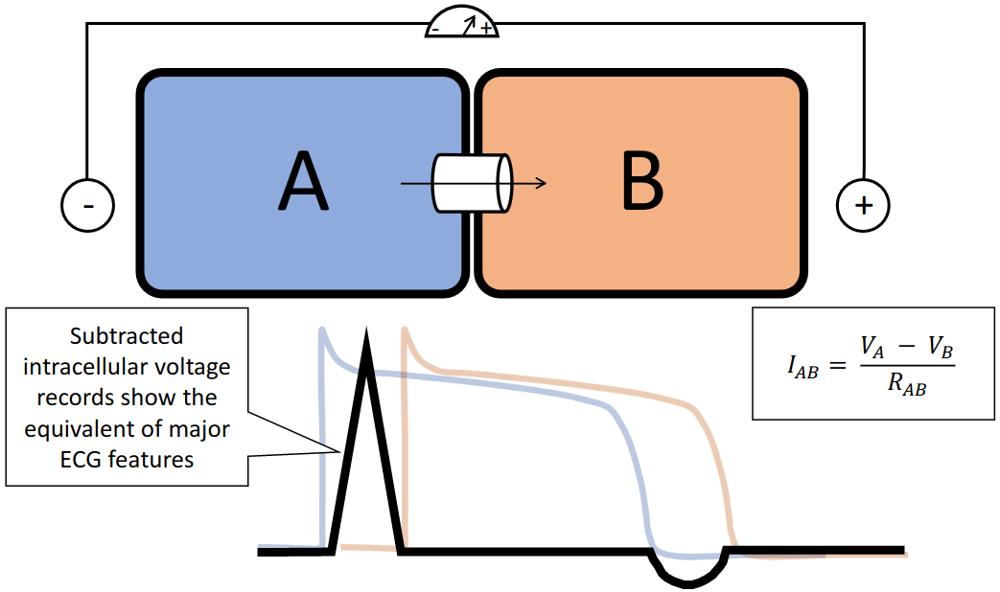
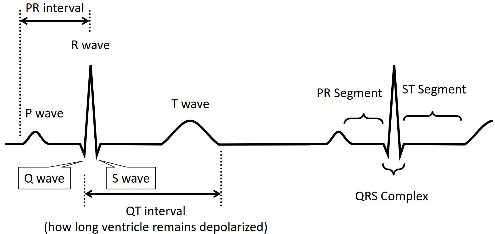
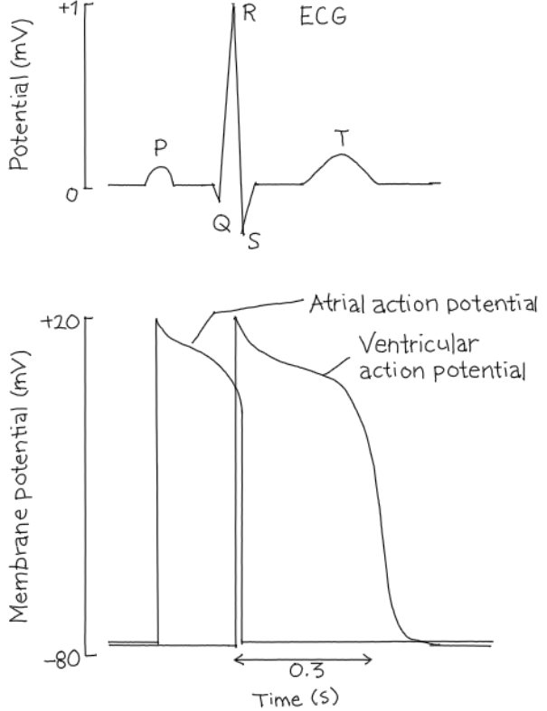
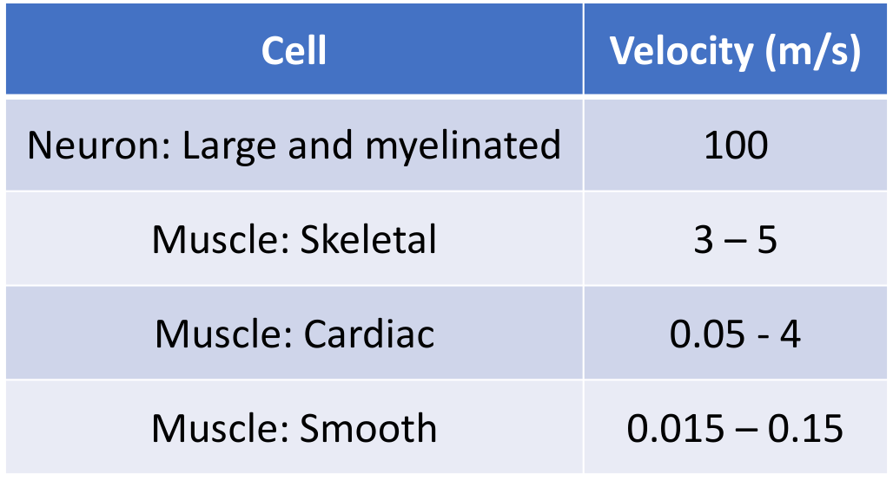
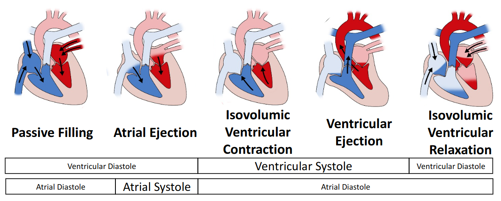
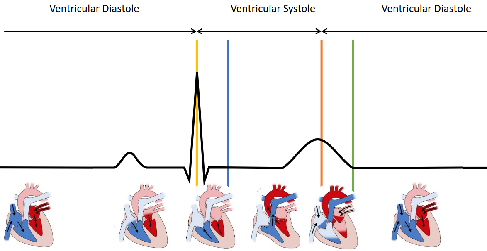
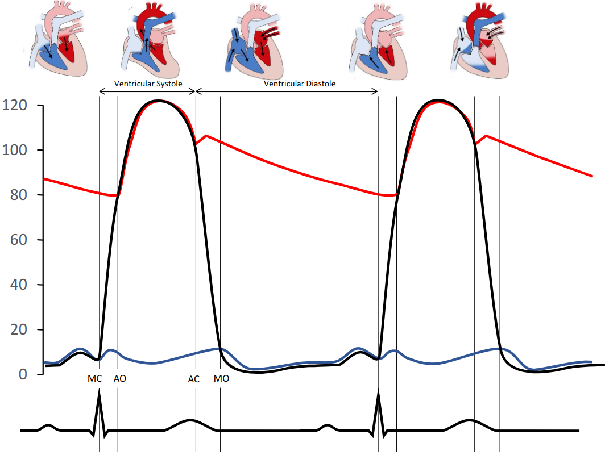

# Lecture 15, Mar 16, 2023

## Electrocardiogram (ECG)

{width=50%}

* Consider 2 cells attached with a gap junction; what if we measure the potential of the entire unit?
	* Since the action potential has to go through the 2 cells, the second cell's action potential is delayed
	* An electrode outside the cells shows the voltage difference on the two sides
* First the sinoatrial node fires, then the atrial muscle depolarizes; the atrioventricular node depolarizes and then spreads the action potential to the other heart tissue

{width=80%}

{width=30%}

* The P wave is caused by the atrial action potential; because there isn't as much atrial muscle mass, the P wave is small
* After a short delay the ventricular action potential fires, and since there is more ventricular muscle, it creates a large spike (the R wave)
	* Since ventricular muscles are synchronized this is a very sharp peak

{width=40%}

* Cardiac muscles conduct much slower than neurons and skeletal muscles and have a large range of speeds

## Sequence of Depolarization/Repolarization

* Depolarization sequence:
	1. The sinoatrial node depolarizes
		* The SA node has a very slow conduction velocity (0.05 m/s), since only calcium is used to depolarize
	2. The depolarization spreads through atrial pathways (1 m/s)
	3. The action potential reaches the atrialventricular node
		* This also spreads very slowly (0.05 m/s)
		* Passing through this node is the only way to depolarize the ventricular muscles
	4. Action potential goes through bundle of his (muscle in the middle of the cell) (1 m/s)
	5. Purkinje system (septum, the muscle separating the 2 sides of the heart, is depolarized) (4 m/s)
	6. The bulk of the ventricular muscles are depolarized (anteroseptal region, near the side of the chest) (1 m/s)
		* This goes down and spreads back up
	7. The posterior portion of the base of the left ventricle is depolarized
* Repolarization sequence starts with the ventricular muscles, starting at the epicardial side (i.e. outside in, opposite to the direction of depolarization)

## ECG Waveform

* Positive electrode below the heart, negative electrode above the heart defines the direction
	* The depolarization moves from the negative electrode to the positive electrode
* Sequence of the waveform:
	1. The atrial muscle depolarizes, creating the small P wave
	2. After a short delay through the atrialventricular node
	3. The septum is depolarizes from left to right, which is away from the positive electrode, creating the negative deflection of the Q node
	4. The ventricular muscles all depolarize towards the positive electrode, causing the large R wave
	5. The depolarization goes through the rest of the ventricular muscles, moving away from the positive electrode and causing the S node
	6. After a delay, the ventricular muscles repolarize, moving away from the positive electrode and creating the T wave; this isn't as coordinated, so the T wave is spread out
* Disturbances during the T wave could lead to ventricular fibrillation
	* Depolarization during the 20 ms upstroke of the T wave causes an action potential going in the wrong direction, messing up the heart rhythm
	* This could happen due to being hit by a ball, fist, etc

## Cardiac Cycle

{width=80%}

* Ventricular diastole happens in 2 phases, first a passive filling and then an active atrial ejection
	* This is where the P wave happens
* At the end of diastole the mitral valve (valve between the left atrium and left ventricle) closes
	* This happens because the ventricle starts to squeeze (mitral valves are one way and are not muscles)
	* The start of this phase is the isovolumic ventricular contraction phase, when the contraction is enough to close the mitral valve but not enough to open the atrial valve
	* The contraction leads to a build up in pressure
* The pressure becomes enough that the aortic valve opens, leading to ventricular ejection
* At the end, the aortic valve closes as the muscles relax; the mitral valve opens after this
	* This is the isovolumic ventricular relaxation phase
* The mitral and aortic valves closing create audible sounds

{width=80%}

{width=70%}

* Where the left ventricular pressure exceeds the left atrial pressure, the mitral valves close; then after the left ventricular pressure comes back down, the mitral vales open as the pressure flips
	* This is why blood pressure has a high value and a low value

