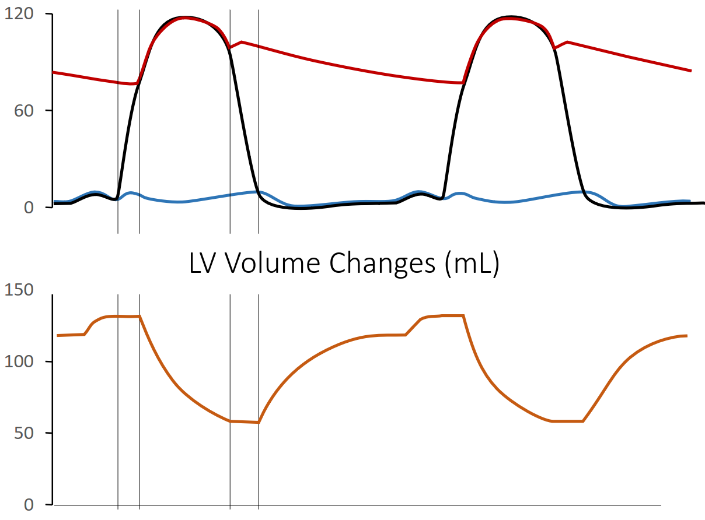
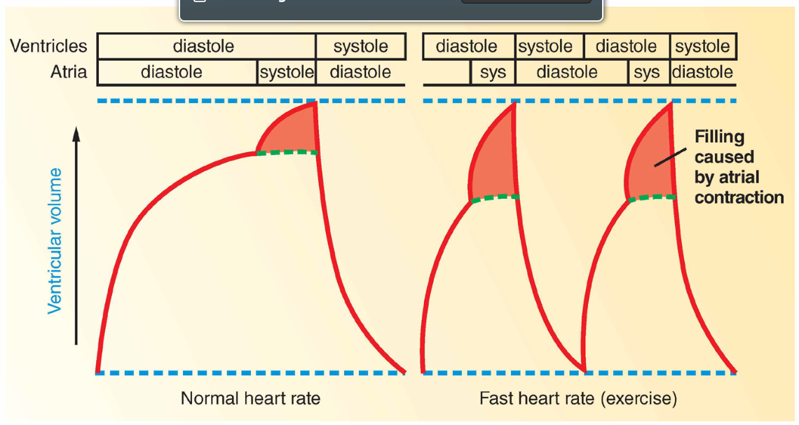
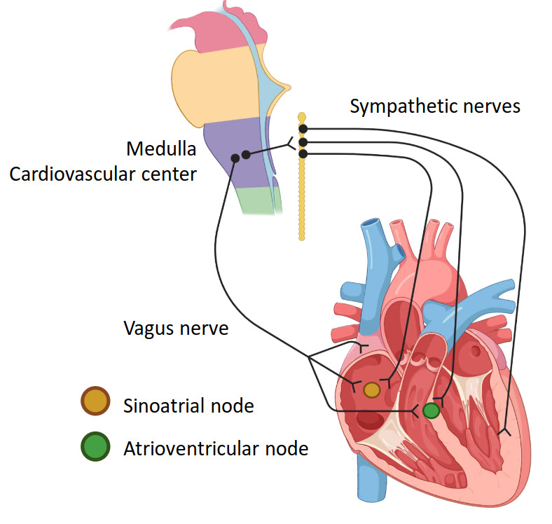
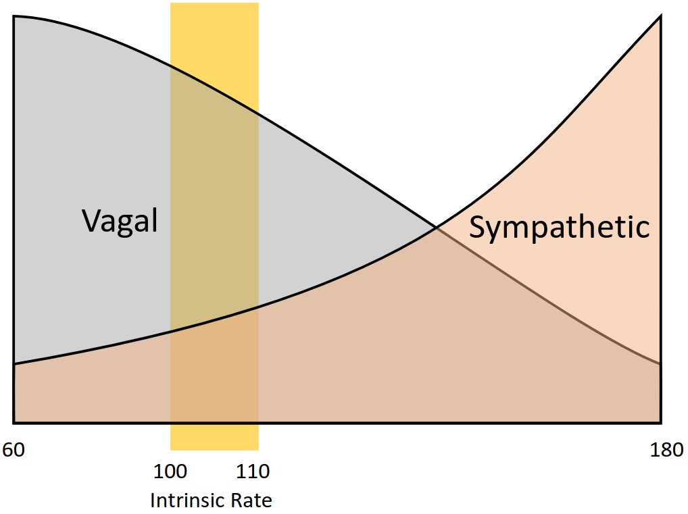
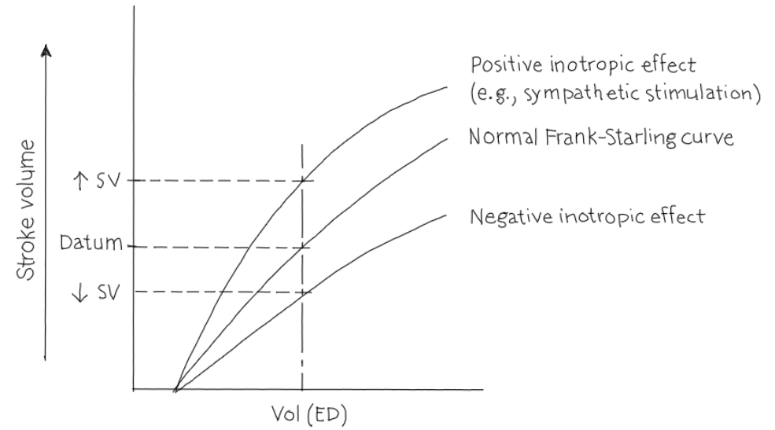

# Lecture 16, Mar 21, 2023

## Volume Changes in the Cardiac Cycle

{width=80%}

{width=80%}

* Changes in left ventricular volume during the cardiac cycle:
	* During the isovolumic contraction and relaxation, the volume stays constant (the two plateaus in the figure)
	* After the isovolumic contraction, the volume in the left ventricle decreases as blood is pumped out to the arteries
	* Then after isovolumic relaxation, the ventricle begins to fill passively, resulting in a gradual filling
	* At the end of the passive filling, the atrial contraction gives another boost to the LV volume, pushing it to the EDV
* During a normal, slow heart rate, the contribution to ventricular volume due to the atrial contraction is not as noticeable; however with faster heart rates, the ventricle has less time to fill, so the filling caused by atrial contraction becomes a lot more important
* The *end-diastolic volume* is the volume in the ventricle after it fills (diastole), or at the beginning of the isovolumic ventricular contraction
	* This is about 135 mL
* The *end-systolic volume* is the volume still left in the ventricle after it pushes the blood out (systole), or at the beginning of isovolumic ventricular relaxation
	* This is about 65 mL
* *Stroke volume* is the amount of blood pumped by the heart every beat; it is the difference between the EDV and ESV
	* This is typically about 135 mL - 65 mL = 70 mL
* *Cardiac output* is defined as the product of stroke volume multiplied by heart rate, in units of litres per minute
	* e.g. with a 70 bpm heartbeat and 70 mL stroke volume, the output is about 5 L/min

## Modifying the Heart Rate

* Heart rate is directly proportional to cardiac output; this can be modified through the behaviour of the sinoatrial nodal myocyte (pacemaker):
	1. Rate of depolarization (funny current)
		* With faster rate of depolarization, after a beat, the membrane potential takes less time to reach the threshold
	2. Shift in minimum diastolic potential
		* Increasing the minimum diastolic potential means after the heart beat, the potential doesn't go as negative, which also makes it easier to reach the threshold
	3. Shift in threshold
		* Lowering the threshold (making it more negative) also makes it faster to reach the threshold and start a beat

{width=40%}

* The heart rate is controlled extrinsically (i.e. autonomically)
	* Signals originate from the cardiovascular centre in the medulla
* The vagus nerve (parasympathetic nervous system) comes out from the medulla, and only targets the atrial muscles, sinoatrial node and atrioventricular node
	* SA nodal cells have M2 receptors, which inhibits target cells
	* The effect of this would be to hyperpolarize the minimum diastolic potential or to reduce the depolarization rate of the SA node, both reducing the heart rate
		* The receptors enhance K+ permeability of the SA node; this hyperpolarizes the minimum diastolic potential, and also opposes the funny current that depolarizes after a beat
* Sympathetic nerves also go to the sinoatrial node, atrioventricular node and also ventricular muscles
	* Sympathetic stimulation increases permeability to calcium, which increases the conduction velocity of the AV node and Purkinje fibres (because only calcium is used for depolarization in cardiac muscle cells)
	* SA nodal cells have $\beta 1$ adrenergic receptors, which excite target cells
		* Increased calcium permeability makes the funny current stronger, making depolarization faster and reducing the time between heart beats
		* The increased calcium currents also make calcium channels more active, thereby reducing the threshold and decreasing the time between heart beats
* The two PNS and SNS are always effecting the heart; they're not on/off, but rather more/less
	* *Autonomic tone* is the balance between the influences from the two systems
	* The intrinsic heart rate (completely unaffected by both systems) would be 100 to 110 bpm

{width=50%}

## Extrinsic Control of Stroke Volume

* Only the sympathetic nervous system controls the stroke volume (since only the sympathetic nerves innervate the ventricular muscles)
* Enhanced calcium currents caused by sympathetic stimulation cause stronger contractions
* The end-diastolic volume stays the same, but the stronger contractions reduce the end-systolic volume, so more blood is pushed out every beat
	* This is called a positive ionotropic effect
* e.g. the ESV can be reduced from 65 mL to 35 mL, which would increase SV from 70 mL to 100 mL

{width=60%}

* Putting it all together, PNS decreases the heart rate, SNS increases both the heart rate and stroke volume; both heart rate and stroke volume combine to produce cardiac output
	* Note if the heart rate becomes too fast (120+ bpm), the stroke volume begins to fall off as the heart doesn't have enough time to fill

