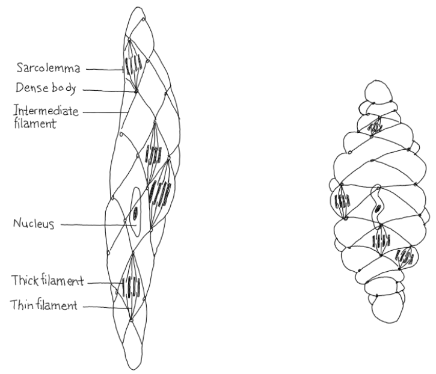
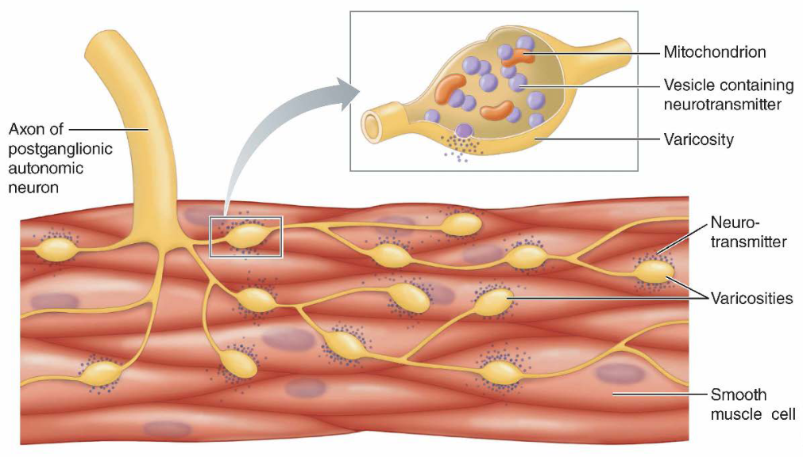
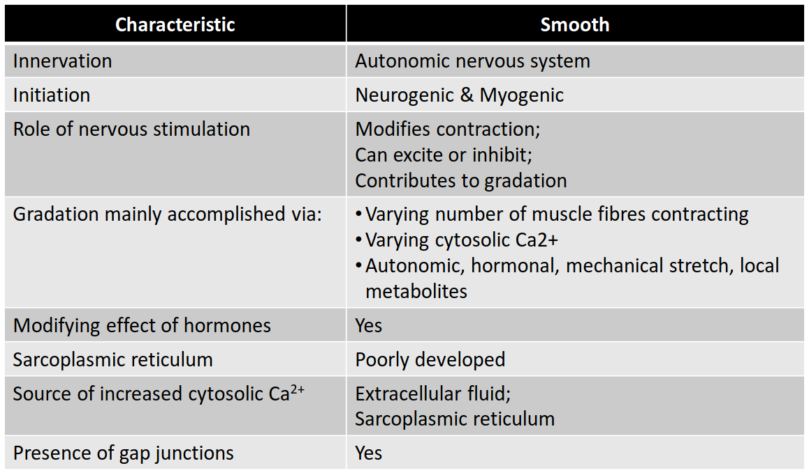
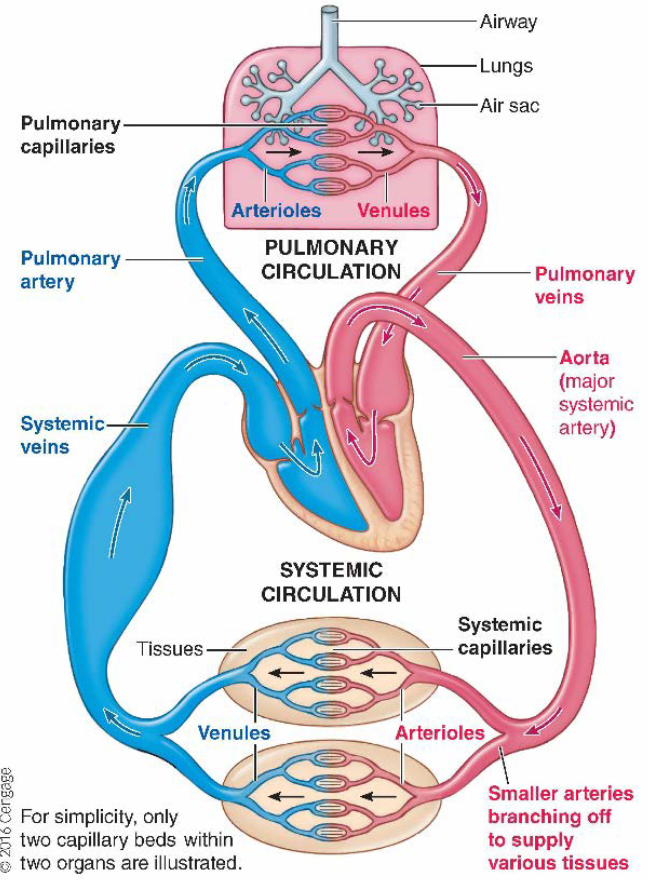
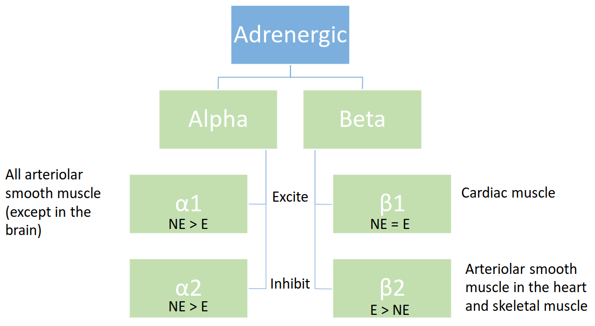
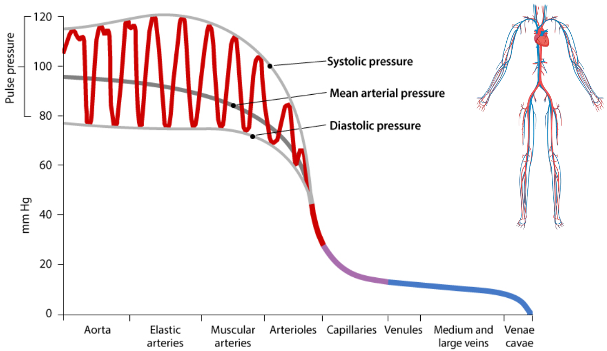
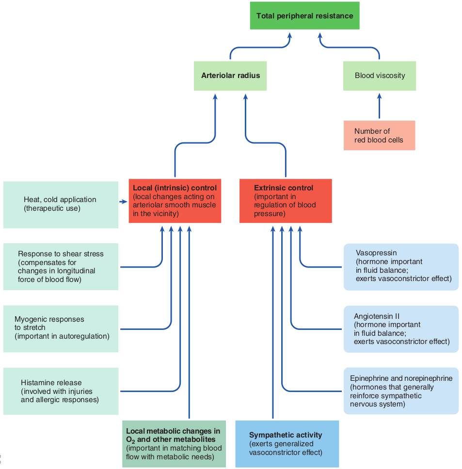

# Lecture 17, Mar 23, 2023

## Smooth Muscle

* Smooth muscle is usually found in organs that aren't "solid"
* Found in STOVE:
	* Skin (the muscles that make your hair stand up)
	* Tracts (e.g. gastrointestinal, respiratory, reproductive)
	* hollow Organs (e.g. bladder, uterus)
	* Vessels (e.g. aorta, arterioles, but not capillaries)
	* Eye (controlling iris)

{width=50%}

{width=70%}

* Smooth muscle have a net-like structure connected by dense bodies; between all dense bodies are the thick and thin filaments (actin, myosin)
	* When smooth muscle contracts, the "net" squishes
* Smooth muscle is more flexible; generally very slow but efficient, and fatigues slowly
* Smooth muscles are innervated by the SNS and PNS; instead of a terminal junction, there are a network of varicosities
* Autonomic stimulation (neurotransmitters) change the availability of calcium ions in the cytosol of smooth muscle cells
* They have sufficient calcium levels to maintain a low level of tension, and are sensitive to neurotransmitters depending on the distribution of receptors

{width=70%}

## Basic Structure of the Vascular System

{width=40%}

* The aorta is the major systemic artery, which supplies blood to all the organs
	* Long, rigid, gets blood to where it needs to go
	* More of a conduit
* Veins have a much larger capacity; there is a reservoir where blood can pool as it returns
* Types of arteries:
	* Elastic arteries go from 3 cm in diameter to 250 microns
		* The structure makes it very flexible and elastic
	* Muscular arteries go from 100 to 40 microns
		* Less elastin, more smooth muscle (hence the name)
		* Smoot muscle dominates behavior
		* Can't stretch as much
	* Arterioles go from 40 to 10 microns
		* No elastin, only smooth muscle

## Factors Effecting Arterioles

* Extrinsic factors (signals from the nervous system)
	* In the normal case, the blood vessel is slightly constricted
	* More sympathetic stimulation leads to more vasoconstriction, decreasing the diameter and leading to higher blood pressure
	* Less sympathetic stimulation leads to vasodilation, increasing the diameter
	* No parasympathetic innervation to arterioles
	* Different tissues have opposite responses to the SNS
		* All arteriolar smooth muscle (exception in the brain) all have $\alpha 1$ type receptors -- they are excited by NE and constrict
		* However the arteriolar smooth muscle in the heart and skeletal muscle have $\beta 2$ receptors, which are more sensitive to E and are inhibited
		* Different types of receptors allow the SNS to either dilate or constrict

{width=60%}

* Smooth muscles can myogenically contract due to intrinsic factors
	* More myogenic activity leads to more constricting
	* Less oxygen or more carbon dioxide leads to dilation; more oxygen or less carbon dioxide leads to constriction
		* More activity lowers the oxygen level in the blood; the vessels dilate to provide more oxygen to active muscles
	* The inner layer of cells around the vessel releases neurotransmitters that lead to myogenic behaviour
		* Endothelin leads to constriction, nitric oxide leads to dilation
		* e.g. beet juice contains nitric oxide, which dilates the vessels and increases muscle performance
* Stimulation from SNS leads to a global vasoconstriction effect, but local factors (depending on the muscle type or local muscle activity) will alter the local effects
	* e.g. during exercise, sympathetic stimulation causes constriction globally, but dilation to the exercising muscles; the lowered oxygen and increased carbon dioxide levels lead to vasodilation of exercising muscles
* Cold temperatures lead to constriction, hot temperatures lead to dilation
* Histamines released by the immune system also lead to dilation (helping the immune response)
	* This makes it possible to be allergic to the cold

## Pressure and Flow Relationships in Vessels

* Hagen-Poiseuille equation: $\Delta P = Q\frac{8\eta L}{\pi r^4}$; $\Delta P$ is the pressure difference, $Q$ is the flow, $r$ is the vessel radius, $L$ is the length, and $\eta$ is the dynamic viscosity
	* $\frac{8\eta L}{\pi r^4}$ is referred to as the *total peripheral resistance* (TPR)
	* $\Delta P$ is the product of cardiac output (flow) and resistance
* $R \propto \frac{1}{r^4}$ so a small increase to the radius significantly lowers the resistance
	* Vessel radius can be effected by local metabolic control and extrinsic vasoconstrictor control (i.e. Sympathetic innervation)
* $R \propto \eta$ and viscosity can be effected by the number of red blood cells (e.g. dehydration leads to thicker blood, increasing resistance)

{width=70%}

* The mean blood pressure is always lowering with smaller vessels; since pressure is the driving force for flow, the smaller vessels will have less flow
	* Pressure also fluctuate with every heart beat
	* The biggest pressure drop happens across the arterioles
	* Arterioles are called "resistance vessels" because of this, due to their inelasticity from only having smooth muscle
	* Barely any resistance happens on the venous side; only a small pressure changes happen in the arteries before arterioles
* The mean arterial pressure (MAP) is the average between the systole and diastole pressures
	* Since diastole occurs for much longer, the diastolic pressure has about twice the weight as the systolic pressure
	* $MAP \approx DBP + \frac{1}{3}PP$ where DBP is the diastolic blood pressure and PP is the pulse pressure (difference between the 2)
	* However with increased heart rate diastole shortens first (before systole shortens), so the weights can change

{width=90%}

