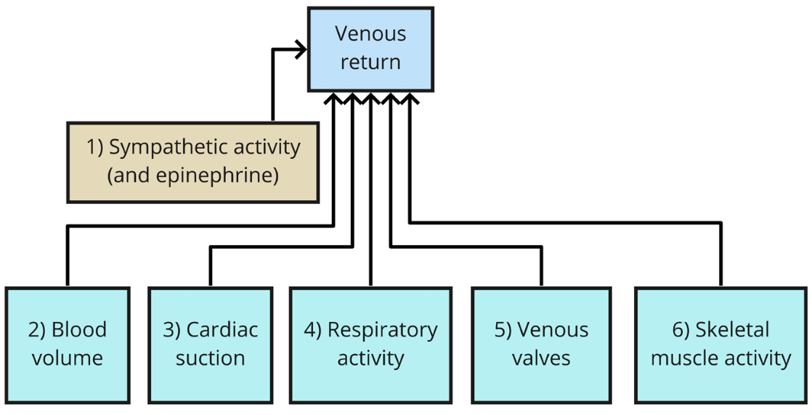
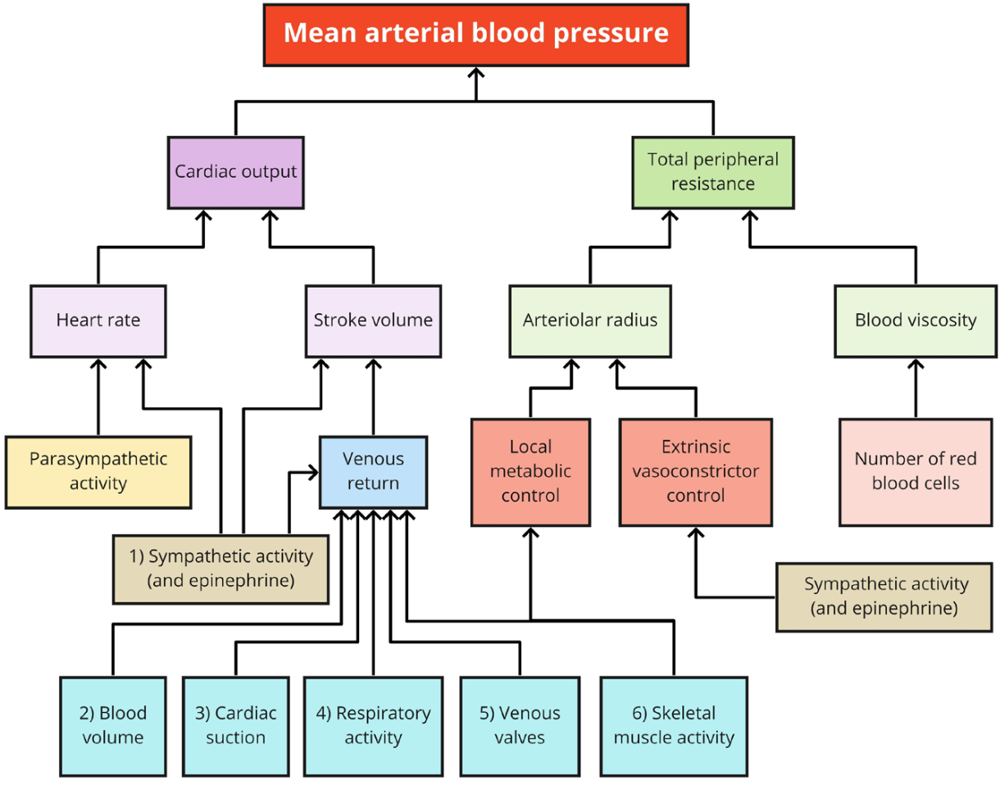

# Lecture 18, Mar 28, 2023

## Changes in Blood Flow

* At rest, flow is only 5 L/min, while with exercise the blood flow can get up to 12.5 L/min
* Most of the extra blood flow goes to skeletal muscle (taking up 64% of the total flow, up from 15% without exercise)
* Flow is diverted away from the digestive system, the kidneys, etc; they end up having lower blood flow, despite the increase in overall blood flow
* Skin blood flow is also increased
* All arteriolar and venule smooth muscle (except the brain) has $\alpha 1$ receptors, so release of NE leads to excitation (constriction)
* Arteriolar smooth muscle that supplies skeletal and cardiac muscle cells have $\beta 2$ receptors, which dilate instead with release of NE
	* There are still $\alpha 1$ receptors, but the $\beta 2$ receptors overwhelms

## Venous Return

* At any given time most (65%) of the blood volume is stored in the systemic veins
* Because arterioles are inflexible, the flow rate back into the heart is limited; if venous return is not increased, the heart will eventually run out of blood to pump since the blood is not returning fast enough
* Factors affecting venous return:
	1. Sympathetic activity: "squeezing" blood out of the veins and into the heart
		* A lot of sympathetic innervation in the spleen, kidney, etc
		* This vasoconstriction pushes the "stored" blood volume in these organs out
	2. Blood volume: having more blood volume (e.g. with a transfusion) has the same effect
	5. Venous valves: one-way valve-like structures in the veins prevent backflow of blood when the vessels are squeezed
	6. Skeletal muscle pump: the skeletal muscles around the valves create pressure, and combined with the venous valves it pushes blood back into the heart

{width=80%}

{width=90%}

## Regulation of Blood Pressure

* Heart rate, stroke volume, and total peripheral resistance are the system effectors
* To sense blood pressure, the body has baroreceptors; these receptors wrap around the arteries, so with higher blood pressure, the vessels stretch and the receptors are activated
* There are carotid sinus baroreceptors (neck) and aortic arch baroreceptors (heart)
* Baroreceptors are tonic receptors, with firing rate proportional to blood pressure
	* With an increase in pressure the receptor sees a spike in potential, which then dies down and stabilizes
	* This means there will first be a transient spike in the firing rate right after a pressure change
* The afferent signals from the baroreceptors come into the medulla, which contains two cardiovascular control centres; one centre increases sympathetic excitation, the other depresses it; there is also a control centre for parasympathetic control (vagus nerve)
	* We can break this down into a cardioaccelatory side (increase SNS, decrease PNS) and a cardioinhibitory side (increase PNS, decrease SNS)
		* Both of these affect the heart rate and stroke volume
	* Signals from the baroreceptors are combined with environmental stimuli (exercise, injury, etc)
	* There is also a vasomotor centre (where there is no parasympathetic response); on the vasoconstrictor side there is more sympathetic response, on the vasodilator side there is less sympathetic response
		* Both of these affect the resistance, and also the stroke volume through squeezing blood out for more venous return
* e.g. when standing up, sympathetic activity increases the heart rate; this is because when standing up all the blood pools at the feet, which drops the blood pressure at the head, activating the carotid sinus baroreceptors and triggering the sympathetic response to increase blood pressure
	* This increases the heart rate at first, and then after some time the stroke volume also catches up since affecting venous return takes some time
	* This also activates vasoconstriction, which increases venous return (which increases stroke volume) and resistance (which increases pressure)

