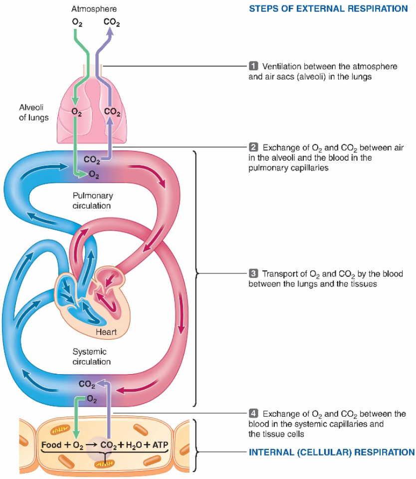
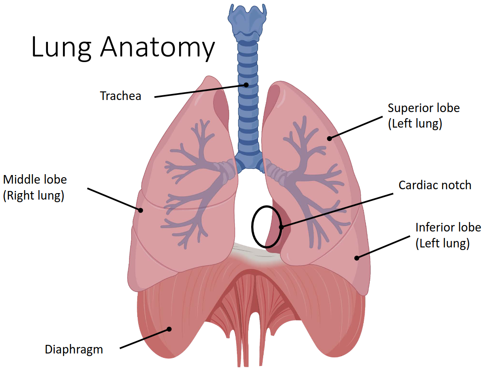
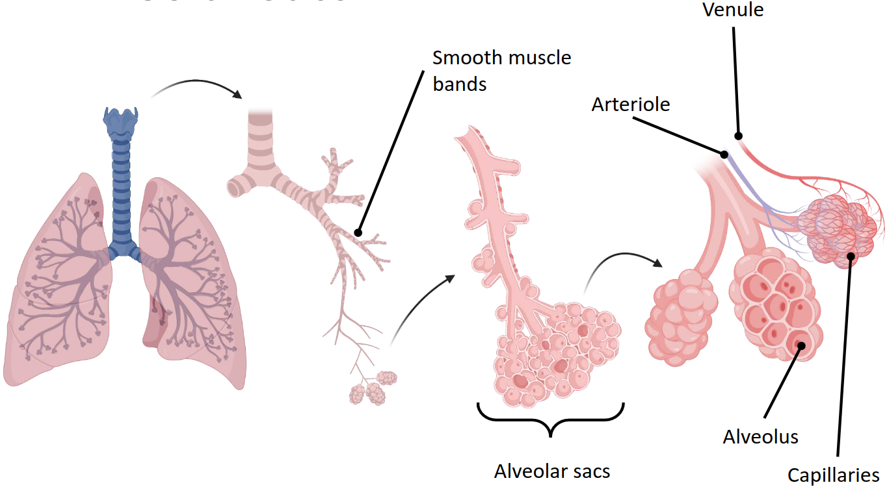
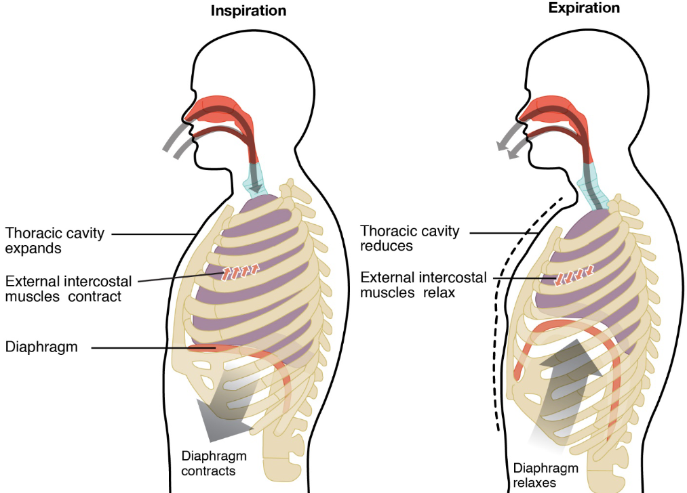

# Lecture 19, Mar 30, 2023

## Respiratory System -- Ventilation and Respiration

{width=70%}

* *Ventilation* is the movement of air in and out of the lungs, exchanging oxygen and CO2 with the blood
	* Ventilation is only external
* *Respiration* can be both internal (within the cell, at the mitochondrial level) and external (transfer from lungs to capillaries)
* Supply of oxygen to body cells is usually rate limited by the circulatory system (e.g. stroke volume, heart rate) instead of how much oxygen is breathed in

## Lung Structure

{width=50%}

{width=80%}

* When the diaphragm muscle contracts, the entire muscle is pulled down, drawing air into the lungs
* Bronchioles are the branches in the lung; smooth muscles warp around this
* Alveolar sacs are made from alveoli (alveolus); venules and arterioles surround the alveolar sacs with capillaries, which lets oxygen transport happen
* There are 2 types of alveolar cells: type I and type II
	* Type I cells are very flat, which gives them surface area for oxygen diffusion
		* They are only 1 micron thick
		* Oxygen transfer happens through these cells
	* Type II alveolar cells are bigger than type I cells, and they excrete a mucus
		* The fluid layer is about 2 microns thick
		* Their thicker size makes it so that oxygen doesn't really transport through them much
	* Type I cells take up 95% of the area, but only 1/3 of the number of cells
* Capillaries surrounding the alveolar sacs have their own cells, which form a tube that carries fluid and red blood cells
	* The distance between the capillaries and the sacs is about 0.5 microns
* Every fluid, cell membrane, and cytosol between the red blood cell and the inside of the alveolar sacs forms a barrier to diffusion
* Alveoli are connected via pores of Kohn, which equalize their pressure
* Law of Laplace: $P = \frac{2T}{r}$ where $T$ is the surface tension and $P$ is the internal pressure of a fluid bubble
	* The surface tension of the fluid coating means the sacs want to contract back when they are expanded (recoil)
	* With just a normal fluid layer, a bigger sac would have a lower pressure, so the smaller sacs would get smaller and the larger sac gets larger -- this leads to alveolar collapse
	* The Type II cells also secrete a surfactant; now as the sac gets smaller, the surfactant concentration per area increases, which decreases the surface tension, avoiding alveolar collapse

## Muscles Responsible for Ventilation

{width=70%}

* The lung is surrounded by a self-contained sac (membrane)
	* This is made of 2 layers of membrane; from the inside of the lung: the visceral pleura, a pleural cavity (space), and then a parietal pleura which then connects to the intercostal muscles
* External intercostal muscles contract and expand the ribcage during inspiration
* Internal intercostal muscles pull and contract the ribcage
* During expiration, muscles relax and the recoil from the fluid pulls the lung back
* A range of muscles can affect inspiration and expiration
	* About 75% of inspiration is due to diaphragm alone; the other 25% is due to extra intercostal muscles
	* The intercostal muscles are only used during active (forceful) expiration; otherwise, expiration is due to the recoil alone

## Mechanics of Ventilation

* Pressure gradient drives air flow
	* Main pressures: atmospheric pressure (considered as 0), alveolar pressure $P_A$, pleural pressure $P_{pl}$ (inside the pleural cavity), the lung recoil (aka transmural, transpulmonary) pressure, $P_{\text{recoil}} = P_A - P_{pl}$
		* $P_{pl}$ is lower than atmospheric pressure during normal breathing (the lung wants to collapse and the chest wall wants to expand)
	* A pressure difference between atmospheric pressure and $P_A$ is needed to drive ventilation

