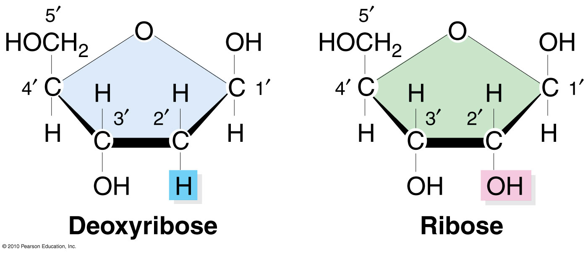
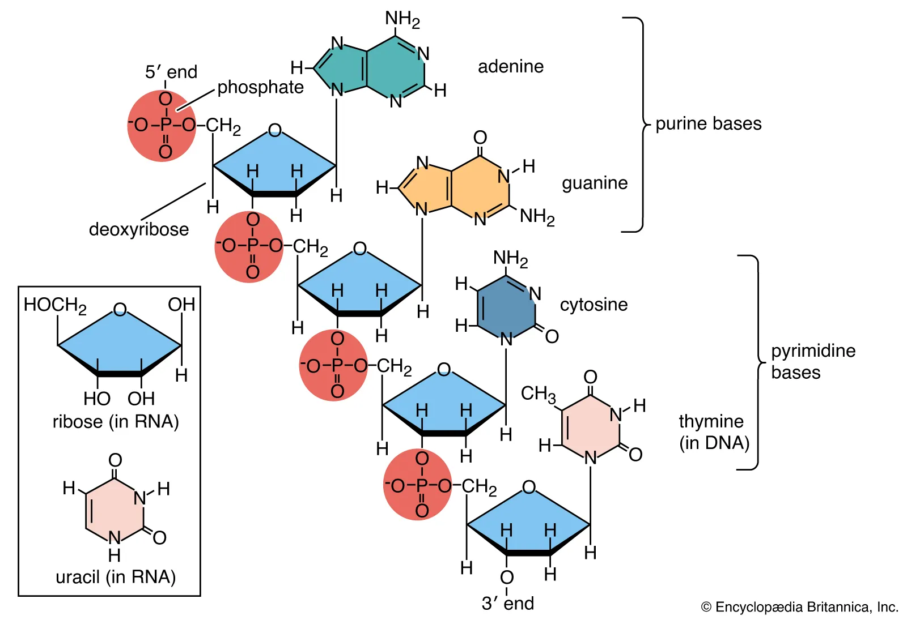

# Lecture 2, Jan 12, 2023

## The Nucleus

* "Control center"
* 2 layers on the surface, nuclear pores connects the two barriers
* At the center is the nucleolus, contains stuff for making RNA
* Chromatin comes out from the center, which are threads of DNA in different proteins
* At the large scale we have chromosomes, which are made of coiled chromatin, which are coils of units of nucleosomes, which are made of spools of histones, which are made of a DNA helix of two complementary strands

## Nucleosome

* DNA thread winds around histone structure, with proteins with tails
	* The proteins hold the DNA in place with latches, and through acetylation the latches unlatch and the DNA becomes loosely packed
* Nucleosome packing can be either loose (euchromatin) through acetylation or tight (heterochromatin) through methylation
	* Loosely packed nucleosomes are easier to read
	* Heterochromatin are harder to read, used to store stuff that isn't read much
* Abnormal methylation or acetylation coiling lead to abnormal chromatin structure, which can lead to cancer (in addition to regular DNA mutation)

## DNA

* DNA is made of two complementary strands, one is the template and one is the coding strand
	* Strands have direction, 3' or 5'; template goes from 3' to 5'; coding goes from 5' to 3'
	* The template and coding strands are always going in opposite directions
* Mnemonic: for the template, we "read up", we go from 3' to 5'; for the code, we "write down", go from 5' to 3'
* DNA is made of 4 nitrogenous bases: *adenine* (A), *thymine* (T), *guanine* (G), *cytosine* (C)
	* Adenine and thymine match together, guanine and cytosine match together
* DNA is not a homogeneous coil -- some parts have a bigger gap and some parts have a smaller gap due to its structure, making some parts more exposed and easier to read and other parts protected
* The backbone is made of sugars and phosphate

### DNA Construction

* A *nucleobase* is the nitrogenous base, adenine, thymine, guanine, or cytosine
	* This is the stuff in the middle of the helix, which actually stores data
* A sugar molecule (deoxyribose) is attached to it to make it a *nucleoside*
	* The sugar goes into a third dimension (above and below the base) due to its structure
* A phosphate can be added to the sugar to make it a *nucleotide*, which helps bonding due to its reactivity
* All the carbon atoms are numbered: 1 is attached to the nucleobase, then clockwise to 2, 3, and 4, then 5 connects to the oxygen that connects to the phosphate
	* 3' would be going down and 5' goes up near the phosphate
	* The 3' end is the sugar, and 5' is the phosphate
* Cytosine and thymine are *pyrimidines*, which have one cycle; they hydrogen bond with *purines*, adenine and guanine, which have two cycles
	* The donor is a hydrogen bonded to an electronegative atom like oxygen, which makes it positive; it sticks to an electron pair on the acceptor (typically another oxygen or nitrogen)
	* Cytosine has one positive hydrogen, and two negative (oxygen and nitrogen) which fits perfectly into guanine
		* Similar for thymine and adenine
		* This is why you can't mix and match nucleobase pairs

{width=70%}

{width=75%}

